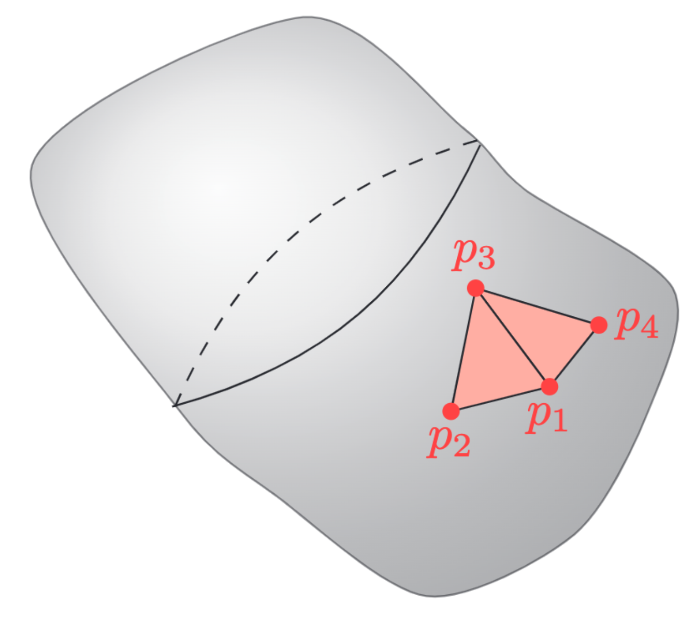
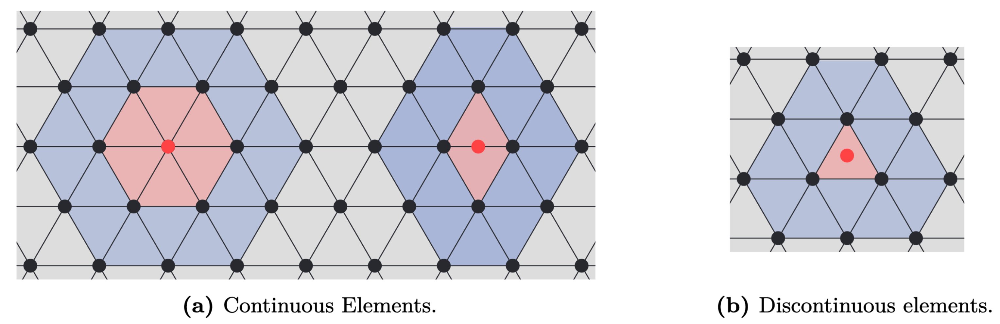

# Theoretical Background
This page includes the theoretical foundations of `BoundaryIntegralEquations.jl`.

## Getting the computer to understand functions
In the most basic terms computers are only capable of understanding numbers, meaning that they are inherently unable to solve equations where the unknowns are functions. This is a problem when trying to solve BIEs. To resolve this issue the functions are instead approximated using parametrizations for which the coefficients (numbers) are unknown. Intuitively these numbers are exactly what the computer is then tasked to find. For element methods this parametrization is chosen to be the simplest possible: A linear combination of functions

```math
p(\mathbf{x}) \approx \mathbf{T}(\mathbf{x})\mathbf{p} 
    = 
    \begin{bmatrix} T_1(\mathbf{x}) &  T_2(\mathbf{x}) &  \dots  &  T_n(\mathbf{x}) \end{bmatrix}
    \begin{bmatrix} p_1             \\ p_2             \\ \vdots \\ p_n             \end{bmatrix}. 
```

Note that linearity is with respect to the unknown parameters ``\mathbf{p}``, but not necessarily in the known basis functions ``\mathbf{T}(\mathbf{x})``. A useful, but not necessary, property is called the Cardinal property stating that 

```math
T_i(\mathbf{x}_j) = \delta_{ij} = 
    \begin{cases}
        1, \quad i = j\\
        0, \quad i \neq j    
    \end{cases}.
```

The usefulness is due the property making the ``j``th value of ``\mathbf{p}`` interpretable as the value of the function at point ``\mathbf{x}_j`` as

```math
\mathbf{T}(\mathbf{x}_j)\mathbf{p} = p_j.
```

One might ask: *How does the above relate to The Boundary Element Method?* The answer is that the functions ``\mathbf{T}_i`` are chosen to be simpler functions with support equal to only a few subdomains of the original domain. These subdomains are commonly referred to as elements. 

## Elements
A key insight is that the element serves two purposes: It represents a subdomain of the original domain (also referred to as the geometry) while also describing parts of the unknown function of interest. In the case of surface elements, which are the ones used for BEMs, the parametrization of an element (denoted by $e$ in the following) is done as
```math
    \mathbf{x}^e(\mathbf{u}) = \mathbf{X}^e\mathbf{N}(\mathbf{u}) \in \Gamma^e, \quad \forall \mathbf{u} \in \mathcal{L},
```
where ``\mathbf{X}^e`` is a matrix with columns equal to the interpolation nodes of the geometry, ``\mathbf{N}(\mathbf{u})`` are the shape functions, $\Gamma^e$ is the element in global coordinates and ``\mathcal{L}`` are the local coordinates. In 3D a triangular element can look as



The element description of the geometry allows for the function approximation of $p$ to be done easily as
```math
    p(\mathbf{x}^e(\mathbf{u})) = \mathbf{T}(\mathbf{x}^e(\mathbf{u}))\mathbf{p} = \underbrace{\mathbf{T}(\mathbf{x}(\mathbf{u}))(\mathbf{L}^e)^\top}_{\mathbf{T}^e(\mathbf{u})}\underbrace{\mathbf{L}^e\mathbf{p}}_{\mathbf{p}^e} = \mathbf{T}^e(u)\mathbf{p}^e, \quad \mathbf{u} \in \mathcal{L}
```
where ``\mathbf{L}^e`` is a permutation-like matrix that extracts the relevant values of ``\mathbf{p}`` and orders them such that they correspond to the local basis functions of ``\mathbf{T}^e(\mathbf{u})``. The local basis functions are usually chosen as (Lagrange) polynomials of degree $d$, but other basis functions such as e.g. Legendre polynomials and splines have also been applied with success. 

!!! info "Example: Element Localization Matrix"
    For a linear element ``e`` all three corners corresponds to a value of the global vector ``\mathbf{p}``. For e.g. an element could have local corner values given by ``\mathbf{p}^e = \begin{bmatrix}p_1 & p_4 & p_3 \end{bmatrix}^\top``. This element would have ``\mathbf{L}^e`` given as
    ```math
        \mathbf{L}^e = 
        \begin{bmatrix}
        1 & 0 & 0 & 0 & ... & 0\\
        0 & 0 & 0 & 1 & ... & 0\\
        0 & 0 & 1 & 0 & ... & 0
        \end{bmatrix}.
    ```
    Note that ``\mathbf{L}^e`` is only an artifact of the mathematical description. Any reasonable implementation should utilize indexing instead of multiplication with ``\mathbf{L}^e``.

## Quadrature
The underlying mathematics of the BEM is that of surface integrals. In most cases it is not possible to compute these analytically. Instead, a quadrature scheme is used to approximate the integrals. To do so the element in global coordinates is transformed into local coordinates using the Jacobian function describing the local deformation from the transformation. For 2D and 3D this deformation looks as follows

```math
\begin{alignat*}{3}
    \text{2D:} & \quad \text{jacobian}(u)   &&= \left\|\mathbf{X}^e \frac{\mathrm{d}\mathbf{N}(u)}{\mathrm{d}u}\right\|_2 \quad && \text{(length deformation)}\\
    \text{3D:} & \quad \text{jacobian}(u,v) &&= \left\|\left(\mathbf{X}^e \frac{\mathrm{d}\mathbf{N}(u,v)}{\mathrm{d}u}\right) \times \left(\mathbf{X}^e \frac{\mathrm{d}\mathbf{N}(u,v)}{\mathrm{d}v}\right) \right\|_2 \quad && \text{(area deformation)}
\end{alignat*}
```

Applying this the surface integral can be transformed into local coordinates and computed using a suitable quadrature scheme as

```math
    \int_{\Gamma^e} f(\mathbf{x})\ \mathrm{d}S_\mathbf{x} = \int_\mathcal{L} \text{jacobian}(\mathbf{u})f(\mathbf{u})\ \mathrm{d}\mathbf{u} \approx \sum_{i=1}^{Q} \text{jacobian}(\mathbf{u}_i)w_if(\mathbf{u}_i),
```
    
where $\mathbf{u}_i$ is the quadrature point with corresponding weights $w_i$.

## The Boundary Element Method
In simple terms the Boundary Element Method (BEM) is a method for solving Boundary Integral Equations through a discretization of both the unknown function and domain. In this thesis the main focus is solving the BIE through the so-called collocation approach. This approach is a particular case of the Galerkin approach where the test function is equal to the sum of Dirac-delta functions

```math
\phi(\mathbf{y}) =  \mathbf{a}^\top
                    \begin{bmatrix}
                        \delta\left(\mathbf{y} - \mathbf{z}_1\right)\\ 
                        \delta\left(\mathbf{y} - \mathbf{z}_2\right)\\ 
                        \vdots\\
                        \delta\left(\mathbf{y} - \mathbf{z}_n\right)\\ 
                    \end{bmatrix},
```

where ``\mathbf{a} \in \mathbb{C}^n`` is a vector of arbitrary constants and ``\mathbf{z}_i \in \mathbb{R}^3`` are the nodal mesh positions. 

```math
\mathbf{a}^\top
\begin{bmatrix}
    c(\mathbf{z}_1)p(\mathbf{z}_1)\\ 
    c(\mathbf{z}_2)p(\mathbf{z}_2)\\ 
    \vdots \\ 
    c(\mathbf{z}_n)p(\mathbf{z}_n)
\end{bmatrix} 
+ 
\mathbf{a}^\top
\begin{bmatrix}
    \int_\Gamma\frac{\partial G(\mathbf{x}, \mathbf{z}_1)}{\partial\mathbf{n}(\mathbf{x})}p(\mathbf{x})\ \mathrm{d}S_\mathbf{x}\\
    \int_\Gamma\frac{\partial G(\mathbf{x}, \mathbf{z}_2)}{\partial\mathbf{n}(\mathbf{x})}p(\mathbf{x})\ \mathrm{d}S_\mathbf{x}\\
    \vdots \\
    \int_\Gamma\frac{\partial G(\mathbf{x}, \mathbf{z}_n)}{\partial\mathbf{n}(\mathbf{x})} p(\mathbf{x})\ \mathrm{d}S_\mathbf{x}
\end{bmatrix}
=
\mathbf{a}^\top
\begin{bmatrix}
    sk\int_\Gamma G(\mathbf{x},\mathbf{z}_1)v_f(\mathbf{x})\ \mathrm{d}S_\mathbf{x}\\
    sk\int_\Gamma G(\mathbf{x},\mathbf{z}_2)v_f(\mathbf{x})\ \mathrm{d}S_\mathbf{x}\\
    \vdots \\
    sk\int_\Gamma G(\mathbf{x},\mathbf{z}_n)v_f(\mathbf{x})\ \mathrm{d}S_\mathbf{x}
\end{bmatrix}.
```

In its current form the solution to the above equation is a *function* which a computer can not be tasked to find. Instead, the problem is made computationally tractable by parametrizing the functions ``p`` and ``v_s`` as shown previously. As such the above reduces to

```math
\mathbf{a}^\top
\begin{bmatrix}
    c(\mathbf{z}_1)\mathbf{T}(\mathbf{z}_1)\mathbf{p}\\ 
    c(\mathbf{z}_2)\mathbf{T}(\mathbf{z}_2)\mathbf{p}\\ 
    \vdots \\ 
    c(\mathbf{z}_n)\mathbf{T}(\mathbf{z}_n)\mathbf{p}
\end{bmatrix}
+ 
\mathbf{a}^\top
\begin{bmatrix}
    \int_\Gamma \frac{\partial G(\mathbf{x}, \mathbf{z}_1)}{\partial\mathbf{n}(\mathbf{x})}\mathbf{T}(\mathbf{x})\mathbf{p}\ \mathrm{d}S_\mathbf{x}\\
    \int_\Gamma\frac{\partial G(\mathbf{x}, \mathbf{z}_2)}{\partial\mathbf{n}(\mathbf{x})}\mathbf{T}(\mathbf{x})\mathbf{p}\ \mathrm{d}S_\mathbf{x}\\
    \vdots \\
    \int_\Gamma\frac{\partial G(\mathbf{x}, \mathbf{z}_n)}{\partial\mathbf{n}(\mathbf{x})}\mathbf{T}(\mathbf{x})\mathbf{p}\ \mathrm{d}S_\mathbf{x}
\end{bmatrix}
\approx
\mathbf{a}^\top
\begin{bmatrix}
    sk\int_\Gamma G(\mathbf{x},\mathbf{z}_1)\mathbf{T}(\mathbf{x})\mathbf{v}_f\ \mathrm{d}S_\mathbf{x}\\
    sk\int_\Gamma G(\mathbf{x},\mathbf{z}_2)\mathbf{T}(\mathbf{x})\mathbf{v}_f\ \mathrm{d}S_\mathbf{x}\\
    \vdots \\
    sk\int_\Gamma G(\mathbf{x},\mathbf{z}_n)\mathbf{T}(\mathbf{x})\mathbf{v}_f\ \mathrm{d}S_\mathbf{x}
\end{bmatrix}.
```

By the cardinal property of the basis functions it follows that

```math
\mathbf{a}^\top
\left(
\text{diag}\left(\begin{bmatrix}
    c(\mathbf{z}_1)\\ 
    c(\mathbf{z}_2)\\ 
    \vdots \\ 
    c(\mathbf{z}_n)
\end{bmatrix}\right)
+ 
\begin{bmatrix}
    \int_\Gamma\frac{\partial G(\mathbf{x}, \mathbf{z}_1)}{\partial\mathbf{n}(\mathbf{x})}\mathbf{T}(\mathbf{x})\ \mathrm{d}S_\mathbf{x}\\
    \int_\Gamma\frac{\partial G(\mathbf{x}, \mathbf{z}_2)}{\partial\mathbf{n}(\mathbf{x})}\mathbf{T}(\mathbf{x})\ \mathrm{d}S_\mathbf{x}\\
    \vdots \\
    \int_\Gamma\frac{\partial G(\mathbf{x}, \mathbf{z}_n)}{\partial\mathbf{n}(\mathbf{x})}\mathbf{T}(\mathbf{x})\ \mathrm{d}S_\mathbf{x}
\end{bmatrix}\right)\mathbf{p}
\approx
\mathbf{a}^\top
\begin{bmatrix}
    sk\int_\Gamma G(\mathbf{x},\mathbf{z}_1)\mathbf{T}(\mathbf{x})\ \mathrm{d}S_\mathbf{x}\\
    sk\int_\Gamma G(\mathbf{x},\mathbf{z}_2)\mathbf{T}(\mathbf{x})\ \mathrm{d}S_\mathbf{x}\\
    \vdots \\
    sk\int_\Gamma G(\mathbf{x},\mathbf{z}_n)\mathbf{T}(\mathbf{x})\ \mathrm{d}S_\mathbf{x}
\end{bmatrix}\mathbf{v}_f.
```

Since the above has to hold for all ``\mathbf{a} \in \mathbb{C}^n`` it follows that
```math
\left(\text{diag}\left(\begin{bmatrix}
    c(\mathbf{z}_1)\\ 
    c(\mathbf{z}_2)\\ 
    \vdots \\ 
    c(\mathbf{z}_n)
\end{bmatrix}\right)
+ 
\mathbf{F}\right)\mathbf{p}
=
sk\mathbf{G}\mathbf{v}_s.
```

For simplification purposes the above is sometimes written as

```math
\mathbf{H}\mathbf{p} + \mathbf{G}\partial_\mathbf{n}\mathbf{p}.
```

We now briefly explain how to compute the ``j``th row of ``\mathbf{H}``. To do so element description of the unknown function used differently as ``\mathbf{p}^e`` is not part of the equation. Instead, we use the split as follows 

```math
\begin{aligned}
\int_\Gamma\frac{\partial G(\mathbf{x}, \mathbf{z}_j)}{\partial\mathbf{n}(\mathbf{x})}\mathbf{T}(\mathbf{x})\mathbf{p}\ \mathrm{d}S_\mathbf{x} 
&\approx \sum_{e=1}^{N}\left(\int_{\Gamma^e}\frac{\partial G(\mathbf{x}, \mathbf{z}_j)}{\partial\mathbf{n}(\mathbf{x})}\mathbf{T}(\mathbf{x})(\mathbf{L}^e)^\top\mathbf{L}^e\ \mathrm{d}S_\mathbf{x}\right) \mathbf{p}\\
&\approx \left(\underbrace{\sum_{e=1}^{N}\left(\sum_{i=1}^{Q(\mathbf{z}_j,e)}\frac{\partial G(\mathbf{x}^e(\mathbf{u}_i), \mathbf{z}_j)}{\partial\mathbf{n}(\mathbf{x}^e(\mathbf{u}_i))}\text{jacobian}(\mathbf{u}_i)w_i\mathbf{T}^e(\mathbf{u}_i)\right)\mathbf{L}^e}_{j\text{th row of }\mathbf{H}}\right)\mathbf{p},
\end{aligned}
```

where the number of quadrature points, ``Q(\mathbf{z}_1,e)``, is depended on element location with respect to the collocation point ``\mathbf{z}_1``. Note that approximation in the first line of the above is due to approximation of the geometry using elements while the second approximation is due to the integration error. A similar approach can be applied for the rows of ``\mathbf{H}``.

A downside of the BEM is that the resulting matrices ``\mathbf{H}, \mathbf{G} \in \mathbb{C}^{n\times n}`` are dense, meaning that storing the two matrices scales as ``\mathcal{O}(n^2)`` rendering the direct application of the method unusable large ``n``.

## The Fast Multipole Method and BEM
The Fast Multipole Method (FMM) can be used to accelerate the multiplication with the BEM matrices ``\mathbf{H}`` and ``\mathbf{G}``. Throughout the years many good resources that explain the intricacies of the FMM have been written. As such the details will here be left out. Instead, the focus will be on how to apply a 3rd-party FMM into an existing BEM framework. As an example the focus will be on the *Flatiron Institute Fast Multipole Libraries*, as this is the library currently interfaced in `BoundaryIntegralEquations.jl`. This library can be used to accelerate sums of the following form from ``O(M)`` to ``O(\\log(M))``
```math
    \begin{aligned}
    u(\mathbf{z}) 
    % &= \sum_{j=1}^M\left[c_j\frac{\mathrm{e}^{\ii k\|\mathbf{z} - \mathbf{x}_j\|}}{\|\mathbf{z} - \mathbf{x}_j\|} - \mathbf{v}_j\cdot\nabla\left(\frac{\mathrm{e}^{\ii k\|\mathbf{z} - \mathbf{x}_j\|}}{\|\mathbf{z} - \mathbf{x}_j\|}\right)\right]
    &= \sum_{j=1}^M\left[4\pi c_jG(\mathbf{x}_j,\mathbf{z}) - 4\pi v_j\mathbf{n}(\mathbf{x}_j)\cdot\nabla G(\mathbf{x}_j,\mathbf{z})\right],
    \end{aligned}
```
where the ``j``th term is excluded from the sum if ``\mathbf{z} = \mathbf{x}_j``. The question is now: *How can this be used to speed up multiplication with the BEM matrices?*

To see how we start by simplifying things by assuming that each element requires the same amount of quadrature points (this will cause numerical issues that are then fixed by a nearfield correction step), ``Q``, and that we want to multiply with a known vector ``\mathbf{y}``. Then for a row of ``\mathbf{G}`` we have that
```math
\begin{aligned}
    \left(\int_\Gamma G(\mathbf{x},\mathbf{z})\mathbf{T}(\mathbf{x})\ \mathrm{d}S_\mathbf{x}\right)\mathbf{y}
    &\approx
    \left(\sum_{e=1}^{N}\left(\sum_{i=1}^{Q}G(\mathbf{x}^e(\mathbf{u}_i),\mathbf{z})\text{jacobian}(\mathbf{u}_i)w_i\mathbf{T}^e(\mathbf{u}_i)\right)\mathbf{L}^e\right)\mathbf{y}\\
    &= \left(\sum_{j=1}^{NQ}G(\mathbf{x}_j,\mathbf{z})\underbrace{\text{jacobian}(\mathbf{u}_j)w_j\mathbf{T}^{e(j)}(\mathbf{u}_j)\mathbf{L}^{e(j)}}_{j\text{th row of } \mathbf{C}}\right)\mathbf{y}\\
    &= 
    \begin{bmatrix}
        G(\mathbf{x}_1,\mathbf{z}) & G(\mathbf{x}_2,\mathbf{z}) & \dots & G(\mathbf{x}_{NQ},\mathbf{z})
    \end{bmatrix}
    \mathbf{C}\mathbf{y}
\end{aligned}
```
where the subscript ``j`` refers to an ordering of the collection of Gaussian points from all elements and ``e(j)`` is a function that returns the element number that Gaussian point ``j`` is located on. Furthermore, the matrix ``\mathbf{C}`` can be thought of as a transformation from ``\mathbf{y}`` into the coefficients ``4\pi c_j``. A similar approach can be applied to ``\mathbf{H}``
```math
\begin{aligned}
    \left(\int_\Gamma\frac{\partial G(\mathbf{x}, \mathbf{z})}{\partial\mathbf{n}(\mathbf{x})}\mathbf{T}(\mathbf{x})\ \mathrm{d}S_\mathbf{x}\right)\mathbf{y}
    &\approx 
    \left(\sum_{e=1}^{N}\left(\sum_{i=1}^{Q}\frac{\partial G(\mathbf{x}^e(\mathbf{u}_i), \mathbf{z})}{\partial\mathbf{n}(\mathbf{x})}\text{jacobian}(\mathbf{u}_i)w_i\mathbf{T}^e(\mathbf{u}_i)\right)\mathbf{L}^e\right)\mathbf{y}\\
    &= \left(\sum_{j=1}^{NQ}\nabla G(\mathbf{x}_j, \mathbf{z})\cdot \mathbf{n}(\mathbf{x}_j)\underbrace{\text{jacobian}(\mathbf{u}_j)w_j\mathbf{T}^{e(j)}(\mathbf{u}_j)\mathbf{L}^{e(j)}}_{j\text{th row of }\mathbf{C}}\right)\mathbf{y}\\
    &= 
    \begin{bmatrix}
        \nabla G(\mathbf{x}_1, \mathbf{z})\cdot \mathbf{n}(\mathbf{x}_1) &
        \dots &
        \nabla G(\mathbf{x}_{NQ}, \mathbf{z})\cdot \mathbf{n}(\mathbf{x}_{NQ})
    \end{bmatrix}
    \mathbf{C}\mathbf{y},
\end{aligned}
```
where ``\mathbf{C}`` is a matrix that transforms ``\mathbf{y}`` into the coefficients ``4\pi v_j``. The two equations highlights how the FMM can be applied for problems where the number of Gaussian points on each element is equal. However, in practical cases this approach will be victim to numerical instabilities due to numerical errors stemming from the integration of elements close to the collocation point. To resolve this issue the BEM matrices is split into parts
```math
        \mathbf{A} = \mathbf{G}\mathbf{C} + \mathbf{S}, \quad \mathbf{G} \in\mathbb{C}^{n\times NQ},\ \mathbf{S}\in\mathbb{C}^{n\times n},\ \mathbf{C}\in\mathbb{R}^{NQ\times n}.
```
Here ``\mathbf{G}`` is the part approximated by the FMM (using ``Q`` Gaussian points on each element), ``\mathbf{F}`` is either ``\mathbf{C}`` or ``\mathbf{V}`` from the two equations while ``\mathbf{S}`` a nearfield correction. In short the nearfield correction subtract the wrong integration done by using only ``Q`` Gaussian points and adds on the correct integration instead. It is important to note that ``\mathbf{S}`` and ``\mathbf{F}`` are both highly sparse matrices, meaning that both assembly and multiplication with these scale ``\mathcal{O}(n\tau)`` where ``\tau \ll n``. This means that using an approximate scheme for ``\mathbf{G}`` with a multiplication that scales linear in time and memory result in a representation of ``\mathbf{A}`` that scales similarly.



