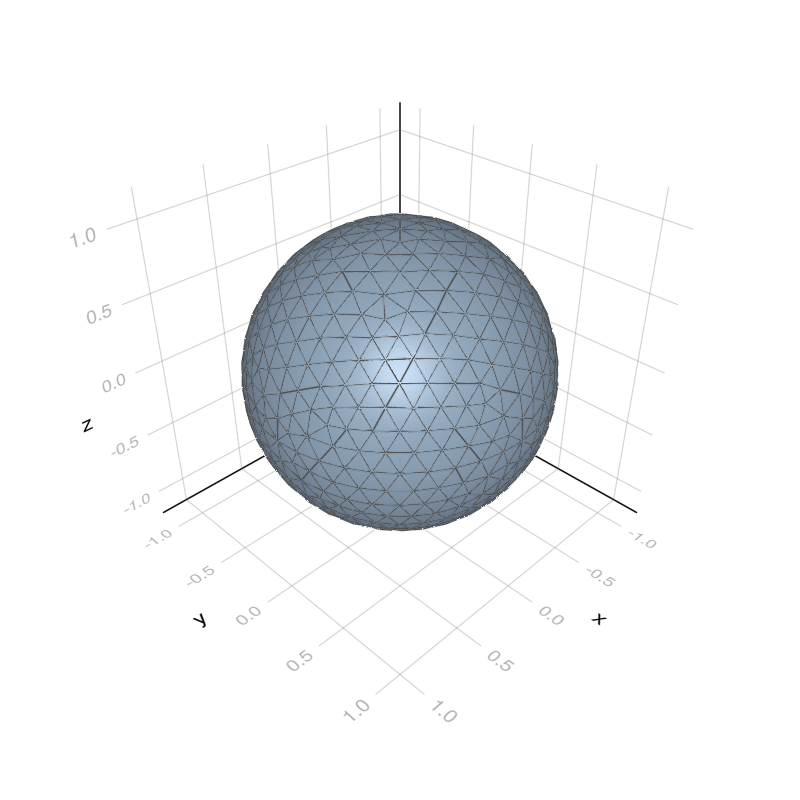

```@meta
EditURL = "../../../examples/3d_chebyshev.jl"
```

# ROSEBEM - Chebyshev
The Reduced Order Series Expansion Boundary Element Method (ROSEBEM) is a technique to significantly increase the computational efficiency of multifrequency BEM problems [panagiotopoulos2020](@cite) [Paltorp2023](@cite) [panagiotopoulos2022a](@cite). In this example we look at the scattering of a rigid sphere and how the ROSEBEM using a Chebyshev series expansion can be used to accelerate the computational efforts.
# Importing related packages

````julia
using BoundaryIntegralEquations # For BIEs
using LegendrePolynomials       # For Legendre Polynomials
using SpecialFunctions          # For Bessel functions
using IterativeSolvers          # For gmres
using LinearAlgebra             # For Diagonal
using Meshes                    # For using `viz`
using Plots                     # For 2d plots
import GLMakie as wgl           # For 3d plotting
````

# Setting up constants

````julia
c  = 343;                           # Speed up sound           (m/s)
a  = 1.0;                           # Radius of sphere_1m      (m)
P₀ = 1.0;                           # Magnitude of planewave   (Pa)
r  = 1.0;                           # Radius of sphere         (m)
θ_analytical = collect(0:0.01:π);   # Colaltitude angles
````

# Loading Mesh

````julia
mesh_file = joinpath(dirname(pathof(BoundaryIntegralEquations)),"..","examples","meshes","sphere_1m_fine");
mesh = load3dTriangularComsolMesh(mesh_file;physics_order=:disctriquadratic)
simple_mesh = create_simple_mesh(mesh);
fig = viz(simple_mesh;showfacets=true);
````


# Analytical Solution
The analytical solution of the scattering of a sphere by plane wave can be computed as ([ihlenburg1998a](@cite))
```math
 p_\text{analytical}(r, \theta) = P_0\left(\exp(\mathrm{i}kr\cos(\theta)) - \sum_{n=1}^\infty \mathrm{i}^n(2n+1)\frac{j_n^{'}(ka)}{h_n^{'}(ka)}P_n(\cos(\theta))h_n(kr)\right),
```
where ``j_n, h_n`` and ``P_n`` are respectively the spherical Bessel function of the first kind, the Hankel function of the first kind and the Legendre polynomial of degree ``n``.
To make the implementation easier we defin the following helper functions

````julia
dsp_j(n,z) = n/z*sphericalbesselj(n,z) - sphericalbesselj(n+1,z); # Derivative of j
dsp_y(n,z) = n/z*sphericalbessely(n,z) - sphericalbessely(n+1,z); # Derivative of y
sp_h(n,z)  = sphericalbesselj(n,z) + im*sphericalbessely(n,z);    # Hankel function (h)
dsp_h(n,z) = dsp_j(n,z) + im*dsp_y(n,z);                          # Derivative of h
````

Using the helper functions we can define the a function for the coefficients

````julia
c_n(n,ka)  = (im)^n*(2n + 1)*(dsp_j.(n,ka)./dsp_h.(n,ka));
````

Function to evalauate the analytical pressure  ([ihlenburg1998a](@cite))

````julia
function p_analytical(θ_analytical,r,k;N_trunc = 50,R=1)
    p_s = P₀*sum(n -> -c_n(n,k*R) .* Pl.(cos.(θ_analytical), n) .* sp_h.(n,k*r), 0:N_trunc)
    p_i = P₀*exp.(im*k*r*cos.(θ_analytical))
    return p_i, p_s
end
````

````
p_analytical (generic function with 1 method)
````

# Solution using the ROSEBEM
The ROSEBEM is based on a series expansion of the BEM matrices and a reduced basis (``\mathbf{U} \in \mathbb{C}^{n\times \ell}``). In [another example](3d_rosebem.md) the Taylor series expansion the BEM system is used. In this example the Chebyshev is applied (similar to the approach in [panagiotopoulos2022a](@cite)). In short this means approximating the systems as
```math
  \left(\sum_{j=0}^{M-1}\mathbf{C}_jc_j\left(g(k)\right)\right)\mathbf{x}(k) = \mathbf{U}^{\text{H}}\mathbf{p}_\text{incident}(k)
```
where ``c_j(\omega)`` are the Chebyshev polynomials of the first kind, ``g(k)`` is a function that maps ``k`` from the frequency range of interst onto ``[-1,1]``, and ``\mathbf{x}`` is the unknown vector. Futhermore the coefficient matrices (``\mathbf{C}_j``) is computed similarly to a standard Chebyshev approximation
```math
\mathbf{C}_j = \frac{2}{M }\sum_{i=0}^{M-1}\left(\mathbf{U}^{\text{H}}\mathbf{A}\left(g^{-1}(\omega_i\right)\mathbf{U}\right)c_j(\omega_i), \quad \omega_i \in [-1,1]
```
with ``\omega_i = \cos\left(\frac{\pi\left(i + \frac{1}{2}\right)}{M}\right)``, ``i = 0,\dots,M-1`` and ``g^{-1}(\omega)`` being the inverse of ``g`` i.e. the function that maps ``[-1,1]`` to the frequency range of interest e.g. mapping to ``[k_\text{min}, k_\text{max}]`` we have that
```math
\begin{aligned}
g(k)           &= \frac{2}{k_\text{max} - k_\text{min}}k      - \frac{k_\text{max} + k_\text{min}}{k_\text{max} - k_\text{min}}\\
g^{-1}(\omega) &= \frac{k_\text{max} - k_\text{min}}{2}\omega + \frac{k_\text{max} + k_\text{min}}{2}
\end{aligned}
```
Note that the above computes the coefficients from the reduced systems, i.e. after ``\mathbf{U}`` as been applied. In practice this means that an acceleration technique can be used generate the matrices. Another important aspect is that the above is non-intrusive, making it easy to implement in existing BEM software.

We now define the relevant functions required to compute the reduced basis matrices and Chebyshev coefficient matrices. Notice that this is all done using a "matrix-free" approach, meaning that the large ``\mathbf{A}``-matrices is never stored in memory. Instead the multiplication with the matrix is approximated using the fast multipole method.

````julia
function create_basis_matrices(mesh,k_secondary,U;n_gauss=3)
    temp = zeros(eltype(U), size(U))
    output = zeros(eltype(U),size(U,2),size(U,2),length(k_secondary))
    for (index,k) in enumerate(k_secondary)
        F = FMMFOperator(mesh,k;n_gauss=n_gauss); # We're actually interseted in H = F + 0.5I
        mul!(temp,F,U) # The mul! currently only works directly on the FMMFOperator
        output[:,:,index] = U'*(temp + U/2) # We add half of a U due to 0.5I in the H-operator.
    end
    return output
end
function create_chebyshev_coefficients(A_reduced)
    M = size(A_reduced,3)
    Cj = similar(A_reduced)
    for j = 0:M-1
        Cj[:,:,j+1] = 2/M*sum(i -> A_reduced[:,:,i+1]*cos(π*j*(i+1/2)/M),0:M-1)
    end
    return Cj
end
function chebyshev_eval(x,M)
    output = ones(M)
    output[2] = x
    for i = 3:M
        output[i] = 2x*output[i-1] - output[i-2]
    end
    return output
end
function eval_chebyshev_matrix(Cj,coeffs)
    output = -Cj[:,:,1]/2
    for index = eachindex(coeffs)
        output += coeffs[index]*Cj[:,:,index]
    end
    return output
end
function assemble_chebyshev(Cj,k)
    return eval_chebyshev_matrix(Cj,chebyshev_eval(k,size(Cj,3)))
end
````

````
assemble_chebyshev (generic function with 1 method)
````

First we define a set of primary wavenumbers for which we compute the reduced basis (`U`) and the solution (`sols`)

````julia
L = 3;           # Number of primary wavenumbers used to compute the ROM Basis
k_primary = 2π*(LinRange(100,300,L))/c;  # Defining the primary frequencies
U,sols,_ = scattering_krylov_basis(mesh,k_primary;P₀=P₀,verbose=false,progress=false);
@info "Reduced basis size: $(size(U,2)) | Reduction in DOF: $(1 - size(U,2)/size(U,1)) %";
````

````
[ Info: Reduced basis size: 32 | Reduction in DOF: 0.9959595959595959 %

````

Then we define the secondary wavenumbers, i.e. the wavenumbers for which we compute the matrices ``\mathbf{U}^\text{H}\mathbf{A}(k)\mathbf{U}``

````julia
kmin = 2π*10/c;
kmax = 2π*400/c;
g(k)    = 2/(kmax - kmin)*k .- (kmax + kmin )/(kmax - kmin);
ginv(ω) = (kmax - kmin)/2*ω .+ (kmin + kmax)/2;
M  = 25;                                # Number of terms in the Chebyshev approximation
ωᵢ = cos.(π*(collect(0:M-1) .+ 1/2)/M); # Zeros of the Chebyshev polynomials
k_secondary = ginv.(ωᵢ);               # Mapping [-1,1] to [kmin, kmax]
````

Using the defined functions we can create the basis matrices ``\mathbf{U}^\text{H}\mathbf{A}(\omega_i)\mathbf{U}``

````julia
A_reduced = create_basis_matrices(mesh,k_secondary,U);
````

Now from the basis matrices we can compute the Chebyshev coefficient matrices (``\mathbf{C}_j``) as

````julia
Cj  = create_chebyshev_coefficients(A_reduced);
````

In order to avoid spurious frequencies we additionally define some so-called CHIEF points

````julia
src_chief = 0.9*rand(3,30)/sqrt(3);
````

Furthermore we want to evaluate the pressure at two field points: One directly in front and one directly in the back of the sphere at double the radius. As such

````julia
X_fieldpoints = [[0.0;0.0;2*r] [0.0;0.0;-2*r]];
````

We define the frequency range of interest

````julia
frequencies = collect(10:1:400);
ks = frequencies/c*2π;
````

Lastly we pre-allocate the output of pressure at the two field points

````julia
p1_chebyshev = zeros(ComplexF64,length(ks));
p2_chebyshev = zeros(ComplexF64,length(ks));
for (i,k) in enumerate(ks)
    Fp,_,_  = assemble_parallel!(mesh,k,X_fieldpoints,n=2,m=2,progress=false); # BEM matrix at field point
    F_chief,_,_  = assemble_parallel!(mesh,k,src_chief,n=2,m=2,progress=false); # CHIEF-point BEM
    p_chief  = P₀*exp.(im*k*src_chief[3,:]);                                    # CHIEF-point rhs
    k_scaled = g(k);                       # Scaling the wavenumber to the interval [-1,1]
    Hti = assemble_chebyshev(Cj,k_scaled); # Evaluating the series expansion at the scaled k value
    pIi = P₀*exp.(im*k*mesh.sources[3,:]); # Evaluating incident at colloation points (rhs)
    Hti     = [Hti; F_chief*U];            # Adding CHIEF system to ROM system
    p_romi  = U*(Hti\[(U'*pIi);p_chief]);  # Adding CHIEF rhs to ROM rhs
    p_field = -Fp*p_romi;                  # Evaluating pressure at the two field points
    p1_chebyshev[i] = p_field[1];          # Saving pressure at field point 1
    p2_chebyshev[i] = p_field[2];          # Saving pressure at field point 2
end
````

# Comparing ROSEBEM solution with the analytical solution
First we start with the point located directly behind the sphere

````julia
p_i, p_s = p_analytical(0,2*r,ks;N_trunc = 80)
plot(frequencies,abs.(p_i + p_s),label="Analytical Solution",legend=:topleft,linewidth=2)
plot!(frequencies,abs.(p_i + p1_chebyshev),label="Chebyshev",legend=:topleft,linestyle=:dash,linewidth=2)
ylims!((0.7,1.5)); xlabel!("Frequency [Hz]"); ylabel!("|p/p0|")
scatter!(k_secondary*340/(2π),0.7ones(length(k_secondary)),label="ωᵢ")
````

```@raw html
<?xml version="1.0" encoding="utf-8"?>
<svg xmlns="http://www.w3.org/2000/svg" xmlns:xlink="http://www.w3.org/1999/xlink" width="600" height="400" viewBox="0 0 2400 1600">
<defs>
  <clipPath id="clip660">
    <rect x="0" y="0" width="2400" height="1600"/>
  </clipPath>
</defs>
<path clip-path="url(#clip660)" d="M0 1600 L2400 1600 L2400 0 L0 0  Z" fill="#ffffff" fill-rule="evenodd" fill-opacity="1"/>
<defs>
  <clipPath id="clip661">
    <rect x="480" y="0" width="1681" height="1600"/>
  </clipPath>
</defs>
<path clip-path="url(#clip660)" d="M219.288 1423.18 L2352.76 1423.18 L2352.76 47.2441 L219.288 47.2441  Z" fill="#ffffff" fill-rule="evenodd" fill-opacity="1"/>
<defs>
  <clipPath id="clip662">
    <rect x="219" y="47" width="2134" height="1377"/>
  </clipPath>
</defs>
<polyline clip-path="url(#clip662)" style="stroke:#000000; stroke-linecap:round; stroke-linejoin:round; stroke-width:2; stroke-opacity:0.1; fill:none" points="228.061,1423.18 228.061,47.2441 "/>
<polyline clip-path="url(#clip662)" style="stroke:#000000; stroke-linecap:round; stroke-linejoin:round; stroke-width:2; stroke-opacity:0.1; fill:none" points="744.139,1423.18 744.139,47.2441 "/>
<polyline clip-path="url(#clip662)" style="stroke:#000000; stroke-linecap:round; stroke-linejoin:round; stroke-width:2; stroke-opacity:0.1; fill:none" points="1260.22,1423.18 1260.22,47.2441 "/>
<polyline clip-path="url(#clip662)" style="stroke:#000000; stroke-linecap:round; stroke-linejoin:round; stroke-width:2; stroke-opacity:0.1; fill:none" points="1776.3,1423.18 1776.3,47.2441 "/>
<polyline clip-path="url(#clip662)" style="stroke:#000000; stroke-linecap:round; stroke-linejoin:round; stroke-width:2; stroke-opacity:0.1; fill:none" points="2292.37,1423.18 2292.37,47.2441 "/>
<polyline clip-path="url(#clip660)" style="stroke:#000000; stroke-linecap:round; stroke-linejoin:round; stroke-width:4; stroke-opacity:1; fill:none" points="219.288,1423.18 2352.76,1423.18 "/>
<polyline clip-path="url(#clip660)" style="stroke:#000000; stroke-linecap:round; stroke-linejoin:round; stroke-width:4; stroke-opacity:1; fill:none" points="228.061,1423.18 228.061,1404.28 "/>
<polyline clip-path="url(#clip660)" style="stroke:#000000; stroke-linecap:round; stroke-linejoin:round; stroke-width:4; stroke-opacity:1; fill:none" points="744.139,1423.18 744.139,1404.28 "/>
<polyline clip-path="url(#clip660)" style="stroke:#000000; stroke-linecap:round; stroke-linejoin:round; stroke-width:4; stroke-opacity:1; fill:none" points="1260.22,1423.18 1260.22,1404.28 "/>
<polyline clip-path="url(#clip660)" style="stroke:#000000; stroke-linecap:round; stroke-linejoin:round; stroke-width:4; stroke-opacity:1; fill:none" points="1776.3,1423.18 1776.3,1404.28 "/>
<polyline clip-path="url(#clip660)" style="stroke:#000000; stroke-linecap:round; stroke-linejoin:round; stroke-width:4; stroke-opacity:1; fill:none" points="2292.37,1423.18 2292.37,1404.28 "/>
<path clip-path="url(#clip660)" d="M228.061 1454.1 Q224.45 1454.1 222.621 1457.66 Q220.816 1461.2 220.816 1468.33 Q220.816 1475.44 222.621 1479.01 Q224.45 1482.55 228.061 1482.55 Q231.695 1482.55 233.501 1479.01 Q235.329 1475.44 235.329 1468.33 Q235.329 1461.2 233.501 1457.66 Q231.695 1454.1 228.061 1454.1 M228.061 1450.39 Q233.871 1450.39 236.927 1455 Q240.005 1459.58 240.005 1468.33 Q240.005 1477.06 236.927 1481.67 Q233.871 1486.25 228.061 1486.25 Q222.251 1486.25 219.172 1481.67 Q216.117 1477.06 216.117 1468.33 Q216.117 1459.58 219.172 1455 Q222.251 1450.39 228.061 1450.39 Z" fill="#000000" fill-rule="nonzero" fill-opacity="1" /><path clip-path="url(#clip660)" d="M703.746 1481.64 L711.385 1481.64 L711.385 1455.28 L703.075 1456.95 L703.075 1452.69 L711.339 1451.02 L716.015 1451.02 L716.015 1481.64 L723.653 1481.64 L723.653 1485.58 L703.746 1485.58 L703.746 1481.64 Z" fill="#000000" fill-rule="nonzero" fill-opacity="1" /><path clip-path="url(#clip660)" d="M743.098 1454.1 Q739.487 1454.1 737.658 1457.66 Q735.852 1461.2 735.852 1468.33 Q735.852 1475.44 737.658 1479.01 Q739.487 1482.55 743.098 1482.55 Q746.732 1482.55 748.537 1479.01 Q750.366 1475.44 750.366 1468.33 Q750.366 1461.2 748.537 1457.66 Q746.732 1454.1 743.098 1454.1 M743.098 1450.39 Q748.908 1450.39 751.963 1455 Q755.042 1459.58 755.042 1468.33 Q755.042 1477.06 751.963 1481.67 Q748.908 1486.25 743.098 1486.25 Q737.288 1486.25 734.209 1481.67 Q731.153 1477.06 731.153 1468.33 Q731.153 1459.58 734.209 1455 Q737.288 1450.39 743.098 1450.39 Z" fill="#000000" fill-rule="nonzero" fill-opacity="1" /><path clip-path="url(#clip660)" d="M773.26 1454.1 Q769.648 1454.1 767.82 1457.66 Q766.014 1461.2 766.014 1468.33 Q766.014 1475.44 767.82 1479.01 Q769.648 1482.55 773.26 1482.55 Q776.894 1482.55 778.699 1479.01 Q780.528 1475.44 780.528 1468.33 Q780.528 1461.2 778.699 1457.66 Q776.894 1454.1 773.26 1454.1 M773.26 1450.39 Q779.07 1450.39 782.125 1455 Q785.204 1459.58 785.204 1468.33 Q785.204 1477.06 782.125 1481.67 Q779.07 1486.25 773.26 1486.25 Q767.449 1486.25 764.371 1481.67 Q761.315 1477.06 761.315 1468.33 Q761.315 1459.58 764.371 1455 Q767.449 1450.39 773.26 1450.39 Z" fill="#000000" fill-rule="nonzero" fill-opacity="1" /><path clip-path="url(#clip660)" d="M1223.91 1481.64 L1240.23 1481.64 L1240.23 1485.58 L1218.29 1485.58 L1218.29 1481.64 Q1220.95 1478.89 1225.53 1474.26 Q1230.14 1469.61 1231.32 1468.27 Q1233.56 1465.74 1234.44 1464.01 Q1235.35 1462.25 1235.35 1460.56 Q1235.35 1457.8 1233.4 1456.07 Q1231.48 1454.33 1228.38 1454.33 Q1226.18 1454.33 1223.72 1455.09 Q1221.29 1455.86 1218.52 1457.41 L1218.52 1452.69 Q1221.34 1451.55 1223.79 1450.97 Q1226.25 1450.39 1228.29 1450.39 Q1233.66 1450.39 1236.85 1453.08 Q1240.04 1455.77 1240.04 1460.26 Q1240.04 1462.39 1239.23 1464.31 Q1238.45 1466.2 1236.34 1468.8 Q1235.76 1469.47 1232.66 1472.69 Q1229.56 1475.88 1223.91 1481.64 Z" fill="#000000" fill-rule="nonzero" fill-opacity="1" /><path clip-path="url(#clip660)" d="M1260.04 1454.1 Q1256.43 1454.1 1254.6 1457.66 Q1252.8 1461.2 1252.8 1468.33 Q1252.8 1475.44 1254.6 1479.01 Q1256.43 1482.55 1260.04 1482.55 Q1263.68 1482.55 1265.48 1479.01 Q1267.31 1475.44 1267.31 1468.33 Q1267.31 1461.2 1265.48 1457.66 Q1263.68 1454.1 1260.04 1454.1 M1260.04 1450.39 Q1265.85 1450.39 1268.91 1455 Q1271.99 1459.58 1271.99 1468.33 Q1271.99 1477.06 1268.91 1481.67 Q1265.85 1486.25 1260.04 1486.25 Q1254.23 1486.25 1251.16 1481.67 Q1248.1 1477.06 1248.1 1468.33 Q1248.1 1459.58 1251.16 1455 Q1254.23 1450.39 1260.04 1450.39 Z" fill="#000000" fill-rule="nonzero" fill-opacity="1" /><path clip-path="url(#clip660)" d="M1290.21 1454.1 Q1286.59 1454.1 1284.77 1457.66 Q1282.96 1461.2 1282.96 1468.33 Q1282.96 1475.44 1284.77 1479.01 Q1286.59 1482.55 1290.21 1482.55 Q1293.84 1482.55 1295.65 1479.01 Q1297.47 1475.44 1297.47 1468.33 Q1297.47 1461.2 1295.65 1457.66 Q1293.84 1454.1 1290.21 1454.1 M1290.21 1450.39 Q1296.02 1450.39 1299.07 1455 Q1302.15 1459.58 1302.15 1468.33 Q1302.15 1477.06 1299.07 1481.67 Q1296.02 1486.25 1290.21 1486.25 Q1284.4 1486.25 1281.32 1481.67 Q1278.26 1477.06 1278.26 1468.33 Q1278.26 1459.58 1281.32 1455 Q1284.4 1450.39 1290.21 1450.39 Z" fill="#000000" fill-rule="nonzero" fill-opacity="1" /><path clip-path="url(#clip660)" d="M1750.06 1466.95 Q1753.41 1467.66 1755.29 1469.93 Q1757.19 1472.2 1757.19 1475.53 Q1757.19 1480.65 1753.67 1483.45 Q1750.15 1486.25 1743.67 1486.25 Q1741.49 1486.25 1739.18 1485.81 Q1736.89 1485.39 1734.43 1484.54 L1734.43 1480.02 Q1736.38 1481.16 1738.69 1481.74 Q1741.01 1482.32 1743.53 1482.32 Q1747.93 1482.32 1750.22 1480.58 Q1752.53 1478.84 1752.53 1475.53 Q1752.53 1472.48 1750.38 1470.77 Q1748.25 1469.03 1744.43 1469.03 L1740.41 1469.03 L1740.41 1465.19 L1744.62 1465.19 Q1748.07 1465.19 1749.9 1463.82 Q1751.72 1462.43 1751.72 1459.84 Q1751.72 1457.18 1749.83 1455.77 Q1747.95 1454.33 1744.43 1454.33 Q1742.51 1454.33 1740.31 1454.75 Q1738.11 1455.16 1735.47 1456.04 L1735.47 1451.88 Q1738.14 1451.14 1740.45 1450.77 Q1742.79 1450.39 1744.85 1450.39 Q1750.17 1450.39 1753.28 1452.83 Q1756.38 1455.23 1756.38 1459.35 Q1756.38 1462.22 1754.73 1464.21 Q1753.09 1466.18 1750.06 1466.95 Z" fill="#000000" fill-rule="nonzero" fill-opacity="1" /><path clip-path="url(#clip660)" d="M1776.05 1454.1 Q1772.44 1454.1 1770.61 1457.66 Q1768.81 1461.2 1768.81 1468.33 Q1768.81 1475.44 1770.61 1479.01 Q1772.44 1482.55 1776.05 1482.55 Q1779.69 1482.55 1781.49 1479.01 Q1783.32 1475.44 1783.32 1468.33 Q1783.32 1461.2 1781.49 1457.66 Q1779.69 1454.1 1776.05 1454.1 M1776.05 1450.39 Q1781.86 1450.39 1784.92 1455 Q1788 1459.58 1788 1468.33 Q1788 1477.06 1784.92 1481.67 Q1781.86 1486.25 1776.05 1486.25 Q1770.24 1486.25 1767.16 1481.67 Q1764.11 1477.06 1764.11 1468.33 Q1764.11 1459.58 1767.16 1455 Q1770.24 1450.39 1776.05 1450.39 Z" fill="#000000" fill-rule="nonzero" fill-opacity="1" /><path clip-path="url(#clip660)" d="M1806.22 1454.1 Q1802.6 1454.1 1800.78 1457.66 Q1798.97 1461.2 1798.97 1468.33 Q1798.97 1475.44 1800.78 1479.01 Q1802.6 1482.55 1806.22 1482.55 Q1809.85 1482.55 1811.65 1479.01 Q1813.48 1475.44 1813.48 1468.33 Q1813.48 1461.2 1811.65 1457.66 Q1809.85 1454.1 1806.22 1454.1 M1806.22 1450.39 Q1812.03 1450.39 1815.08 1455 Q1818.16 1459.58 1818.16 1468.33 Q1818.16 1477.06 1815.08 1481.67 Q1812.03 1486.25 1806.22 1486.25 Q1800.4 1486.25 1797.33 1481.67 Q1794.27 1477.06 1794.27 1468.33 Q1794.27 1459.58 1797.33 1455 Q1800.4 1450.39 1806.22 1450.39 Z" fill="#000000" fill-rule="nonzero" fill-opacity="1" /><path clip-path="url(#clip660)" d="M2265.47 1455.09 L2253.66 1473.54 L2265.47 1473.54 L2265.47 1455.09 M2264.24 1451.02 L2270.12 1451.02 L2270.12 1473.54 L2275.05 1473.54 L2275.05 1477.43 L2270.12 1477.43 L2270.12 1485.58 L2265.47 1485.58 L2265.47 1477.43 L2249.86 1477.43 L2249.86 1472.92 L2264.24 1451.02 Z" fill="#000000" fill-rule="nonzero" fill-opacity="1" /><path clip-path="url(#clip660)" d="M2292.78 1454.1 Q2289.17 1454.1 2287.34 1457.66 Q2285.53 1461.2 2285.53 1468.33 Q2285.53 1475.44 2287.34 1479.01 Q2289.17 1482.55 2292.78 1482.55 Q2296.41 1482.55 2298.22 1479.01 Q2300.05 1475.44 2300.05 1468.33 Q2300.05 1461.2 2298.22 1457.66 Q2296.41 1454.1 2292.78 1454.1 M2292.78 1450.39 Q2298.59 1450.39 2301.65 1455 Q2304.72 1459.58 2304.72 1468.33 Q2304.72 1477.06 2301.65 1481.67 Q2298.59 1486.25 2292.78 1486.25 Q2286.97 1486.25 2283.89 1481.67 Q2280.84 1477.06 2280.84 1468.33 Q2280.84 1459.58 2283.89 1455 Q2286.97 1450.39 2292.78 1450.39 Z" fill="#000000" fill-rule="nonzero" fill-opacity="1" /><path clip-path="url(#clip660)" d="M2322.94 1454.1 Q2319.33 1454.1 2317.5 1457.66 Q2315.7 1461.2 2315.7 1468.33 Q2315.7 1475.44 2317.5 1479.01 Q2319.33 1482.55 2322.94 1482.55 Q2326.58 1482.55 2328.38 1479.01 Q2330.21 1475.44 2330.21 1468.33 Q2330.21 1461.2 2328.38 1457.66 Q2326.58 1454.1 2322.94 1454.1 M2322.94 1450.39 Q2328.75 1450.39 2331.81 1455 Q2334.89 1459.58 2334.89 1468.33 Q2334.89 1477.06 2331.81 1481.67 Q2328.75 1486.25 2322.94 1486.25 Q2317.13 1486.25 2314.05 1481.67 Q2311 1477.06 2311 1468.33 Q2311 1459.58 2314.05 1455 Q2317.13 1450.39 2322.94 1450.39 Z" fill="#000000" fill-rule="nonzero" fill-opacity="1" /><path clip-path="url(#clip660)" d="M1046.24 1520.52 L1073.55 1520.52 L1073.55 1525.93 L1052.67 1525.93 L1052.67 1539.94 L1071.51 1539.94 L1071.51 1545.35 L1052.67 1545.35 L1052.67 1568.04 L1046.24 1568.04 L1046.24 1520.52 Z" fill="#000000" fill-rule="nonzero" fill-opacity="1" /><path clip-path="url(#clip660)" d="M1099.4 1537.87 Q1098.41 1537.3 1097.23 1537.04 Q1096.08 1536.76 1094.68 1536.76 Q1089.72 1536.76 1087.05 1540 Q1084.4 1543.22 1084.4 1549.27 L1084.4 1568.04 L1078.52 1568.04 L1078.52 1532.4 L1084.4 1532.4 L1084.4 1537.93 Q1086.25 1534.69 1089.21 1533.13 Q1092.17 1531.54 1096.4 1531.54 Q1097.01 1531.54 1097.74 1531.63 Q1098.47 1531.7 1099.36 1531.85 L1099.4 1537.87 Z" fill="#000000" fill-rule="nonzero" fill-opacity="1" /><path clip-path="url(#clip660)" d="M1134.6 1548.76 L1134.6 1551.62 L1107.67 1551.62 Q1108.05 1557.67 1111.3 1560.85 Q1114.58 1564 1120.4 1564 Q1123.78 1564 1126.93 1563.17 Q1130.11 1562.35 1133.23 1560.69 L1133.23 1566.23 Q1130.08 1567.57 1126.77 1568.27 Q1123.46 1568.97 1120.05 1568.97 Q1111.52 1568.97 1106.52 1564 Q1101.56 1559.04 1101.56 1550.57 Q1101.56 1541.82 1106.27 1536.69 Q1111.01 1531.54 1119.03 1531.54 Q1126.23 1531.54 1130.4 1536.18 Q1134.6 1540.8 1134.6 1548.76 M1128.74 1547.04 Q1128.68 1542.23 1126.04 1539.37 Q1123.43 1536.5 1119.1 1536.5 Q1114.2 1536.5 1111.24 1539.27 Q1108.31 1542.04 1107.86 1547.07 L1128.74 1547.04 Z" fill="#000000" fill-rule="nonzero" fill-opacity="1" /><path clip-path="url(#clip660)" d="M1147.71 1550.25 Q1147.71 1556.71 1150.35 1560.4 Q1153.03 1564.07 1157.67 1564.07 Q1162.32 1564.07 1164.99 1560.4 Q1167.67 1556.71 1167.67 1550.25 Q1167.67 1543.79 1164.99 1540.13 Q1162.32 1536.44 1157.67 1536.44 Q1153.03 1536.44 1150.35 1540.13 Q1147.71 1543.79 1147.71 1550.25 M1167.67 1562.7 Q1165.82 1565.88 1162.99 1567.44 Q1160.19 1568.97 1156.24 1568.97 Q1149.78 1568.97 1145.71 1563.81 Q1141.66 1558.65 1141.66 1550.25 Q1141.66 1541.85 1145.71 1536.69 Q1149.78 1531.54 1156.24 1531.54 Q1160.19 1531.54 1162.99 1533.1 Q1165.82 1534.62 1167.67 1537.81 L1167.67 1532.4 L1173.52 1532.4 L1173.52 1581.6 L1167.67 1581.6 L1167.67 1562.7 Z" fill="#000000" fill-rule="nonzero" fill-opacity="1" /><path clip-path="url(#clip660)" d="M1184.98 1553.98 L1184.98 1532.4 L1190.84 1532.4 L1190.84 1553.75 Q1190.84 1558.81 1192.81 1561.36 Q1194.79 1563.87 1198.73 1563.87 Q1203.47 1563.87 1206.21 1560.85 Q1208.98 1557.83 1208.98 1552.61 L1208.98 1532.4 L1214.84 1532.4 L1214.84 1568.04 L1208.98 1568.04 L1208.98 1562.57 Q1206.85 1565.82 1204.02 1567.41 Q1201.21 1568.97 1197.49 1568.97 Q1191.35 1568.97 1188.16 1565.15 Q1184.98 1561.33 1184.98 1553.98 M1199.72 1531.54 L1199.72 1531.54 Z" fill="#000000" fill-rule="nonzero" fill-opacity="1" /><path clip-path="url(#clip660)" d="M1257.39 1548.76 L1257.39 1551.62 L1230.47 1551.62 Q1230.85 1557.67 1234.09 1560.85 Q1237.37 1564 1243.2 1564 Q1246.57 1564 1249.72 1563.17 Q1252.9 1562.35 1256.02 1560.69 L1256.02 1566.23 Q1252.87 1567.57 1249.56 1568.27 Q1246.25 1568.97 1242.85 1568.97 Q1234.32 1568.97 1229.32 1564 Q1224.35 1559.04 1224.35 1550.57 Q1224.35 1541.82 1229.06 1536.69 Q1233.81 1531.54 1241.83 1531.54 Q1249.02 1531.54 1253.19 1536.18 Q1257.39 1540.8 1257.39 1548.76 M1251.54 1547.04 Q1251.47 1542.23 1248.83 1539.37 Q1246.22 1536.5 1241.89 1536.5 Q1236.99 1536.5 1234.03 1539.27 Q1231.1 1542.04 1230.66 1547.07 L1251.54 1547.04 Z" fill="#000000" fill-rule="nonzero" fill-opacity="1" /><path clip-path="url(#clip660)" d="M1296.64 1546.53 L1296.64 1568.04 L1290.78 1568.04 L1290.78 1546.72 Q1290.78 1541.66 1288.81 1539.14 Q1286.83 1536.63 1282.89 1536.63 Q1278.14 1536.63 1275.41 1539.65 Q1272.67 1542.68 1272.67 1547.9 L1272.67 1568.04 L1266.78 1568.04 L1266.78 1532.4 L1272.67 1532.4 L1272.67 1537.93 Q1274.77 1534.72 1277.6 1533.13 Q1280.47 1531.54 1284.19 1531.54 Q1290.33 1531.54 1293.49 1535.36 Q1296.64 1539.14 1296.64 1546.53 Z" fill="#000000" fill-rule="nonzero" fill-opacity="1" /><path clip-path="url(#clip660)" d="M1333.97 1533.76 L1333.97 1539.24 Q1331.49 1537.87 1328.97 1537.2 Q1326.49 1536.5 1323.95 1536.5 Q1318.25 1536.5 1315.1 1540.13 Q1311.95 1543.73 1311.95 1550.25 Q1311.95 1556.78 1315.1 1560.4 Q1318.25 1564 1323.95 1564 Q1326.49 1564 1328.97 1563.33 Q1331.49 1562.63 1333.97 1561.26 L1333.97 1566.68 Q1331.52 1567.82 1328.88 1568.39 Q1326.27 1568.97 1323.31 1568.97 Q1315.26 1568.97 1310.51 1563.91 Q1305.77 1558.85 1305.77 1550.25 Q1305.77 1541.53 1310.55 1536.53 Q1315.35 1531.54 1323.69 1531.54 Q1326.4 1531.54 1328.97 1532.11 Q1331.55 1532.65 1333.97 1533.76 Z" fill="#000000" fill-rule="nonzero" fill-opacity="1" /><path clip-path="url(#clip660)" d="M1358.99 1571.35 Q1356.51 1577.72 1354.15 1579.66 Q1351.8 1581.6 1347.85 1581.6 L1343.17 1581.6 L1343.17 1576.7 L1346.61 1576.7 Q1349.03 1576.7 1350.36 1575.56 Q1351.7 1574.41 1353.32 1570.14 L1354.37 1567.47 L1339.96 1532.4 L1346.16 1532.4 L1357.3 1560.28 L1368.44 1532.4 L1374.65 1532.4 L1358.99 1571.35 Z" fill="#000000" fill-rule="nonzero" fill-opacity="1" /><path clip-path="url(#clip660)" d="M1402.91 1518.52 L1416.41 1518.52 L1416.41 1523.07 L1408.77 1523.07 L1408.77 1572.09 L1416.41 1572.09 L1416.41 1576.64 L1402.91 1576.64 L1402.91 1518.52 Z" fill="#000000" fill-rule="nonzero" fill-opacity="1" /><path clip-path="url(#clip660)" d="M1429.14 1520.52 L1435.57 1520.52 L1435.57 1540 L1458.93 1540 L1458.93 1520.52 L1465.36 1520.52 L1465.36 1568.04 L1458.93 1568.04 L1458.93 1545.41 L1435.57 1545.41 L1435.57 1568.04 L1429.14 1568.04 L1429.14 1520.52 Z" fill="#000000" fill-rule="nonzero" fill-opacity="1" /><path clip-path="url(#clip660)" d="M1475.35 1532.4 L1503.17 1532.4 L1503.17 1537.74 L1481.15 1563.37 L1503.17 1563.37 L1503.17 1568.04 L1474.56 1568.04 L1474.56 1562.7 L1496.58 1537.07 L1475.35 1537.07 L1475.35 1532.4 Z" fill="#000000" fill-rule="nonzero" fill-opacity="1" /><path clip-path="url(#clip660)" d="M1525.8 1518.52 L1525.8 1576.64 L1512.31 1576.64 L1512.31 1572.09 L1519.91 1572.09 L1519.91 1523.07 L1512.31 1523.07 L1512.31 1518.52 L1525.8 1518.52 Z" fill="#000000" fill-rule="nonzero" fill-opacity="1" /><polyline clip-path="url(#clip662)" style="stroke:#000000; stroke-linecap:round; stroke-linejoin:round; stroke-width:2; stroke-opacity:0.1; fill:none" points="219.288,1251.19 2352.76,1251.19 "/>
<polyline clip-path="url(#clip662)" style="stroke:#000000; stroke-linecap:round; stroke-linejoin:round; stroke-width:2; stroke-opacity:0.1; fill:none" points="219.288,907.204 2352.76,907.204 "/>
<polyline clip-path="url(#clip662)" style="stroke:#000000; stroke-linecap:round; stroke-linejoin:round; stroke-width:2; stroke-opacity:0.1; fill:none" points="219.288,563.22 2352.76,563.22 "/>
<polyline clip-path="url(#clip662)" style="stroke:#000000; stroke-linecap:round; stroke-linejoin:round; stroke-width:2; stroke-opacity:0.1; fill:none" points="219.288,219.236 2352.76,219.236 "/>
<polyline clip-path="url(#clip660)" style="stroke:#000000; stroke-linecap:round; stroke-linejoin:round; stroke-width:4; stroke-opacity:1; fill:none" points="219.288,1423.18 219.288,47.2441 "/>
<polyline clip-path="url(#clip660)" style="stroke:#000000; stroke-linecap:round; stroke-linejoin:round; stroke-width:4; stroke-opacity:1; fill:none" points="219.288,1251.19 238.185,1251.19 "/>
<polyline clip-path="url(#clip660)" style="stroke:#000000; stroke-linecap:round; stroke-linejoin:round; stroke-width:4; stroke-opacity:1; fill:none" points="219.288,907.204 238.185,907.204 "/>
<polyline clip-path="url(#clip660)" style="stroke:#000000; stroke-linecap:round; stroke-linejoin:round; stroke-width:4; stroke-opacity:1; fill:none" points="219.288,563.22 238.185,563.22 "/>
<polyline clip-path="url(#clip660)" style="stroke:#000000; stroke-linecap:round; stroke-linejoin:round; stroke-width:4; stroke-opacity:1; fill:none" points="219.288,219.236 238.185,219.236 "/>
<path clip-path="url(#clip660)" d="M126.205 1236.99 Q122.593 1236.99 120.765 1240.55 Q118.959 1244.09 118.959 1251.22 Q118.959 1258.33 120.765 1261.89 Q122.593 1265.44 126.205 1265.44 Q129.839 1265.44 131.644 1261.89 Q133.473 1258.33 133.473 1251.22 Q133.473 1244.09 131.644 1240.55 Q129.839 1236.99 126.205 1236.99 M126.205 1233.28 Q132.015 1233.28 135.07 1237.89 Q138.149 1242.47 138.149 1251.22 Q138.149 1259.95 135.07 1264.56 Q132.015 1269.14 126.205 1269.14 Q120.394 1269.14 117.316 1264.56 Q114.26 1259.95 114.26 1251.22 Q114.26 1242.47 117.316 1237.89 Q120.394 1233.28 126.205 1233.28 Z" fill="#000000" fill-rule="nonzero" fill-opacity="1" /><path clip-path="url(#clip660)" d="M146.366 1262.59 L151.251 1262.59 L151.251 1268.47 L146.366 1268.47 L146.366 1262.59 Z" fill="#000000" fill-rule="nonzero" fill-opacity="1" /><path clip-path="url(#clip660)" d="M171.436 1252.06 Q168.102 1252.06 166.181 1253.84 Q164.283 1255.62 164.283 1258.75 Q164.283 1261.87 166.181 1263.65 Q168.102 1265.44 171.436 1265.44 Q174.769 1265.44 176.69 1263.65 Q178.612 1261.85 178.612 1258.75 Q178.612 1255.62 176.69 1253.84 Q174.792 1252.06 171.436 1252.06 M166.76 1250.07 Q163.751 1249.32 162.061 1247.26 Q160.394 1245.2 160.394 1242.24 Q160.394 1238.1 163.334 1235.69 Q166.297 1233.28 171.436 1233.28 Q176.598 1233.28 179.538 1235.69 Q182.477 1238.1 182.477 1242.24 Q182.477 1245.2 180.788 1247.26 Q179.121 1249.32 176.135 1250.07 Q179.514 1250.85 181.389 1253.14 Q183.288 1255.44 183.288 1258.75 Q183.288 1263.77 180.209 1266.45 Q177.153 1269.14 171.436 1269.14 Q165.718 1269.14 162.64 1266.45 Q159.584 1263.77 159.584 1258.75 Q159.584 1255.44 161.482 1253.14 Q163.38 1250.85 166.76 1250.07 M165.047 1242.68 Q165.047 1245.37 166.714 1246.87 Q168.403 1248.38 171.436 1248.38 Q174.445 1248.38 176.135 1246.87 Q177.848 1245.37 177.848 1242.68 Q177.848 1240 176.135 1238.49 Q174.445 1236.99 171.436 1236.99 Q168.403 1236.99 166.714 1238.49 Q165.047 1240 165.047 1242.68 Z" fill="#000000" fill-rule="nonzero" fill-opacity="1" /><path clip-path="url(#clip660)" d="M116.922 920.549 L124.561 920.549 L124.561 894.183 L116.251 895.85 L116.251 891.591 L124.515 889.924 L129.191 889.924 L129.191 920.549 L136.829 920.549 L136.829 924.484 L116.922 924.484 L116.922 920.549 Z" fill="#000000" fill-rule="nonzero" fill-opacity="1" /><path clip-path="url(#clip660)" d="M146.274 918.604 L151.158 918.604 L151.158 924.484 L146.274 924.484 L146.274 918.604 Z" fill="#000000" fill-rule="nonzero" fill-opacity="1" /><path clip-path="url(#clip660)" d="M171.343 893.003 Q167.732 893.003 165.903 896.567 Q164.098 900.109 164.098 907.239 Q164.098 914.345 165.903 917.91 Q167.732 921.452 171.343 921.452 Q174.977 921.452 176.783 917.91 Q178.612 914.345 178.612 907.239 Q178.612 900.109 176.783 896.567 Q174.977 893.003 171.343 893.003 M171.343 889.299 Q177.153 889.299 180.209 893.905 Q183.288 898.489 183.288 907.239 Q183.288 915.965 180.209 920.572 Q177.153 925.155 171.343 925.155 Q165.533 925.155 162.454 920.572 Q159.399 915.965 159.399 907.239 Q159.399 898.489 162.454 893.905 Q165.533 889.299 171.343 889.299 Z" fill="#000000" fill-rule="nonzero" fill-opacity="1" /><path clip-path="url(#clip660)" d="M118.519 576.565 L126.158 576.565 L126.158 550.199 L117.848 551.866 L117.848 547.607 L126.112 545.94 L130.788 545.94 L130.788 576.565 L138.427 576.565 L138.427 580.5 L118.519 580.5 L118.519 576.565 Z" fill="#000000" fill-rule="nonzero" fill-opacity="1" /><path clip-path="url(#clip660)" d="M147.871 574.62 L152.755 574.62 L152.755 580.5 L147.871 580.5 L147.871 574.62 Z" fill="#000000" fill-rule="nonzero" fill-opacity="1" /><path clip-path="url(#clip660)" d="M166.968 576.565 L183.288 576.565 L183.288 580.5 L161.343 580.5 L161.343 576.565 Q164.005 573.81 168.589 569.181 Q173.195 564.528 174.376 563.185 Q176.621 560.662 177.501 558.926 Q178.403 557.167 178.403 555.477 Q178.403 552.722 176.459 550.986 Q174.538 549.25 171.436 549.25 Q169.237 549.25 166.783 550.014 Q164.352 550.778 161.575 552.329 L161.575 547.607 Q164.399 546.472 166.852 545.894 Q169.306 545.315 171.343 545.315 Q176.714 545.315 179.908 548 Q183.102 550.685 183.102 555.176 Q183.102 557.306 182.292 559.227 Q181.505 561.125 179.399 563.718 Q178.82 564.389 175.718 567.607 Q172.616 570.801 166.968 576.565 Z" fill="#000000" fill-rule="nonzero" fill-opacity="1" /><path clip-path="url(#clip660)" d="M116.436 232.581 L124.075 232.581 L124.075 206.215 L115.765 207.882 L115.765 203.623 L124.029 201.956 L128.705 201.956 L128.705 232.581 L136.343 232.581 L136.343 236.516 L116.436 236.516 L116.436 232.581 Z" fill="#000000" fill-rule="nonzero" fill-opacity="1" /><path clip-path="url(#clip660)" d="M145.788 230.636 L150.672 230.636 L150.672 236.516 L145.788 236.516 L145.788 230.636 Z" fill="#000000" fill-rule="nonzero" fill-opacity="1" /><path clip-path="url(#clip660)" d="M173.704 206.03 L161.899 224.479 L173.704 224.479 L173.704 206.03 M172.477 201.956 L178.357 201.956 L178.357 224.479 L183.288 224.479 L183.288 228.368 L178.357 228.368 L178.357 236.516 L173.704 236.516 L173.704 228.368 L158.103 228.368 L158.103 223.854 L172.477 201.956 Z" fill="#000000" fill-rule="nonzero" fill-opacity="1" /><path clip-path="url(#clip660)" d="M14.1925 816.582 L79.3773 816.582 L79.3773 821.992 L14.1925 821.992 L14.1925 816.582 Z" fill="#000000" fill-rule="nonzero" fill-opacity="1" /><path clip-path="url(#clip660)" d="M58.657 796.498 L77.5631 796.498 L77.5631 802.386 L28.3562 802.386 L28.3562 796.498 L33.7671 796.498 Q30.5842 794.652 29.0564 791.851 Q27.4968 789.018 27.4968 785.103 Q27.4968 778.61 32.6531 774.568 Q37.8093 770.494 46.212 770.494 Q54.6147 770.494 59.771 774.568 Q64.9272 778.61 64.9272 785.103 Q64.9272 789.018 63.3994 791.851 Q61.8398 794.652 58.657 796.498 M46.212 776.573 Q39.7508 776.573 36.0905 779.247 Q32.3984 781.889 32.3984 786.535 Q32.3984 791.182 36.0905 793.856 Q39.7508 796.498 46.212 796.498 Q52.6732 796.498 56.3653 793.856 Q60.0256 791.182 60.0256 786.535 Q60.0256 781.889 56.3653 779.247 Q52.6732 776.573 46.212 776.573 Z" fill="#000000" fill-rule="nonzero" fill-opacity="1" /><path clip-path="url(#clip660)" d="M16.4842 750.378 L16.4842 744.967 L70.0516 761.518 L70.0516 766.929 L16.4842 750.378 Z" fill="#000000" fill-rule="nonzero" fill-opacity="1" /><path clip-path="url(#clip660)" d="M58.657 733.159 L77.5631 733.159 L77.5631 739.047 L28.3562 739.047 L28.3562 733.159 L33.7671 733.159 Q30.5842 731.313 29.0564 728.512 Q27.4968 725.679 27.4968 721.764 Q27.4968 715.271 32.6531 711.229 Q37.8093 707.155 46.212 707.155 Q54.6147 707.155 59.771 711.229 Q64.9272 715.271 64.9272 721.764 Q64.9272 725.679 63.3994 728.512 Q61.8398 731.313 58.657 733.159 M46.212 713.234 Q39.7508 713.234 36.0905 715.908 Q32.3984 718.55 32.3984 723.197 Q32.3984 727.844 36.0905 730.517 Q39.7508 733.159 46.212 733.159 Q52.6732 733.159 56.3653 730.517 Q60.0256 727.844 60.0256 723.197 Q60.0256 718.55 56.3653 715.908 Q52.6732 713.234 46.212 713.234 Z" fill="#000000" fill-rule="nonzero" fill-opacity="1" /><path clip-path="url(#clip660)" d="M20.7174 682.87 Q20.7174 687.835 25.6189 690.35 Q30.4887 692.832 40.2919 692.832 Q50.0633 692.832 54.9649 690.35 Q59.8346 687.835 59.8346 682.87 Q59.8346 677.873 54.9649 675.39 Q50.0633 672.876 40.2919 672.876 Q30.4887 672.876 25.6189 675.39 Q20.7174 677.873 20.7174 682.87 M15.6248 682.87 Q15.6248 674.881 21.9587 670.68 Q28.2607 666.446 40.2919 666.446 Q52.2913 666.446 58.6251 670.68 Q64.9272 674.881 64.9272 682.87 Q64.9272 690.859 58.6251 695.092 Q52.2913 699.293 40.2919 699.293 Q28.2607 699.293 21.9587 695.092 Q15.6248 690.859 15.6248 682.87 Z" fill="#000000" fill-rule="nonzero" fill-opacity="1" /><path clip-path="url(#clip660)" d="M14.1925 648.431 L79.3773 648.431 L79.3773 653.842 L14.1925 653.842 L14.1925 648.431 Z" fill="#000000" fill-rule="nonzero" fill-opacity="1" /><polyline clip-path="url(#clip662)" style="stroke:#009af9; stroke-linecap:round; stroke-linejoin:round; stroke-width:8; stroke-opacity:1; fill:none" points="279.669,903.47 284.83,902.669 289.99,901.784 295.151,900.815 300.312,899.761 305.473,898.62 310.633,897.391 315.794,896.073 320.955,894.666 326.116,893.168 331.277,891.579 336.437,889.899 341.598,888.128 346.759,886.267 351.92,884.315 357.081,882.275 362.241,880.147 367.402,877.934 372.563,875.637 377.724,873.259 382.884,870.802 388.045,868.271 393.206,865.668 398.367,862.997 403.528,860.263 408.688,857.471 413.849,854.625 419.01,851.73 424.171,848.792 429.331,845.816 434.492,842.808 439.653,839.774 444.814,836.72 449.975,833.65 455.135,830.573 460.296,827.492 465.457,824.414 470.618,821.344 475.779,818.288 480.939,815.25 486.1,812.235 491.261,809.248 496.422,806.292 501.582,803.37 506.743,800.487 511.904,797.643 517.065,794.843 522.226,792.087 527.386,789.375 532.547,786.71 537.708,784.091 542.869,781.518 548.03,778.99 553.19,776.506 558.351,774.064 563.512,771.662 568.673,769.299 573.833,766.971 578.994,764.677 584.155,762.412 589.316,760.175 594.477,757.961 599.637,755.769 604.798,753.594 609.959,751.433 615.12,749.284 620.281,747.144 625.441,745.01 630.602,742.879 635.763,740.75 640.924,738.619 646.084,736.486 651.245,734.349 656.406,732.207 661.567,730.059 666.728,727.905 671.888,725.744 677.049,723.576 682.21,721.403 687.371,719.224 692.532,717.04 697.692,714.853 702.853,712.665 708.014,710.476 713.175,708.289 718.335,706.105 723.496,703.927 728.657,701.756 733.818,699.595 738.979,697.447 744.139,695.312 749.3,693.193 754.461,691.092 759.622,689.012 764.782,686.953 769.943,684.917 775.104,682.905 780.265,680.92 785.426,678.961 790.586,677.029 795.747,675.126 800.908,673.251 806.069,671.403 811.23,669.584 816.39,667.792 821.551,666.028 826.712,664.289 831.873,662.575 837.033,660.885 842.194,659.217 847.355,657.57 852.516,655.943 857.677,654.333 862.837,652.739 867.998,651.159 873.159,649.592 878.32,648.036 883.481,646.488 888.641,644.948 893.802,643.414 898.963,641.884 904.124,640.357 909.284,638.832 914.445,637.309 919.606,635.785 924.767,634.261 929.928,632.736 935.088,631.209 940.249,629.681 945.41,628.152 950.571,626.621 955.732,625.089 960.892,623.557 966.053,622.025 971.214,620.493 976.375,618.964 981.535,617.438 986.696,615.915 991.857,614.398 997.018,612.886 1002.18,611.382 1007.34,609.887 1012.5,608.401 1017.66,606.926 1022.82,605.463 1027.98,604.013 1033.14,602.576 1038.3,601.155 1043.46,599.749 1048.63,598.359 1053.79,596.986 1058.95,595.629 1064.11,594.29 1069.27,592.969 1074.43,591.664 1079.59,590.377 1084.75,589.106 1089.91,587.852 1095.07,586.613 1100.23,585.39 1105.39,584.182 1110.56,582.986 1115.72,581.804 1120.88,580.633 1126.04,579.473 1131.2,578.323 1136.36,577.182 1141.52,576.048 1146.68,574.92 1151.84,573.798 1157,572.681 1162.16,571.568 1167.32,570.457 1172.48,569.348 1177.65,568.241 1182.81,567.134 1187.97,566.028 1193.13,564.922 1198.29,563.815 1203.45,562.708 1208.61,561.6 1213.77,560.491 1218.93,559.382 1224.09,558.273 1229.25,557.164 1234.41,556.055 1239.57,554.947 1244.74,553.841 1249.9,552.737 1255.06,551.636 1260.22,550.538 1265.38,549.444 1270.54,548.356 1275.7,547.273 1280.86,546.197 1286.02,545.128 1291.18,544.066 1296.34,543.014 1301.5,541.97 1306.66,540.936 1311.83,539.911 1316.99,538.898 1322.15,537.895 1327.31,536.903 1332.47,535.922 1337.63,534.952 1342.79,533.993 1347.95,533.046 1353.11,532.109 1358.27,531.183 1363.43,530.267 1368.59,529.361 1373.76,528.464 1378.92,527.576 1384.08,526.696 1389.24,525.824 1394.4,524.959 1399.56,524.1 1404.72,523.247 1409.88,522.398 1415.04,521.554 1420.2,520.714 1425.36,519.877 1430.52,519.042 1435.68,518.209 1440.85,517.377 1446.01,516.547 1451.17,515.717 1456.33,514.887 1461.49,514.057 1466.65,513.228 1471.81,512.397 1476.97,511.567 1482.13,510.736 1487.29,509.905 1492.45,509.074 1497.61,508.243 1502.77,507.413 1507.94,506.583 1513.1,505.754 1518.26,504.927 1523.42,504.102 1528.58,503.279 1533.74,502.46 1538.9,501.643 1544.06,500.831 1549.22,500.022 1554.38,499.219 1559.54,498.421 1564.7,497.628 1569.86,496.842 1575.03,496.062 1580.19,495.289 1585.35,494.523 1590.51,493.764 1595.67,493.012 1600.83,492.268 1605.99,491.532 1611.15,490.803 1616.31,490.082 1621.47,489.368 1626.63,488.661 1631.79,487.961 1636.96,487.268 1642.12,486.581 1647.28,485.901 1652.44,485.226 1657.6,484.556 1662.76,483.891 1667.92,483.231 1673.08,482.574 1678.24,481.921 1683.4,481.271 1688.56,480.624 1693.72,479.979 1698.88,479.336 1704.05,478.694 1709.21,478.053 1714.37,477.413 1719.53,476.774 1724.69,476.135 1729.85,475.496 1735.01,474.857 1740.17,474.218 1745.33,473.579 1750.49,472.939 1755.65,472.3 1760.81,471.66 1765.97,471.021 1771.14,470.382 1776.3,469.744 1781.46,469.106 1786.62,468.469 1791.78,467.834 1796.94,467.2 1802.1,466.569 1807.26,465.939 1812.42,465.313 1817.58,464.689 1822.74,464.069 1827.9,463.452 1833.06,462.839 1838.23,462.231 1843.39,461.626 1848.55,461.027 1853.71,460.433 1858.87,459.843 1864.03,459.259 1869.19,458.68 1874.35,458.106 1879.51,457.538 1884.67,456.975 1889.83,456.417 1894.99,455.864 1900.16,455.317 1905.32,454.774 1910.48,454.236 1915.64,453.702 1920.8,453.172 1925.96,452.646 1931.12,452.124 1936.28,451.605 1941.44,451.089 1946.6,450.575 1951.76,450.064 1956.92,449.555 1962.08,449.048 1967.25,448.542 1972.41,448.037 1977.57,447.534 1982.73,447.031 1987.89,446.528 1993.05,446.026 1998.21,445.524 2003.37,445.022 2008.53,444.52 2013.69,444.018 2018.85,443.516 2024.01,443.015 2029.17,442.513 2034.34,442.011 2039.5,441.51 2044.66,441.009 2049.82,440.508 2054.98,440.008 2060.14,439.509 2065.3,439.012 2070.46,438.515 2075.62,438.021 2080.78,437.528 2085.94,437.037 2091.1,436.548 2096.26,436.062 2101.43,435.579 2106.59,435.099 2111.75,434.622 2116.91,434.148 2122.07,433.678 2127.23,433.212 2132.39,432.749 2137.55,432.29 2142.71,431.835 2147.87,431.384 2153.03,430.936 2158.19,430.493 2163.36,430.053 2168.52,429.617 2173.68,429.184 2178.84,428.755 2184,428.33 2189.16,427.907 2194.32,427.488 2199.48,427.071 2204.64,426.656 2209.8,426.244 2214.96,425.835 2220.12,425.426 2225.28,425.02 2230.45,424.615 2235.61,424.211 2240.77,423.809 2245.93,423.407 2251.09,423.006 2256.25,422.605 2261.41,422.205 2266.57,421.805 2271.73,421.405 2276.89,421.005 2282.05,420.606 2287.21,420.206 2292.37,419.807 "/>
<polyline clip-path="url(#clip662)" style="stroke:#e26f46; stroke-linecap:round; stroke-linejoin:round; stroke-width:8; stroke-opacity:1; fill:none" stroke-dasharray="32, 20" points="279.669,903.466 284.83,902.664 289.99,901.778 295.151,900.808 300.312,899.753 305.473,898.609 310.633,897.38 315.794,896.062 320.955,894.651 326.116,893.153 331.277,891.563 336.437,889.88 341.598,888.108 346.759,886.246 351.92,884.29 357.081,882.249 362.241,880.12 367.402,877.902 372.563,875.604 377.724,873.224 382.884,870.763 388.045,868.23 393.206,865.625 398.367,862.952 403.528,860.215 408.688,857.421 413.849,854.57 419.01,851.673 424.171,848.733 429.331,845.752 434.492,842.743 439.653,839.707 444.814,836.646 449.975,833.576 455.135,830.495 460.296,827.409 465.457,824.33 470.618,821.259 475.779,818.196 480.939,815.157 486.1,812.14 491.261,809.147 496.422,806.189 501.582,803.266 506.743,800.379 511.904,797.532 517.065,794.73 522.226,791.971 527.386,789.256 532.547,786.588 537.708,783.964 542.869,781.39 548.03,778.859 553.19,776.369 558.351,773.927 563.512,771.523 568.673,769.154 573.833,766.826 578.994,764.529 584.155,762.26 589.316,760.02 594.477,757.807 599.637,755.609 604.798,753.43 609.959,751.269 615.12,749.115 620.281,746.97 625.441,744.833 630.602,742.698 635.763,740.565 640.924,738.435 646.084,736.295 651.245,734.154 656.406,732.012 661.567,729.857 666.728,727.699 671.888,725.535 677.049,723.361 682.21,721.185 687.371,719.003 692.532,716.813 697.692,714.623 702.853,712.432 708.014,710.237 713.175,708.048 718.335,705.859 723.496,703.674 728.657,701.503 733.818,699.338 738.979,697.182 744.139,695.046 749.3,692.922 754.461,690.815 759.622,688.733 764.782,686.669 769.943,684.626 775.104,682.614 780.265,680.624 785.426,678.656 790.586,676.726 795.747,674.818 800.908,672.934 806.069,671.087 811.23,669.263 816.39,667.462 821.551,665.698 826.712,663.954 831.873,662.232 837.033,660.543 842.194,658.87 847.355,657.213 852.516,655.588 857.677,653.973 862.837,652.369 867.998,650.791 873.159,649.219 878.32,647.651 883.481,646.105 888.641,644.56 893.802,643.013 898.963,641.487 904.124,639.955 909.284,638.417 914.445,636.896 919.606,635.368 924.767,633.831 929.928,632.308 935.088,630.776 940.249,629.234 945.41,627.708 950.571,626.172 955.732,624.625 960.892,623.097 966.053,621.558 971.214,620.011 976.375,618.487 981.535,616.954 986.696,615.416 991.857,613.904 997.018,612.387 1002.18,610.866 1007.34,609.376 1012.5,607.884 1017.66,606.392 1022.82,604.937 1027.98,603.481 1033.14,602.028 1038.3,600.615 1043.46,599.207 1048.63,597.8 1053.79,596.438 1058.95,595.08 1064.11,593.728 1069.27,592.424 1074.43,591.126 1079.59,589.834 1084.75,588.589 1089.91,587.356 1095.07,586.124 1100.23,584.943 1105.39,583.763 1110.56,582.576 1115.72,581.431 1120.88,580.272 1126.04,579.093 1131.2,577.953 1136.36,576.797 1141.52,575.63 1146.68,574.5 1151.84,573.355 1157,572.202 1162.16,571.089 1167.32,569.959 1172.48,568.819 1177.65,567.712 1182.81,566.594 1187.97,565.454 1193.13,564.352 1198.29,563.237 1203.45,562.1 1208.61,560.996 1213.77,559.877 1218.93,558.742 1224.09,557.638 1229.25,556.52 1234.41,555.386 1239.57,554.285 1244.74,553.17 1249.9,552.035 1255.06,550.947 1260.22,549.845 1265.38,548.723 1270.54,547.643 1275.7,546.556 1280.86,545.444 1286.02,544.392 1291.18,543.327 1296.34,542.245 1301.5,541.211 1306.66,540.171 1311.83,539.12 1316.99,538.117 1322.15,537.112 1327.31,536.082 1332.47,535.121 1337.63,534.145 1342.79,533.152 1347.95,532.224 1353.11,531.283 1358.27,530.328 1363.43,529.426 1368.59,528.515 1373.76,527.59 1378.92,526.715 1384.08,525.833 1389.24,524.924 1394.4,524.082 1399.56,523.224 1404.72,522.347 1409.88,521.508 1415.04,520.662 1420.2,519.787 1425.36,518.978 1430.52,518.148 1435.68,517.281 1440.85,516.476 1446.01,515.661 1451.17,514.812 1456.33,514.01 1461.49,513.218 1466.65,512.386 1471.81,511.622 1476.97,510.854 1482.13,510.065 1487.29,509.336 1492.45,508.603 1497.61,507.774 1502.77,506.958 1507.94,506.111 1513.1,505.193 1518.26,504.326 1523.42,503.466 1528.58,502.558 1533.74,501.721 1538.9,500.876 1544.06,499.996 1549.22,499.186 1554.38,498.361 1559.54,497.507 1564.7,496.72 1569.86,495.926 1575.03,495.093 1580.19,494.326 1585.35,493.556 1590.51,492.751 1595.67,492.008 1600.83,491.262 1605.99,490.483 1611.15,489.761 1616.31,489.044 1621.47,488.285 1626.63,487.588 1631.79,486.891 1636.96,486.156 1642.12,485.48 1647.28,484.807 1652.44,484.088 1657.6,483.43 1662.76,482.773 1667.92,482.07 1673.08,481.426 1678.24,480.778 1683.4,480.091 1688.56,479.455 1693.72,478.808 1698.88,478.116 1704.05,477.505 1709.21,476.877 1714.37,476.196 1719.53,475.569 1724.69,474.942 1729.85,474.28 1735.01,473.639 1740.17,473.013 1745.33,472.353 1750.49,471.71 1755.65,471.088 1760.81,470.412 1765.97,469.789 1771.14,469.168 1776.3,468.496 1781.46,467.878 1786.62,467.265 1791.78,466.604 1796.94,466 1802.1,465.397 1807.26,464.761 1812.42,464.182 1817.58,463.613 1822.74,463.015 1827.9,462.469 1833.06,461.964 1838.23,461.416 1843.39,460.934 1848.55,460.456 1853.71,459.882 1858.87,459.241 1864.03,458.594 1869.19,457.867 1874.35,457.211 1879.51,456.594 1884.67,455.928 1889.83,455.325 1894.99,454.747 1900.16,454.133 1905.32,453.573 1910.48,453.027 1915.64,452.444 1920.8,451.907 1925.96,451.383 1931.12,450.828 1936.28,450.3 1941.44,449.797 1946.6,449.238 1951.76,448.733 1956.92,448.234 1962.08,447.695 1967.25,447.193 1972.41,446.699 1977.57,446.16 1982.73,445.647 1987.89,445.155 1993.05,444.585 1998.21,444.074 2003.37,443.555 2008.53,442.995 2013.69,442.468 2018.85,441.958 2024.01,441.357 2029.17,440.866 2034.34,440.363 2039.5,439.804 2044.66,439.287 2049.82,438.783 2054.98,438.23 2060.14,437.709 2065.3,437.195 2070.46,436.634 2075.62,436.143 2080.78,435.649 2085.94,435.098 2091.1,434.584 2096.26,434.096 2101.43,433.525 2106.59,433.039 2111.75,432.559 2116.91,431.984 2122.07,431.51 2127.23,431.041 2132.39,430.494 2137.55,430.013 2142.71,429.544 2147.87,428.966 2153.03,428.526 2158.19,428.067 2163.36,427.531 2168.52,427.064 2173.68,426.531 2178.84,426.062 2184,425.5 2189.16,424.988 2194.32,424.273 2199.48,423.839 2204.64,423.433 2209.8,422.921 2214.96,422.469 2220.12,422.044 2225.28,421.455 2230.45,421.015 2235.61,420.545 2240.77,419.94 2245.93,419.532 2251.09,419.087 2256.25,418.509 2261.41,418.037 2266.57,417.582 2271.73,416.983 2276.89,416.514 2282.05,416.03 2287.21,415.453 2292.37,414.974 "/>
<circle clip-path="url(#clip662)" cx="2272.35" cy="1423.18" r="14.4" fill="#3da44d" fill-rule="evenodd" fill-opacity="1" stroke="#000000" stroke-opacity="1" stroke-width="3.2"/>
<circle clip-path="url(#clip662)" cx="2256.65" cy="1423.18" r="14.4" fill="#3da44d" fill-rule="evenodd" fill-opacity="1" stroke="#000000" stroke-opacity="1" stroke-width="3.2"/>
<circle clip-path="url(#clip662)" cx="2225.5" cy="1423.18" r="14.4" fill="#3da44d" fill-rule="evenodd" fill-opacity="1" stroke="#000000" stroke-opacity="1" stroke-width="3.2"/>
<circle clip-path="url(#clip662)" cx="2179.38" cy="1423.18" r="14.4" fill="#3da44d" fill-rule="evenodd" fill-opacity="1" stroke="#000000" stroke-opacity="1" stroke-width="3.2"/>
<circle clip-path="url(#clip662)" cx="2119.03" cy="1423.18" r="14.4" fill="#3da44d" fill-rule="evenodd" fill-opacity="1" stroke="#000000" stroke-opacity="1" stroke-width="3.2"/>
<circle clip-path="url(#clip662)" cx="2045.39" cy="1423.18" r="14.4" fill="#3da44d" fill-rule="evenodd" fill-opacity="1" stroke="#000000" stroke-opacity="1" stroke-width="3.2"/>
<circle clip-path="url(#clip662)" cx="1959.64" cy="1423.18" r="14.4" fill="#3da44d" fill-rule="evenodd" fill-opacity="1" stroke="#000000" stroke-opacity="1" stroke-width="3.2"/>
<circle clip-path="url(#clip662)" cx="1863.11" cy="1423.18" r="14.4" fill="#3da44d" fill-rule="evenodd" fill-opacity="1" stroke="#000000" stroke-opacity="1" stroke-width="3.2"/>
<circle clip-path="url(#clip662)" cx="1757.34" cy="1423.18" r="14.4" fill="#3da44d" fill-rule="evenodd" fill-opacity="1" stroke="#000000" stroke-opacity="1" stroke-width="3.2"/>
<circle clip-path="url(#clip662)" cx="1643.99" cy="1423.18" r="14.4" fill="#3da44d" fill-rule="evenodd" fill-opacity="1" stroke="#000000" stroke-opacity="1" stroke-width="3.2"/>
<circle clip-path="url(#clip662)" cx="1524.85" cy="1423.18" r="14.4" fill="#3da44d" fill-rule="evenodd" fill-opacity="1" stroke="#000000" stroke-opacity="1" stroke-width="3.2"/>
<circle clip-path="url(#clip662)" cx="1401.79" cy="1423.18" r="14.4" fill="#3da44d" fill-rule="evenodd" fill-opacity="1" stroke="#000000" stroke-opacity="1" stroke-width="3.2"/>
<circle clip-path="url(#clip662)" cx="1276.77" cy="1423.18" r="14.4" fill="#3da44d" fill-rule="evenodd" fill-opacity="1" stroke="#000000" stroke-opacity="1" stroke-width="3.2"/>
<circle clip-path="url(#clip662)" cx="1151.74" cy="1423.18" r="14.4" fill="#3da44d" fill-rule="evenodd" fill-opacity="1" stroke="#000000" stroke-opacity="1" stroke-width="3.2"/>
<circle clip-path="url(#clip662)" cx="1028.69" cy="1423.18" r="14.4" fill="#3da44d" fill-rule="evenodd" fill-opacity="1" stroke="#000000" stroke-opacity="1" stroke-width="3.2"/>
<circle clip-path="url(#clip662)" cx="909.545" cy="1423.18" r="14.4" fill="#3da44d" fill-rule="evenodd" fill-opacity="1" stroke="#000000" stroke-opacity="1" stroke-width="3.2"/>
<circle clip-path="url(#clip662)" cx="796.195" cy="1423.18" r="14.4" fill="#3da44d" fill-rule="evenodd" fill-opacity="1" stroke="#000000" stroke-opacity="1" stroke-width="3.2"/>
<circle clip-path="url(#clip662)" cx="690.423" cy="1423.18" r="14.4" fill="#3da44d" fill-rule="evenodd" fill-opacity="1" stroke="#000000" stroke-opacity="1" stroke-width="3.2"/>
<circle clip-path="url(#clip662)" cx="593.898" cy="1423.18" r="14.4" fill="#3da44d" fill-rule="evenodd" fill-opacity="1" stroke="#000000" stroke-opacity="1" stroke-width="3.2"/>
<circle clip-path="url(#clip662)" cx="508.142" cy="1423.18" r="14.4" fill="#3da44d" fill-rule="evenodd" fill-opacity="1" stroke="#000000" stroke-opacity="1" stroke-width="3.2"/>
<circle clip-path="url(#clip662)" cx="434.508" cy="1423.18" r="14.4" fill="#3da44d" fill-rule="evenodd" fill-opacity="1" stroke="#000000" stroke-opacity="1" stroke-width="3.2"/>
<circle clip-path="url(#clip662)" cx="374.157" cy="1423.18" r="14.4" fill="#3da44d" fill-rule="evenodd" fill-opacity="1" stroke="#000000" stroke-opacity="1" stroke-width="3.2"/>
<circle clip-path="url(#clip662)" cx="328.041" cy="1423.18" r="14.4" fill="#3da44d" fill-rule="evenodd" fill-opacity="1" stroke="#000000" stroke-opacity="1" stroke-width="3.2"/>
<circle clip-path="url(#clip662)" cx="296.887" cy="1423.18" r="14.4" fill="#3da44d" fill-rule="evenodd" fill-opacity="1" stroke="#000000" stroke-opacity="1" stroke-width="3.2"/>
<circle clip-path="url(#clip662)" cx="281.186" cy="1423.18" r="14.4" fill="#3da44d" fill-rule="evenodd" fill-opacity="1" stroke="#000000" stroke-opacity="1" stroke-width="3.2"/>
<path clip-path="url(#clip660)" d="M290.403 300.469 L940.345 300.469 L940.345 93.1086 L290.403 93.1086  Z" fill="#ffffff" fill-rule="evenodd" fill-opacity="1"/>
<polyline clip-path="url(#clip660)" style="stroke:#000000; stroke-linecap:round; stroke-linejoin:round; stroke-width:4; stroke-opacity:1; fill:none" points="290.403,300.469 940.345,300.469 940.345,93.1086 290.403,93.1086 290.403,300.469 "/>
<polyline clip-path="url(#clip660)" style="stroke:#009af9; stroke-linecap:round; stroke-linejoin:round; stroke-width:8; stroke-opacity:1; fill:none" points="314.108,144.949 456.34,144.949 "/>
<path clip-path="url(#clip660)" d="M495.878 132.275 L489.535 149.474 L502.244 149.474 L495.878 132.275 M493.239 127.669 L498.54 127.669 L511.711 162.229 L506.85 162.229 L503.702 153.363 L488.123 153.363 L484.975 162.229 L480.045 162.229 L493.239 127.669 Z" fill="#000000" fill-rule="nonzero" fill-opacity="1" /><path clip-path="url(#clip660)" d="M538.123 146.581 L538.123 162.229 L533.864 162.229 L533.864 146.719 Q533.864 143.039 532.429 141.21 Q530.994 139.382 528.123 139.382 Q524.674 139.382 522.683 141.581 Q520.693 143.78 520.693 147.576 L520.693 162.229 L516.41 162.229 L516.41 136.303 L520.693 136.303 L520.693 140.331 Q522.221 137.993 524.281 136.835 Q526.364 135.678 529.072 135.678 Q533.54 135.678 535.832 138.456 Q538.123 141.21 538.123 146.581 Z" fill="#000000" fill-rule="nonzero" fill-opacity="1" /><path clip-path="url(#clip660)" d="M558.401 149.196 Q553.239 149.196 551.248 150.377 Q549.257 151.557 549.257 154.405 Q549.257 156.673 550.739 158.016 Q552.243 159.335 554.813 159.335 Q558.355 159.335 560.484 156.835 Q562.637 154.312 562.637 150.145 L562.637 149.196 L558.401 149.196 M566.896 147.437 L566.896 162.229 L562.637 162.229 L562.637 158.293 Q561.179 160.655 559.003 161.789 Q556.827 162.9 553.679 162.9 Q549.697 162.9 547.336 160.678 Q544.998 158.432 544.998 154.682 Q544.998 150.307 547.915 148.085 Q550.855 145.863 556.665 145.863 L562.637 145.863 L562.637 145.446 Q562.637 142.507 560.693 140.909 Q558.771 139.289 555.276 139.289 Q553.054 139.289 550.947 139.821 Q548.841 140.354 546.896 141.419 L546.896 137.483 Q549.234 136.581 551.433 136.141 Q553.632 135.678 555.716 135.678 Q561.341 135.678 564.118 138.594 Q566.896 141.511 566.896 147.437 Z" fill="#000000" fill-rule="nonzero" fill-opacity="1" /><path clip-path="url(#clip660)" d="M575.669 126.21 L579.929 126.21 L579.929 162.229 L575.669 162.229 L575.669 126.21 Z" fill="#000000" fill-rule="nonzero" fill-opacity="1" /><path clip-path="url(#clip660)" d="M599.627 164.636 Q597.822 169.266 596.109 170.678 Q594.396 172.09 591.526 172.09 L588.123 172.09 L588.123 168.525 L590.623 168.525 Q592.382 168.525 593.354 167.692 Q594.327 166.858 595.507 163.756 L596.271 161.812 L585.785 136.303 L590.299 136.303 L598.401 156.581 L606.502 136.303 L611.016 136.303 L599.627 164.636 Z" fill="#000000" fill-rule="nonzero" fill-opacity="1" /><path clip-path="url(#clip660)" d="M621.109 128.942 L621.109 136.303 L629.882 136.303 L629.882 139.613 L621.109 139.613 L621.109 153.687 Q621.109 156.858 621.965 157.761 Q622.845 158.664 625.507 158.664 L629.882 158.664 L629.882 162.229 L625.507 162.229 Q620.576 162.229 618.701 160.4 Q616.826 158.548 616.826 153.687 L616.826 139.613 L613.701 139.613 L613.701 136.303 L616.826 136.303 L616.826 128.942 L621.109 128.942 Z" fill="#000000" fill-rule="nonzero" fill-opacity="1" /><path clip-path="url(#clip660)" d="M635.484 136.303 L639.743 136.303 L639.743 162.229 L635.484 162.229 L635.484 136.303 M635.484 126.21 L639.743 126.21 L639.743 131.604 L635.484 131.604 L635.484 126.21 Z" fill="#000000" fill-rule="nonzero" fill-opacity="1" /><path clip-path="url(#clip660)" d="M667.312 137.298 L667.312 141.28 Q665.507 140.284 663.678 139.798 Q661.873 139.289 660.021 139.289 Q655.877 139.289 653.586 141.928 Q651.294 144.544 651.294 149.289 Q651.294 154.034 653.586 156.673 Q655.877 159.289 660.021 159.289 Q661.873 159.289 663.678 158.803 Q665.507 158.293 667.312 157.298 L667.312 161.233 Q665.53 162.067 663.609 162.483 Q661.711 162.9 659.558 162.9 Q653.701 162.9 650.252 159.219 Q646.803 155.539 646.803 149.289 Q646.803 142.946 650.275 139.312 Q653.771 135.678 659.836 135.678 Q661.803 135.678 663.678 136.095 Q665.553 136.488 667.312 137.298 Z" fill="#000000" fill-rule="nonzero" fill-opacity="1" /><path clip-path="url(#clip660)" d="M686.502 149.196 Q681.34 149.196 679.349 150.377 Q677.359 151.557 677.359 154.405 Q677.359 156.673 678.84 158.016 Q680.345 159.335 682.914 159.335 Q686.456 159.335 688.585 156.835 Q690.738 154.312 690.738 150.145 L690.738 149.196 L686.502 149.196 M694.997 147.437 L694.997 162.229 L690.738 162.229 L690.738 158.293 Q689.28 160.655 687.104 161.789 Q684.928 162.9 681.78 162.9 Q677.798 162.9 675.437 160.678 Q673.099 158.432 673.099 154.682 Q673.099 150.307 676.016 148.085 Q678.956 145.863 684.766 145.863 L690.738 145.863 L690.738 145.446 Q690.738 142.507 688.794 140.909 Q686.872 139.289 683.377 139.289 Q681.155 139.289 679.048 139.821 Q676.942 140.354 674.997 141.419 L674.997 137.483 Q677.335 136.581 679.534 136.141 Q681.734 135.678 683.817 135.678 Q689.442 135.678 692.22 138.594 Q694.997 141.511 694.997 147.437 Z" fill="#000000" fill-rule="nonzero" fill-opacity="1" /><path clip-path="url(#clip660)" d="M703.77 126.21 L708.03 126.21 L708.03 162.229 L703.77 162.229 L703.77 126.21 Z" fill="#000000" fill-rule="nonzero" fill-opacity="1" /><path clip-path="url(#clip660)" d="M752.914 128.803 L752.914 133.363 Q750.252 132.09 747.891 131.465 Q745.529 130.84 743.33 130.84 Q739.511 130.84 737.428 132.321 Q735.368 133.803 735.368 136.534 Q735.368 138.826 736.733 140.007 Q738.122 141.164 741.965 141.882 L744.789 142.46 Q750.02 143.456 752.497 145.979 Q754.997 148.479 754.997 152.692 Q754.997 157.715 751.617 160.307 Q748.261 162.9 741.756 162.9 Q739.303 162.9 736.525 162.344 Q733.77 161.789 730.807 160.701 L730.807 155.886 Q733.655 157.483 736.386 158.293 Q739.117 159.104 741.756 159.104 Q745.761 159.104 747.937 157.53 Q750.113 155.956 750.113 153.039 Q750.113 150.493 748.539 149.057 Q746.988 147.622 743.423 146.905 L740.576 146.349 Q735.344 145.307 733.006 143.085 Q730.668 140.863 730.668 136.905 Q730.668 132.321 733.886 129.682 Q737.127 127.044 742.798 127.044 Q745.229 127.044 747.752 127.483 Q750.275 127.923 752.914 128.803 Z" fill="#000000" fill-rule="nonzero" fill-opacity="1" /><path clip-path="url(#clip660)" d="M772.15 139.289 Q768.724 139.289 766.733 141.974 Q764.742 144.636 764.742 149.289 Q764.742 153.942 766.71 156.627 Q768.701 159.289 772.15 159.289 Q775.552 159.289 777.543 156.604 Q779.534 153.918 779.534 149.289 Q779.534 144.682 777.543 141.997 Q775.552 139.289 772.15 139.289 M772.15 135.678 Q777.705 135.678 780.877 139.289 Q784.048 142.9 784.048 149.289 Q784.048 155.655 780.877 159.289 Q777.705 162.9 772.15 162.9 Q766.571 162.9 763.4 159.289 Q760.252 155.655 760.252 149.289 Q760.252 142.9 763.4 139.289 Q766.571 135.678 772.15 135.678 Z" fill="#000000" fill-rule="nonzero" fill-opacity="1" /><path clip-path="url(#clip660)" d="M791.108 126.21 L795.367 126.21 L795.367 162.229 L791.108 162.229 L791.108 126.21 Z" fill="#000000" fill-rule="nonzero" fill-opacity="1" /><path clip-path="url(#clip660)" d="M803.839 151.997 L803.839 136.303 L808.099 136.303 L808.099 151.835 Q808.099 155.516 809.534 157.368 Q810.969 159.196 813.839 159.196 Q817.288 159.196 819.279 156.997 Q821.293 154.798 821.293 151.002 L821.293 136.303 L825.552 136.303 L825.552 162.229 L821.293 162.229 L821.293 158.247 Q819.742 160.608 817.682 161.766 Q815.645 162.9 812.937 162.9 Q808.469 162.9 806.154 160.122 Q803.839 157.344 803.839 151.997 M814.557 135.678 L814.557 135.678 Z" fill="#000000" fill-rule="nonzero" fill-opacity="1" /><path clip-path="url(#clip660)" d="M838.538 128.942 L838.538 136.303 L847.311 136.303 L847.311 139.613 L838.538 139.613 L838.538 153.687 Q838.538 156.858 839.395 157.761 Q840.274 158.664 842.936 158.664 L847.311 158.664 L847.311 162.229 L842.936 162.229 Q838.006 162.229 836.131 160.4 Q834.256 158.548 834.256 153.687 L834.256 139.613 L831.131 139.613 L831.131 136.303 L834.256 136.303 L834.256 128.942 L838.538 128.942 Z" fill="#000000" fill-rule="nonzero" fill-opacity="1" /><path clip-path="url(#clip660)" d="M852.913 136.303 L857.172 136.303 L857.172 162.229 L852.913 162.229 L852.913 136.303 M852.913 126.21 L857.172 126.21 L857.172 131.604 L852.913 131.604 L852.913 126.21 Z" fill="#000000" fill-rule="nonzero" fill-opacity="1" /><path clip-path="url(#clip660)" d="M876.131 139.289 Q872.705 139.289 870.714 141.974 Q868.723 144.636 868.723 149.289 Q868.723 153.942 870.691 156.627 Q872.682 159.289 876.131 159.289 Q879.533 159.289 881.524 156.604 Q883.515 153.918 883.515 149.289 Q883.515 144.682 881.524 141.997 Q879.533 139.289 876.131 139.289 M876.131 135.678 Q881.686 135.678 884.857 139.289 Q888.029 142.9 888.029 149.289 Q888.029 155.655 884.857 159.289 Q881.686 162.9 876.131 162.9 Q870.552 162.9 867.381 159.289 Q864.233 155.655 864.233 149.289 Q864.233 142.9 867.381 139.289 Q870.552 135.678 876.131 135.678 Z" fill="#000000" fill-rule="nonzero" fill-opacity="1" /><path clip-path="url(#clip660)" d="M916.64 146.581 L916.64 162.229 L912.38 162.229 L912.38 146.719 Q912.38 143.039 910.945 141.21 Q909.51 139.382 906.64 139.382 Q903.191 139.382 901.2 141.581 Q899.209 143.78 899.209 147.576 L899.209 162.229 L894.927 162.229 L894.927 136.303 L899.209 136.303 L899.209 140.331 Q900.737 137.993 902.797 136.835 Q904.88 135.678 907.589 135.678 Q912.056 135.678 914.348 138.456 Q916.64 141.21 916.64 146.581 Z" fill="#000000" fill-rule="nonzero" fill-opacity="1" /><polyline clip-path="url(#clip660)" style="stroke:#e26f46; stroke-linecap:round; stroke-linejoin:round; stroke-width:8; stroke-opacity:1; fill:none" stroke-dasharray="32, 20" points="314.108,196.789 456.34,196.789 "/>
<path clip-path="url(#clip660)" d="M507.915 182.171 L507.915 187.101 Q505.554 184.902 502.869 183.814 Q500.207 182.726 497.197 182.726 Q491.272 182.726 488.123 186.36 Q484.975 189.972 484.975 196.823 Q484.975 203.652 488.123 207.286 Q491.272 210.897 497.197 210.897 Q500.207 210.897 502.869 209.809 Q505.554 208.721 507.915 206.522 L507.915 211.407 Q505.461 213.073 502.707 213.907 Q499.975 214.74 496.92 214.74 Q489.073 214.74 484.559 209.948 Q480.045 205.133 480.045 196.823 Q480.045 188.49 484.559 183.698 Q489.073 178.884 496.92 178.884 Q500.022 178.884 502.753 179.717 Q505.508 180.527 507.915 182.171 Z" fill="#000000" fill-rule="nonzero" fill-opacity="1" /><path clip-path="url(#clip660)" d="M536.503 198.421 L536.503 214.069 L532.244 214.069 L532.244 198.559 Q532.244 194.879 530.808 193.05 Q529.373 191.222 526.503 191.222 Q523.054 191.222 521.063 193.421 Q519.072 195.62 519.072 199.416 L519.072 214.069 L514.79 214.069 L514.79 178.05 L519.072 178.05 L519.072 192.171 Q520.6 189.833 522.66 188.675 Q524.744 187.518 527.452 187.518 Q531.92 187.518 534.211 190.296 Q536.503 193.05 536.503 198.421 Z" fill="#000000" fill-rule="nonzero" fill-opacity="1" /><path clip-path="url(#clip660)" d="M567.174 200.041 L567.174 202.124 L547.591 202.124 Q547.869 206.522 550.23 208.837 Q552.614 211.129 556.85 211.129 Q559.304 211.129 561.595 210.527 Q563.91 209.925 566.179 208.721 L566.179 212.749 Q563.887 213.721 561.48 214.231 Q559.072 214.74 556.595 214.74 Q550.392 214.74 546.757 211.129 Q543.146 207.518 543.146 201.36 Q543.146 194.995 546.572 191.268 Q550.021 187.518 555.855 187.518 Q561.086 187.518 564.118 190.897 Q567.174 194.254 567.174 200.041 M562.915 198.791 Q562.868 195.296 560.947 193.212 Q559.049 191.129 555.901 191.129 Q552.336 191.129 550.183 193.143 Q548.054 195.157 547.73 198.814 L562.915 198.791 Z" fill="#000000" fill-rule="nonzero" fill-opacity="1" /><path clip-path="url(#clip660)" d="M592.776 201.129 Q592.776 196.43 590.831 193.768 Q588.91 191.083 585.53 191.083 Q582.151 191.083 580.206 193.768 Q578.285 196.43 578.285 201.129 Q578.285 205.828 580.206 208.513 Q582.151 211.175 585.53 211.175 Q588.91 211.175 590.831 208.513 Q592.776 205.828 592.776 201.129 M578.285 192.078 Q579.628 189.763 581.665 188.652 Q583.725 187.518 586.572 187.518 Q591.294 187.518 594.234 191.268 Q597.197 195.018 597.197 201.129 Q597.197 207.24 594.234 210.99 Q591.294 214.74 586.572 214.74 Q583.725 214.74 581.665 213.629 Q579.628 212.495 578.285 210.18 L578.285 214.069 L574.003 214.069 L574.003 178.05 L578.285 178.05 L578.285 192.078 Z" fill="#000000" fill-rule="nonzero" fill-opacity="1" /><path clip-path="url(#clip660)" d="M615.044 216.476 Q613.239 221.106 611.526 222.518 Q609.813 223.93 606.942 223.93 L603.54 223.93 L603.54 220.365 L606.04 220.365 Q607.799 220.365 608.771 219.532 Q609.743 218.698 610.924 215.596 L611.688 213.652 L601.202 188.143 L605.715 188.143 L613.817 208.421 L621.919 188.143 L626.433 188.143 L615.044 216.476 Z" fill="#000000" fill-rule="nonzero" fill-opacity="1" /><path clip-path="url(#clip660)" d="M648.84 188.907 L648.84 192.934 Q647.035 192.009 645.09 191.546 Q643.146 191.083 641.062 191.083 Q637.891 191.083 636.294 192.055 Q634.72 193.027 634.72 194.971 Q634.72 196.453 635.854 197.309 Q636.988 198.143 640.414 198.907 L641.873 199.231 Q646.41 200.203 648.308 201.985 Q650.229 203.745 650.229 206.916 Q650.229 210.527 647.359 212.633 Q644.512 214.74 639.512 214.74 Q637.428 214.74 635.16 214.323 Q632.914 213.93 630.414 213.12 L630.414 208.721 Q632.775 209.948 635.067 210.573 Q637.359 211.175 639.604 211.175 Q642.613 211.175 644.234 210.157 Q645.854 209.115 645.854 207.24 Q645.854 205.504 644.674 204.578 Q643.516 203.652 639.558 202.796 L638.076 202.448 Q634.118 201.615 632.359 199.902 Q630.6 198.166 630.6 195.157 Q630.6 191.499 633.192 189.509 Q635.785 187.518 640.553 187.518 Q642.914 187.518 644.998 187.865 Q647.081 188.212 648.84 188.907 Z" fill="#000000" fill-rule="nonzero" fill-opacity="1" /><path clip-path="url(#clip660)" d="M678.562 198.421 L678.562 214.069 L674.303 214.069 L674.303 198.559 Q674.303 194.879 672.868 193.05 Q671.433 191.222 668.562 191.222 Q665.113 191.222 663.123 193.421 Q661.132 195.62 661.132 199.416 L661.132 214.069 L656.849 214.069 L656.849 178.05 L661.132 178.05 L661.132 192.171 Q662.66 189.833 664.72 188.675 Q666.803 187.518 669.511 187.518 Q673.979 187.518 676.271 190.296 Q678.562 193.05 678.562 198.421 Z" fill="#000000" fill-rule="nonzero" fill-opacity="1" /><path clip-path="url(#clip660)" d="M709.233 200.041 L709.233 202.124 L689.65 202.124 Q689.928 206.522 692.289 208.837 Q694.673 211.129 698.909 211.129 Q701.363 211.129 703.655 210.527 Q705.97 209.925 708.238 208.721 L708.238 212.749 Q705.946 213.721 703.539 214.231 Q701.132 214.74 698.655 214.74 Q692.451 214.74 688.817 211.129 Q685.206 207.518 685.206 201.36 Q685.206 194.995 688.632 191.268 Q692.081 187.518 697.914 187.518 Q703.145 187.518 706.178 190.897 Q709.233 194.254 709.233 200.041 M704.974 198.791 Q704.928 195.296 703.007 193.212 Q701.108 191.129 697.96 191.129 Q694.396 191.129 692.243 193.143 Q690.113 195.157 689.789 198.814 L704.974 198.791 Z" fill="#000000" fill-rule="nonzero" fill-opacity="1" /><path clip-path="url(#clip660)" d="M713.169 188.143 L717.682 188.143 L725.784 209.902 L733.886 188.143 L738.4 188.143 L728.678 214.069 L722.891 214.069 L713.169 188.143 Z" fill="#000000" fill-rule="nonzero" fill-opacity="1" /><circle clip-path="url(#clip660)" cx="385.224" cy="248.629" r="20.48" fill="#3da44d" fill-rule="evenodd" fill-opacity="1" stroke="#000000" stroke-opacity="1" stroke-width="4.55111"/>
<path clip-path="url(#clip660)" d="M489.651 266.58 Q480.045 266.58 480.045 252.83 Q480.045 247.39 483.633 239.983 L488.216 239.983 Q484.906 247.39 484.906 252.946 Q484.906 262.969 490.045 262.969 Q494.744 262.969 494.744 250.515 L498.679 250.515 Q498.679 262.969 503.378 262.969 Q508.517 262.969 508.517 252.946 Q508.517 247.39 505.207 239.983 L509.79 239.983 Q513.378 247.39 513.378 252.83 Q513.378 266.58 503.772 266.58 Q497.475 266.58 496.711 259.659 Q495.762 266.58 489.651 266.58 Z" fill="#000000" fill-rule="nonzero" fill-opacity="1" /><path clip-path="url(#clip660)" d="M519.443 251.395 L522.128 251.395 L522.128 265.909 L519.443 265.909 L519.443 251.395 M519.443 245.747 L522.128 245.747 L522.128 248.756 L519.443 248.756 L519.443 245.747 Z" fill="#000000" fill-rule="nonzero" fill-opacity="1" /></svg>

```

While for the point located directly in front of the sphere the results look as follows

````julia
p_i, p_s = p_analytical(π,2*r,ks;N_trunc = 80)
plot(frequencies,abs.(p_i + p_s),label="Analytical Solution",legend=:topleft,linewidth=2)
plot!(frequencies,abs.(p_i + p2_chebyshev),label="Chebyshev",legend=:topleft,linestyle=:dash,linewidth=2)
ylims!((0.5,1.6)); xlabel!("Frequency [Hz]"); ylabel!("|p/p0|")
scatter!(k_secondary*340/(2π),0.5ones(length(k_secondary)),label="ωᵢ")
````

```@raw html
<?xml version="1.0" encoding="utf-8"?>
<svg xmlns="http://www.w3.org/2000/svg" xmlns:xlink="http://www.w3.org/1999/xlink" width="600" height="400" viewBox="0 0 2400 1600">
<defs>
  <clipPath id="clip700">
    <rect x="0" y="0" width="2400" height="1600"/>
  </clipPath>
</defs>
<path clip-path="url(#clip700)" d="M0 1600 L2400 1600 L2400 0 L0 0  Z" fill="#ffffff" fill-rule="evenodd" fill-opacity="1"/>
<defs>
  <clipPath id="clip701">
    <rect x="480" y="0" width="1681" height="1600"/>
  </clipPath>
</defs>
<path clip-path="url(#clip700)" d="M249.542 1423.18 L2352.76 1423.18 L2352.76 47.2441 L249.542 47.2441  Z" fill="#ffffff" fill-rule="evenodd" fill-opacity="1"/>
<defs>
  <clipPath id="clip702">
    <rect x="249" y="47" width="2104" height="1377"/>
  </clipPath>
</defs>
<polyline clip-path="url(#clip702)" style="stroke:#000000; stroke-linecap:round; stroke-linejoin:round; stroke-width:2; stroke-opacity:0.1; fill:none" points="258.191,1423.18 258.191,47.2441 "/>
<polyline clip-path="url(#clip702)" style="stroke:#000000; stroke-linecap:round; stroke-linejoin:round; stroke-width:2; stroke-opacity:0.1; fill:none" points="766.951,1423.18 766.951,47.2441 "/>
<polyline clip-path="url(#clip702)" style="stroke:#000000; stroke-linecap:round; stroke-linejoin:round; stroke-width:2; stroke-opacity:0.1; fill:none" points="1275.71,1423.18 1275.71,47.2441 "/>
<polyline clip-path="url(#clip702)" style="stroke:#000000; stroke-linecap:round; stroke-linejoin:round; stroke-width:2; stroke-opacity:0.1; fill:none" points="1784.47,1423.18 1784.47,47.2441 "/>
<polyline clip-path="url(#clip702)" style="stroke:#000000; stroke-linecap:round; stroke-linejoin:round; stroke-width:2; stroke-opacity:0.1; fill:none" points="2293.23,1423.18 2293.23,47.2441 "/>
<polyline clip-path="url(#clip700)" style="stroke:#000000; stroke-linecap:round; stroke-linejoin:round; stroke-width:4; stroke-opacity:1; fill:none" points="249.542,1423.18 2352.76,1423.18 "/>
<polyline clip-path="url(#clip700)" style="stroke:#000000; stroke-linecap:round; stroke-linejoin:round; stroke-width:4; stroke-opacity:1; fill:none" points="258.191,1423.18 258.191,1404.28 "/>
<polyline clip-path="url(#clip700)" style="stroke:#000000; stroke-linecap:round; stroke-linejoin:round; stroke-width:4; stroke-opacity:1; fill:none" points="766.951,1423.18 766.951,1404.28 "/>
<polyline clip-path="url(#clip700)" style="stroke:#000000; stroke-linecap:round; stroke-linejoin:round; stroke-width:4; stroke-opacity:1; fill:none" points="1275.71,1423.18 1275.71,1404.28 "/>
<polyline clip-path="url(#clip700)" style="stroke:#000000; stroke-linecap:round; stroke-linejoin:round; stroke-width:4; stroke-opacity:1; fill:none" points="1784.47,1423.18 1784.47,1404.28 "/>
<polyline clip-path="url(#clip700)" style="stroke:#000000; stroke-linecap:round; stroke-linejoin:round; stroke-width:4; stroke-opacity:1; fill:none" points="2293.23,1423.18 2293.23,1404.28 "/>
<path clip-path="url(#clip700)" d="M258.191 1454.1 Q254.58 1454.1 252.751 1457.66 Q250.946 1461.2 250.946 1468.33 Q250.946 1475.44 252.751 1479.01 Q254.58 1482.55 258.191 1482.55 Q261.825 1482.55 263.631 1479.01 Q265.459 1475.44 265.459 1468.33 Q265.459 1461.2 263.631 1457.66 Q261.825 1454.1 258.191 1454.1 M258.191 1450.39 Q264.001 1450.39 267.057 1455 Q270.135 1459.58 270.135 1468.33 Q270.135 1477.06 267.057 1481.67 Q264.001 1486.25 258.191 1486.25 Q252.381 1486.25 249.302 1481.67 Q246.247 1477.06 246.247 1468.33 Q246.247 1459.58 249.302 1455 Q252.381 1450.39 258.191 1450.39 Z" fill="#000000" fill-rule="nonzero" fill-opacity="1" /><path clip-path="url(#clip700)" d="M726.558 1481.64 L734.197 1481.64 L734.197 1455.28 L725.886 1456.95 L725.886 1452.69 L734.15 1451.02 L738.826 1451.02 L738.826 1481.64 L746.465 1481.64 L746.465 1485.58 L726.558 1485.58 L726.558 1481.64 Z" fill="#000000" fill-rule="nonzero" fill-opacity="1" /><path clip-path="url(#clip700)" d="M765.909 1454.1 Q762.298 1454.1 760.47 1457.66 Q758.664 1461.2 758.664 1468.33 Q758.664 1475.44 760.47 1479.01 Q762.298 1482.55 765.909 1482.55 Q769.544 1482.55 771.349 1479.01 Q773.178 1475.44 773.178 1468.33 Q773.178 1461.2 771.349 1457.66 Q769.544 1454.1 765.909 1454.1 M765.909 1450.39 Q771.719 1450.39 774.775 1455 Q777.854 1459.58 777.854 1468.33 Q777.854 1477.06 774.775 1481.67 Q771.719 1486.25 765.909 1486.25 Q760.099 1486.25 757.02 1481.67 Q753.965 1477.06 753.965 1468.33 Q753.965 1459.58 757.02 1455 Q760.099 1450.39 765.909 1450.39 Z" fill="#000000" fill-rule="nonzero" fill-opacity="1" /><path clip-path="url(#clip700)" d="M796.071 1454.1 Q792.46 1454.1 790.631 1457.66 Q788.826 1461.2 788.826 1468.33 Q788.826 1475.44 790.631 1479.01 Q792.46 1482.55 796.071 1482.55 Q799.705 1482.55 801.511 1479.01 Q803.34 1475.44 803.34 1468.33 Q803.34 1461.2 801.511 1457.66 Q799.705 1454.1 796.071 1454.1 M796.071 1450.39 Q801.881 1450.39 804.937 1455 Q808.016 1459.58 808.016 1468.33 Q808.016 1477.06 804.937 1481.67 Q801.881 1486.25 796.071 1486.25 Q790.261 1486.25 787.182 1481.67 Q784.127 1477.06 784.127 1468.33 Q784.127 1459.58 787.182 1455 Q790.261 1450.39 796.071 1450.39 Z" fill="#000000" fill-rule="nonzero" fill-opacity="1" /><path clip-path="url(#clip700)" d="M1239.4 1481.64 L1255.72 1481.64 L1255.72 1485.58 L1233.78 1485.58 L1233.78 1481.64 Q1236.44 1478.89 1241.02 1474.26 Q1245.63 1469.61 1246.81 1468.27 Q1249.06 1465.74 1249.94 1464.01 Q1250.84 1462.25 1250.84 1460.56 Q1250.84 1457.8 1248.89 1456.07 Q1246.97 1454.33 1243.87 1454.33 Q1241.67 1454.33 1239.22 1455.09 Q1236.79 1455.86 1234.01 1457.41 L1234.01 1452.69 Q1236.83 1451.55 1239.29 1450.97 Q1241.74 1450.39 1243.78 1450.39 Q1249.15 1450.39 1252.34 1453.08 Q1255.54 1455.77 1255.54 1460.26 Q1255.54 1462.39 1254.73 1464.31 Q1253.94 1466.2 1251.83 1468.8 Q1251.26 1469.47 1248.15 1472.69 Q1245.05 1475.88 1239.4 1481.64 Z" fill="#000000" fill-rule="nonzero" fill-opacity="1" /><path clip-path="url(#clip700)" d="M1275.54 1454.1 Q1271.93 1454.1 1270.1 1457.66 Q1268.29 1461.2 1268.29 1468.33 Q1268.29 1475.44 1270.1 1479.01 Q1271.93 1482.55 1275.54 1482.55 Q1279.17 1482.55 1280.98 1479.01 Q1282.81 1475.44 1282.81 1468.33 Q1282.81 1461.2 1280.98 1457.66 Q1279.17 1454.1 1275.54 1454.1 M1275.54 1450.39 Q1281.35 1450.39 1284.4 1455 Q1287.48 1459.58 1287.48 1468.33 Q1287.48 1477.06 1284.4 1481.67 Q1281.35 1486.25 1275.54 1486.25 Q1269.73 1486.25 1266.65 1481.67 Q1263.59 1477.06 1263.59 1468.33 Q1263.59 1459.58 1266.65 1455 Q1269.73 1450.39 1275.54 1450.39 Z" fill="#000000" fill-rule="nonzero" fill-opacity="1" /><path clip-path="url(#clip700)" d="M1305.7 1454.1 Q1302.09 1454.1 1300.26 1457.66 Q1298.45 1461.2 1298.45 1468.33 Q1298.45 1475.44 1300.26 1479.01 Q1302.09 1482.55 1305.7 1482.55 Q1309.33 1482.55 1311.14 1479.01 Q1312.97 1475.44 1312.97 1468.33 Q1312.97 1461.2 1311.14 1457.66 Q1309.33 1454.1 1305.7 1454.1 M1305.7 1450.39 Q1311.51 1450.39 1314.56 1455 Q1317.64 1459.58 1317.64 1468.33 Q1317.64 1477.06 1314.56 1481.67 Q1311.51 1486.25 1305.7 1486.25 Q1299.89 1486.25 1296.81 1481.67 Q1293.75 1477.06 1293.75 1468.33 Q1293.75 1459.58 1296.81 1455 Q1299.89 1450.39 1305.7 1450.39 Z" fill="#000000" fill-rule="nonzero" fill-opacity="1" /><path clip-path="url(#clip700)" d="M1758.23 1466.95 Q1761.59 1467.66 1763.46 1469.93 Q1765.36 1472.2 1765.36 1475.53 Q1765.36 1480.65 1761.84 1483.45 Q1758.33 1486.25 1751.84 1486.25 Q1749.67 1486.25 1747.35 1485.81 Q1745.06 1485.39 1742.61 1484.54 L1742.61 1480.02 Q1744.55 1481.16 1746.87 1481.74 Q1749.18 1482.32 1751.7 1482.32 Q1756.1 1482.32 1758.39 1480.58 Q1760.71 1478.84 1760.71 1475.53 Q1760.71 1472.48 1758.56 1470.77 Q1756.43 1469.03 1752.61 1469.03 L1748.58 1469.03 L1748.58 1465.19 L1752.79 1465.19 Q1756.24 1465.19 1758.07 1463.82 Q1759.9 1462.43 1759.9 1459.84 Q1759.9 1457.18 1758 1455.77 Q1756.13 1454.33 1752.61 1454.33 Q1750.69 1454.33 1748.49 1454.75 Q1746.29 1455.16 1743.65 1456.04 L1743.65 1451.88 Q1746.31 1451.14 1748.63 1450.77 Q1750.96 1450.39 1753.02 1450.39 Q1758.35 1450.39 1761.45 1452.83 Q1764.55 1455.23 1764.55 1459.35 Q1764.55 1462.22 1762.91 1464.21 Q1761.27 1466.18 1758.23 1466.95 Z" fill="#000000" fill-rule="nonzero" fill-opacity="1" /><path clip-path="url(#clip700)" d="M1784.23 1454.1 Q1780.62 1454.1 1778.79 1457.66 Q1776.98 1461.2 1776.98 1468.33 Q1776.98 1475.44 1778.79 1479.01 Q1780.62 1482.55 1784.23 1482.55 Q1787.86 1482.55 1789.67 1479.01 Q1791.5 1475.44 1791.5 1468.33 Q1791.5 1461.2 1789.67 1457.66 Q1787.86 1454.1 1784.23 1454.1 M1784.23 1450.39 Q1790.04 1450.39 1793.09 1455 Q1796.17 1459.58 1796.17 1468.33 Q1796.17 1477.06 1793.09 1481.67 Q1790.04 1486.25 1784.23 1486.25 Q1778.42 1486.25 1775.34 1481.67 Q1772.28 1477.06 1772.28 1468.33 Q1772.28 1459.58 1775.34 1455 Q1778.42 1450.39 1784.23 1450.39 Z" fill="#000000" fill-rule="nonzero" fill-opacity="1" /><path clip-path="url(#clip700)" d="M1814.39 1454.1 Q1810.78 1454.1 1808.95 1457.66 Q1807.14 1461.2 1807.14 1468.33 Q1807.14 1475.44 1808.95 1479.01 Q1810.78 1482.55 1814.39 1482.55 Q1818.02 1482.55 1819.83 1479.01 Q1821.66 1475.44 1821.66 1468.33 Q1821.66 1461.2 1819.83 1457.66 Q1818.02 1454.1 1814.39 1454.1 M1814.39 1450.39 Q1820.2 1450.39 1823.26 1455 Q1826.33 1459.58 1826.33 1468.33 Q1826.33 1477.06 1823.26 1481.67 Q1820.2 1486.25 1814.39 1486.25 Q1808.58 1486.25 1805.5 1481.67 Q1802.45 1477.06 1802.45 1468.33 Q1802.45 1459.58 1805.5 1455 Q1808.58 1450.39 1814.39 1450.39 Z" fill="#000000" fill-rule="nonzero" fill-opacity="1" /><path clip-path="url(#clip700)" d="M2266.32 1455.09 L2254.52 1473.54 L2266.32 1473.54 L2266.32 1455.09 M2265.09 1451.02 L2270.97 1451.02 L2270.97 1473.54 L2275.9 1473.54 L2275.9 1477.43 L2270.97 1477.43 L2270.97 1485.58 L2266.32 1485.58 L2266.32 1477.43 L2250.72 1477.43 L2250.72 1472.92 L2265.09 1451.02 Z" fill="#000000" fill-rule="nonzero" fill-opacity="1" /><path clip-path="url(#clip700)" d="M2293.64 1454.1 Q2290.02 1454.1 2288.2 1457.66 Q2286.39 1461.2 2286.39 1468.33 Q2286.39 1475.44 2288.2 1479.01 Q2290.02 1482.55 2293.64 1482.55 Q2297.27 1482.55 2299.08 1479.01 Q2300.9 1475.44 2300.9 1468.33 Q2300.9 1461.2 2299.08 1457.66 Q2297.27 1454.1 2293.64 1454.1 M2293.64 1450.39 Q2299.45 1450.39 2302.5 1455 Q2305.58 1459.58 2305.58 1468.33 Q2305.58 1477.06 2302.5 1481.67 Q2299.45 1486.25 2293.64 1486.25 Q2287.83 1486.25 2284.75 1481.67 Q2281.69 1477.06 2281.69 1468.33 Q2281.69 1459.58 2284.75 1455 Q2287.83 1450.39 2293.64 1450.39 Z" fill="#000000" fill-rule="nonzero" fill-opacity="1" /><path clip-path="url(#clip700)" d="M2323.8 1454.1 Q2320.19 1454.1 2318.36 1457.66 Q2316.55 1461.2 2316.55 1468.33 Q2316.55 1475.44 2318.36 1479.01 Q2320.19 1482.55 2323.8 1482.55 Q2327.43 1482.55 2329.24 1479.01 Q2331.07 1475.44 2331.07 1468.33 Q2331.07 1461.2 2329.24 1457.66 Q2327.43 1454.1 2323.8 1454.1 M2323.8 1450.39 Q2329.61 1450.39 2332.66 1455 Q2335.74 1459.58 2335.74 1468.33 Q2335.74 1477.06 2332.66 1481.67 Q2329.61 1486.25 2323.8 1486.25 Q2317.99 1486.25 2314.91 1481.67 Q2311.85 1477.06 2311.85 1468.33 Q2311.85 1459.58 2314.91 1455 Q2317.99 1450.39 2323.8 1450.39 Z" fill="#000000" fill-rule="nonzero" fill-opacity="1" /><path clip-path="url(#clip700)" d="M1061.37 1520.52 L1088.68 1520.52 L1088.68 1525.93 L1067.8 1525.93 L1067.8 1539.94 L1086.64 1539.94 L1086.64 1545.35 L1067.8 1545.35 L1067.8 1568.04 L1061.37 1568.04 L1061.37 1520.52 Z" fill="#000000" fill-rule="nonzero" fill-opacity="1" /><path clip-path="url(#clip700)" d="M1114.52 1537.87 Q1113.54 1537.3 1112.36 1537.04 Q1111.21 1536.76 1109.81 1536.76 Q1104.85 1536.76 1102.17 1540 Q1099.53 1543.22 1099.53 1549.27 L1099.53 1568.04 L1093.64 1568.04 L1093.64 1532.4 L1099.53 1532.4 L1099.53 1537.93 Q1101.38 1534.69 1104.34 1533.13 Q1107.3 1531.54 1111.53 1531.54 Q1112.14 1531.54 1112.87 1531.63 Q1113.6 1531.7 1114.49 1531.85 L1114.52 1537.87 Z" fill="#000000" fill-rule="nonzero" fill-opacity="1" /><path clip-path="url(#clip700)" d="M1149.72 1548.76 L1149.72 1551.62 L1122.8 1551.62 Q1123.18 1557.67 1126.43 1560.85 Q1129.7 1564 1135.53 1564 Q1138.9 1564 1142.05 1563.17 Q1145.24 1562.35 1148.36 1560.69 L1148.36 1566.23 Q1145.21 1567.57 1141.89 1568.27 Q1138.58 1568.97 1135.18 1568.97 Q1126.65 1568.97 1121.65 1564 Q1116.69 1559.04 1116.69 1550.57 Q1116.69 1541.82 1121.4 1536.69 Q1126.14 1531.54 1134.16 1531.54 Q1141.35 1531.54 1145.52 1536.18 Q1149.72 1540.8 1149.72 1548.76 M1143.87 1547.04 Q1143.8 1542.23 1141.16 1539.37 Q1138.55 1536.5 1134.22 1536.5 Q1129.32 1536.5 1126.36 1539.27 Q1123.43 1542.04 1122.99 1547.07 L1143.87 1547.04 Z" fill="#000000" fill-rule="nonzero" fill-opacity="1" /><path clip-path="url(#clip700)" d="M1162.84 1550.25 Q1162.84 1556.71 1165.48 1560.4 Q1168.15 1564.07 1172.8 1564.07 Q1177.45 1564.07 1180.12 1560.4 Q1182.79 1556.71 1182.79 1550.25 Q1182.79 1543.79 1180.12 1540.13 Q1177.45 1536.44 1172.8 1536.44 Q1168.15 1536.44 1165.48 1540.13 Q1162.84 1543.79 1162.84 1550.25 M1182.79 1562.7 Q1180.95 1565.88 1178.12 1567.44 Q1175.31 1568.97 1171.37 1568.97 Q1164.91 1568.97 1160.83 1563.81 Q1156.79 1558.65 1156.79 1550.25 Q1156.79 1541.85 1160.83 1536.69 Q1164.91 1531.54 1171.37 1531.54 Q1175.31 1531.54 1178.12 1533.1 Q1180.95 1534.62 1182.79 1537.81 L1182.79 1532.4 L1188.65 1532.4 L1188.65 1581.6 L1182.79 1581.6 L1182.79 1562.7 Z" fill="#000000" fill-rule="nonzero" fill-opacity="1" /><path clip-path="url(#clip700)" d="M1200.11 1553.98 L1200.11 1532.4 L1205.97 1532.4 L1205.97 1553.75 Q1205.97 1558.81 1207.94 1561.36 Q1209.91 1563.87 1213.86 1563.87 Q1218.6 1563.87 1221.34 1560.85 Q1224.11 1557.83 1224.11 1552.61 L1224.11 1532.4 L1229.96 1532.4 L1229.96 1568.04 L1224.11 1568.04 L1224.11 1562.57 Q1221.98 1565.82 1219.14 1567.41 Q1216.34 1568.97 1212.62 1568.97 Q1206.47 1568.97 1203.29 1565.15 Q1200.11 1561.33 1200.11 1553.98 M1214.85 1531.54 L1214.85 1531.54 Z" fill="#000000" fill-rule="nonzero" fill-opacity="1" /><path clip-path="url(#clip700)" d="M1272.52 1548.76 L1272.52 1551.62 L1245.59 1551.62 Q1245.97 1557.67 1249.22 1560.85 Q1252.5 1564 1258.32 1564 Q1261.7 1564 1264.85 1563.17 Q1268.03 1562.35 1271.15 1560.69 L1271.15 1566.23 Q1268 1567.57 1264.69 1568.27 Q1261.38 1568.97 1257.97 1568.97 Q1249.44 1568.97 1244.45 1564 Q1239.48 1559.04 1239.48 1550.57 Q1239.48 1541.82 1244.19 1536.69 Q1248.93 1531.54 1256.96 1531.54 Q1264.15 1531.54 1268.32 1536.18 Q1272.52 1540.8 1272.52 1548.76 M1266.66 1547.04 Q1266.6 1542.23 1263.96 1539.37 Q1261.35 1536.5 1257.02 1536.5 Q1252.12 1536.5 1249.16 1539.27 Q1246.23 1542.04 1245.78 1547.07 L1266.66 1547.04 Z" fill="#000000" fill-rule="nonzero" fill-opacity="1" /><path clip-path="url(#clip700)" d="M1311.76 1546.53 L1311.76 1568.04 L1305.91 1568.04 L1305.91 1546.72 Q1305.91 1541.66 1303.93 1539.14 Q1301.96 1536.63 1298.01 1536.63 Q1293.27 1536.63 1290.53 1539.65 Q1287.8 1542.68 1287.8 1547.9 L1287.8 1568.04 L1281.91 1568.04 L1281.91 1532.4 L1287.8 1532.4 L1287.8 1537.93 Q1289.9 1534.72 1292.73 1533.13 Q1295.59 1531.54 1299.32 1531.54 Q1305.46 1531.54 1308.61 1535.36 Q1311.76 1539.14 1311.76 1546.53 Z" fill="#000000" fill-rule="nonzero" fill-opacity="1" /><path clip-path="url(#clip700)" d="M1349.1 1533.76 L1349.1 1539.24 Q1346.62 1537.87 1344.1 1537.2 Q1341.62 1536.5 1339.07 1536.5 Q1333.38 1536.5 1330.22 1540.13 Q1327.07 1543.73 1327.07 1550.25 Q1327.07 1556.78 1330.22 1560.4 Q1333.38 1564 1339.07 1564 Q1341.62 1564 1344.1 1563.33 Q1346.62 1562.63 1349.1 1561.26 L1349.1 1566.68 Q1346.65 1567.82 1344.01 1568.39 Q1341.4 1568.97 1338.44 1568.97 Q1330.38 1568.97 1325.64 1563.91 Q1320.9 1558.85 1320.9 1550.25 Q1320.9 1541.53 1325.67 1536.53 Q1330.48 1531.54 1338.82 1531.54 Q1341.52 1531.54 1344.1 1532.11 Q1346.68 1532.65 1349.1 1533.76 Z" fill="#000000" fill-rule="nonzero" fill-opacity="1" /><path clip-path="url(#clip700)" d="M1374.12 1571.35 Q1371.63 1577.72 1369.28 1579.66 Q1366.92 1581.6 1362.98 1581.6 L1358.3 1581.6 L1358.3 1576.7 L1361.73 1576.7 Q1364.15 1576.7 1365.49 1575.56 Q1366.83 1574.41 1368.45 1570.14 L1369.5 1567.47 L1355.08 1532.4 L1361.29 1532.4 L1372.43 1560.28 L1383.57 1532.4 L1389.78 1532.4 L1374.12 1571.35 Z" fill="#000000" fill-rule="nonzero" fill-opacity="1" /><path clip-path="url(#clip700)" d="M1418.04 1518.52 L1431.53 1518.52 L1431.53 1523.07 L1423.9 1523.07 L1423.9 1572.09 L1431.53 1572.09 L1431.53 1576.64 L1418.04 1576.64 L1418.04 1518.52 Z" fill="#000000" fill-rule="nonzero" fill-opacity="1" /><path clip-path="url(#clip700)" d="M1444.27 1520.52 L1450.7 1520.52 L1450.7 1540 L1474.06 1540 L1474.06 1520.52 L1480.49 1520.52 L1480.49 1568.04 L1474.06 1568.04 L1474.06 1545.41 L1450.7 1545.41 L1450.7 1568.04 L1444.27 1568.04 L1444.27 1520.52 Z" fill="#000000" fill-rule="nonzero" fill-opacity="1" /><path clip-path="url(#clip700)" d="M1490.48 1532.4 L1518.3 1532.4 L1518.3 1537.74 L1496.27 1563.37 L1518.3 1563.37 L1518.3 1568.04 L1489.69 1568.04 L1489.69 1562.7 L1511.71 1537.07 L1490.48 1537.07 L1490.48 1532.4 Z" fill="#000000" fill-rule="nonzero" fill-opacity="1" /><path clip-path="url(#clip700)" d="M1540.93 1518.52 L1540.93 1576.64 L1527.43 1576.64 L1527.43 1572.09 L1535.04 1572.09 L1535.04 1523.07 L1527.43 1523.07 L1527.43 1518.52 L1540.93 1518.52 Z" fill="#000000" fill-rule="nonzero" fill-opacity="1" /><polyline clip-path="url(#clip702)" style="stroke:#000000; stroke-linecap:round; stroke-linejoin:round; stroke-width:2; stroke-opacity:0.1; fill:none" points="249.542,1423.18 2352.76,1423.18 "/>
<polyline clip-path="url(#clip702)" style="stroke:#000000; stroke-linecap:round; stroke-linejoin:round; stroke-width:2; stroke-opacity:0.1; fill:none" points="249.542,1110.47 2352.76,1110.47 "/>
<polyline clip-path="url(#clip702)" style="stroke:#000000; stroke-linecap:round; stroke-linejoin:round; stroke-width:2; stroke-opacity:0.1; fill:none" points="249.542,797.755 2352.76,797.755 "/>
<polyline clip-path="url(#clip702)" style="stroke:#000000; stroke-linecap:round; stroke-linejoin:round; stroke-width:2; stroke-opacity:0.1; fill:none" points="249.542,485.042 2352.76,485.042 "/>
<polyline clip-path="url(#clip702)" style="stroke:#000000; stroke-linecap:round; stroke-linejoin:round; stroke-width:2; stroke-opacity:0.1; fill:none" points="249.542,172.329 2352.76,172.329 "/>
<polyline clip-path="url(#clip700)" style="stroke:#000000; stroke-linecap:round; stroke-linejoin:round; stroke-width:4; stroke-opacity:1; fill:none" points="249.542,1423.18 249.542,47.2441 "/>
<polyline clip-path="url(#clip700)" style="stroke:#000000; stroke-linecap:round; stroke-linejoin:round; stroke-width:4; stroke-opacity:1; fill:none" points="249.542,1423.18 268.44,1423.18 "/>
<polyline clip-path="url(#clip700)" style="stroke:#000000; stroke-linecap:round; stroke-linejoin:round; stroke-width:4; stroke-opacity:1; fill:none" points="249.542,1110.47 268.44,1110.47 "/>
<polyline clip-path="url(#clip700)" style="stroke:#000000; stroke-linecap:round; stroke-linejoin:round; stroke-width:4; stroke-opacity:1; fill:none" points="249.542,797.755 268.44,797.755 "/>
<polyline clip-path="url(#clip700)" style="stroke:#000000; stroke-linecap:round; stroke-linejoin:round; stroke-width:4; stroke-opacity:1; fill:none" points="249.542,485.042 268.44,485.042 "/>
<polyline clip-path="url(#clip700)" style="stroke:#000000; stroke-linecap:round; stroke-linejoin:round; stroke-width:4; stroke-opacity:1; fill:none" points="249.542,172.329 268.44,172.329 "/>
<path clip-path="url(#clip700)" d="M126.205 1408.98 Q122.593 1408.98 120.765 1412.54 Q118.959 1416.08 118.959 1423.21 Q118.959 1430.32 120.765 1433.89 Q122.593 1437.43 126.205 1437.43 Q129.839 1437.43 131.644 1433.89 Q133.473 1430.32 133.473 1423.21 Q133.473 1416.08 131.644 1412.54 Q129.839 1408.98 126.205 1408.98 M126.205 1405.27 Q132.015 1405.27 135.07 1409.88 Q138.149 1414.46 138.149 1423.21 Q138.149 1431.94 135.07 1436.55 Q132.015 1441.13 126.205 1441.13 Q120.394 1441.13 117.316 1436.55 Q114.26 1431.94 114.26 1423.21 Q114.26 1414.46 117.316 1409.88 Q120.394 1405.27 126.205 1405.27 Z" fill="#000000" fill-rule="nonzero" fill-opacity="1" /><path clip-path="url(#clip700)" d="M146.366 1434.58 L151.251 1434.58 L151.251 1440.46 L146.366 1440.46 L146.366 1434.58 Z" fill="#000000" fill-rule="nonzero" fill-opacity="1" /><path clip-path="url(#clip700)" d="M161.482 1405.9 L179.839 1405.9 L179.839 1409.84 L165.765 1409.84 L165.765 1418.31 Q166.783 1417.96 167.802 1417.8 Q168.82 1417.61 169.839 1417.61 Q175.626 1417.61 179.005 1420.78 Q182.385 1423.96 182.385 1429.37 Q182.385 1434.95 178.913 1438.05 Q175.44 1441.13 169.121 1441.13 Q166.945 1441.13 164.677 1440.76 Q162.431 1440.39 160.024 1439.65 L160.024 1434.95 Q162.107 1436.08 164.329 1436.64 Q166.552 1437.2 169.028 1437.2 Q173.033 1437.2 175.371 1435.09 Q177.709 1432.98 177.709 1429.37 Q177.709 1425.76 175.371 1423.65 Q173.033 1421.55 169.028 1421.55 Q167.153 1421.55 165.278 1421.96 Q163.427 1422.38 161.482 1423.26 L161.482 1405.9 Z" fill="#000000" fill-rule="nonzero" fill-opacity="1" /><path clip-path="url(#clip700)" d="M201.598 1408.98 Q197.987 1408.98 196.158 1412.54 Q194.352 1416.08 194.352 1423.21 Q194.352 1430.32 196.158 1433.89 Q197.987 1437.43 201.598 1437.43 Q205.232 1437.43 207.037 1433.89 Q208.866 1430.32 208.866 1423.21 Q208.866 1416.08 207.037 1412.54 Q205.232 1408.98 201.598 1408.98 M201.598 1405.27 Q207.408 1405.27 210.463 1409.88 Q213.542 1414.46 213.542 1423.21 Q213.542 1431.94 210.463 1436.55 Q207.408 1441.13 201.598 1441.13 Q195.787 1441.13 192.709 1436.55 Q189.653 1431.94 189.653 1423.21 Q189.653 1414.46 192.709 1409.88 Q195.787 1405.27 201.598 1405.27 Z" fill="#000000" fill-rule="nonzero" fill-opacity="1" /><path clip-path="url(#clip700)" d="M127.2 1096.27 Q123.589 1096.27 121.76 1099.83 Q119.955 1103.37 119.955 1110.5 Q119.955 1117.61 121.76 1121.17 Q123.589 1124.71 127.2 1124.71 Q130.834 1124.71 132.64 1121.17 Q134.468 1117.61 134.468 1110.5 Q134.468 1103.37 132.64 1099.83 Q130.834 1096.27 127.2 1096.27 M127.2 1092.56 Q133.01 1092.56 136.066 1097.17 Q139.144 1101.75 139.144 1110.5 Q139.144 1119.23 136.066 1123.84 Q133.01 1128.42 127.2 1128.42 Q121.39 1128.42 118.311 1123.84 Q115.256 1119.23 115.256 1110.5 Q115.256 1101.75 118.311 1097.17 Q121.39 1092.56 127.2 1092.56 Z" fill="#000000" fill-rule="nonzero" fill-opacity="1" /><path clip-path="url(#clip700)" d="M147.362 1121.87 L152.246 1121.87 L152.246 1127.75 L147.362 1127.75 L147.362 1121.87 Z" fill="#000000" fill-rule="nonzero" fill-opacity="1" /><path clip-path="url(#clip700)" d="M161.251 1093.19 L183.473 1093.19 L183.473 1095.18 L170.927 1127.75 L166.042 1127.75 L177.848 1097.12 L161.251 1097.12 L161.251 1093.19 Z" fill="#000000" fill-rule="nonzero" fill-opacity="1" /><path clip-path="url(#clip700)" d="M192.639 1093.19 L210.996 1093.19 L210.996 1097.12 L196.922 1097.12 L196.922 1105.59 Q197.94 1105.25 198.959 1105.09 Q199.977 1104.9 200.996 1104.9 Q206.783 1104.9 210.162 1108.07 Q213.542 1111.24 213.542 1116.66 Q213.542 1122.24 210.07 1125.34 Q206.598 1128.42 200.278 1128.42 Q198.102 1128.42 195.834 1128.05 Q193.588 1127.68 191.181 1126.94 L191.181 1122.24 Q193.264 1123.37 195.487 1123.93 Q197.709 1124.48 200.186 1124.48 Q204.19 1124.48 206.528 1122.38 Q208.866 1120.27 208.866 1116.66 Q208.866 1113.05 206.528 1110.94 Q204.19 1108.84 200.186 1108.84 Q198.311 1108.84 196.436 1109.25 Q194.584 1109.67 192.639 1110.55 L192.639 1093.19 Z" fill="#000000" fill-rule="nonzero" fill-opacity="1" /><path clip-path="url(#clip700)" d="M117.015 811.099 L124.654 811.099 L124.654 784.734 L116.343 786.4 L116.343 782.141 L124.607 780.475 L129.283 780.475 L129.283 811.099 L136.922 811.099 L136.922 815.035 L117.015 815.035 L117.015 811.099 Z" fill="#000000" fill-rule="nonzero" fill-opacity="1" /><path clip-path="url(#clip700)" d="M146.366 809.155 L151.251 809.155 L151.251 815.035 L146.366 815.035 L146.366 809.155 Z" fill="#000000" fill-rule="nonzero" fill-opacity="1" /><path clip-path="url(#clip700)" d="M171.436 783.553 Q167.825 783.553 165.996 787.118 Q164.19 790.66 164.19 797.789 Q164.19 804.896 165.996 808.46 Q167.825 812.002 171.436 812.002 Q175.07 812.002 176.876 808.46 Q178.704 804.896 178.704 797.789 Q178.704 790.66 176.876 787.118 Q175.07 783.553 171.436 783.553 M171.436 779.85 Q177.246 779.85 180.301 784.456 Q183.38 789.039 183.38 797.789 Q183.38 806.516 180.301 811.122 Q177.246 815.706 171.436 815.706 Q165.626 815.706 162.547 811.122 Q159.491 806.516 159.491 797.789 Q159.491 789.039 162.547 784.456 Q165.626 779.85 171.436 779.85 Z" fill="#000000" fill-rule="nonzero" fill-opacity="1" /><path clip-path="url(#clip700)" d="M201.598 783.553 Q197.987 783.553 196.158 787.118 Q194.352 790.66 194.352 797.789 Q194.352 804.896 196.158 808.46 Q197.987 812.002 201.598 812.002 Q205.232 812.002 207.037 808.46 Q208.866 804.896 208.866 797.789 Q208.866 790.66 207.037 787.118 Q205.232 783.553 201.598 783.553 M201.598 779.85 Q207.408 779.85 210.463 784.456 Q213.542 789.039 213.542 797.789 Q213.542 806.516 210.463 811.122 Q207.408 815.706 201.598 815.706 Q195.787 815.706 192.709 811.122 Q189.653 806.516 189.653 797.789 Q189.653 789.039 192.709 784.456 Q195.787 779.85 201.598 779.85 Z" fill="#000000" fill-rule="nonzero" fill-opacity="1" /><path clip-path="url(#clip700)" d="M118.01 498.387 L125.649 498.387 L125.649 472.021 L117.339 473.688 L117.339 469.428 L125.603 467.762 L130.279 467.762 L130.279 498.387 L137.917 498.387 L137.917 502.322 L118.01 502.322 L118.01 498.387 Z" fill="#000000" fill-rule="nonzero" fill-opacity="1" /><path clip-path="url(#clip700)" d="M147.362 496.442 L152.246 496.442 L152.246 502.322 L147.362 502.322 L147.362 496.442 Z" fill="#000000" fill-rule="nonzero" fill-opacity="1" /><path clip-path="url(#clip700)" d="M166.459 498.387 L182.778 498.387 L182.778 502.322 L160.834 502.322 L160.834 498.387 Q163.496 495.632 168.079 491.002 Q172.686 486.35 173.866 485.007 Q176.112 482.484 176.991 480.748 Q177.894 478.989 177.894 477.299 Q177.894 474.544 175.95 472.808 Q174.028 471.072 170.927 471.072 Q168.727 471.072 166.274 471.836 Q163.843 472.6 161.065 474.151 L161.065 469.428 Q163.89 468.294 166.343 467.716 Q168.797 467.137 170.834 467.137 Q176.204 467.137 179.399 469.822 Q182.593 472.507 182.593 476.998 Q182.593 479.128 181.783 481.049 Q180.996 482.947 178.889 485.54 Q178.311 486.211 175.209 489.428 Q172.107 492.623 166.459 498.387 Z" fill="#000000" fill-rule="nonzero" fill-opacity="1" /><path clip-path="url(#clip700)" d="M192.639 467.762 L210.996 467.762 L210.996 471.697 L196.922 471.697 L196.922 480.169 Q197.94 479.822 198.959 479.66 Q199.977 479.475 200.996 479.475 Q206.783 479.475 210.162 482.646 Q213.542 485.817 213.542 491.234 Q213.542 496.813 210.07 499.914 Q206.598 502.993 200.278 502.993 Q198.102 502.993 195.834 502.623 Q193.588 502.252 191.181 501.512 L191.181 496.813 Q193.264 497.947 195.487 498.502 Q197.709 499.058 200.186 499.058 Q204.19 499.058 206.528 496.951 Q208.866 494.845 208.866 491.234 Q208.866 487.623 206.528 485.516 Q204.19 483.41 200.186 483.41 Q198.311 483.41 196.436 483.827 Q194.584 484.243 192.639 485.123 L192.639 467.762 Z" fill="#000000" fill-rule="nonzero" fill-opacity="1" /><path clip-path="url(#clip700)" d="M117.015 185.674 L124.654 185.674 L124.654 159.308 L116.343 160.975 L116.343 156.716 L124.607 155.049 L129.283 155.049 L129.283 185.674 L136.922 185.674 L136.922 189.609 L117.015 189.609 L117.015 185.674 Z" fill="#000000" fill-rule="nonzero" fill-opacity="1" /><path clip-path="url(#clip700)" d="M146.366 183.73 L151.251 183.73 L151.251 189.609 L146.366 189.609 L146.366 183.73 Z" fill="#000000" fill-rule="nonzero" fill-opacity="1" /><path clip-path="url(#clip700)" d="M161.482 155.049 L179.839 155.049 L179.839 158.984 L165.765 158.984 L165.765 167.457 Q166.783 167.109 167.802 166.947 Q168.82 166.762 169.839 166.762 Q175.626 166.762 179.005 169.933 Q182.385 173.105 182.385 178.521 Q182.385 184.1 178.913 187.202 Q175.44 190.28 169.121 190.28 Q166.945 190.28 164.677 189.91 Q162.431 189.54 160.024 188.799 L160.024 184.1 Q162.107 185.234 164.329 185.79 Q166.552 186.345 169.028 186.345 Q173.033 186.345 175.371 184.239 Q177.709 182.132 177.709 178.521 Q177.709 174.91 175.371 172.804 Q173.033 170.697 169.028 170.697 Q167.153 170.697 165.278 171.114 Q163.427 171.531 161.482 172.41 L161.482 155.049 Z" fill="#000000" fill-rule="nonzero" fill-opacity="1" /><path clip-path="url(#clip700)" d="M201.598 158.128 Q197.987 158.128 196.158 161.693 Q194.352 165.234 194.352 172.364 Q194.352 179.47 196.158 183.035 Q197.987 186.577 201.598 186.577 Q205.232 186.577 207.037 183.035 Q208.866 179.47 208.866 172.364 Q208.866 165.234 207.037 161.693 Q205.232 158.128 201.598 158.128 M201.598 154.424 Q207.408 154.424 210.463 159.031 Q213.542 163.614 213.542 172.364 Q213.542 181.091 210.463 185.697 Q207.408 190.28 201.598 190.28 Q195.787 190.28 192.709 185.697 Q189.653 181.091 189.653 172.364 Q189.653 163.614 192.709 159.031 Q195.787 154.424 201.598 154.424 Z" fill="#000000" fill-rule="nonzero" fill-opacity="1" /><path clip-path="url(#clip700)" d="M14.1925 816.582 L79.3773 816.582 L79.3773 821.992 L14.1925 821.992 L14.1925 816.582 Z" fill="#000000" fill-rule="nonzero" fill-opacity="1" /><path clip-path="url(#clip700)" d="M58.657 796.498 L77.5631 796.498 L77.5631 802.386 L28.3562 802.386 L28.3562 796.498 L33.7671 796.498 Q30.5842 794.652 29.0564 791.851 Q27.4968 789.018 27.4968 785.103 Q27.4968 778.61 32.6531 774.568 Q37.8093 770.494 46.212 770.494 Q54.6147 770.494 59.771 774.568 Q64.9272 778.61 64.9272 785.103 Q64.9272 789.018 63.3994 791.851 Q61.8398 794.652 58.657 796.498 M46.212 776.573 Q39.7508 776.573 36.0905 779.247 Q32.3984 781.889 32.3984 786.535 Q32.3984 791.182 36.0905 793.856 Q39.7508 796.498 46.212 796.498 Q52.6732 796.498 56.3653 793.856 Q60.0256 791.182 60.0256 786.535 Q60.0256 781.889 56.3653 779.247 Q52.6732 776.573 46.212 776.573 Z" fill="#000000" fill-rule="nonzero" fill-opacity="1" /><path clip-path="url(#clip700)" d="M16.4842 750.378 L16.4842 744.967 L70.0516 761.518 L70.0516 766.929 L16.4842 750.378 Z" fill="#000000" fill-rule="nonzero" fill-opacity="1" /><path clip-path="url(#clip700)" d="M58.657 733.159 L77.5631 733.159 L77.5631 739.047 L28.3562 739.047 L28.3562 733.159 L33.7671 733.159 Q30.5842 731.313 29.0564 728.512 Q27.4968 725.679 27.4968 721.764 Q27.4968 715.271 32.6531 711.229 Q37.8093 707.155 46.212 707.155 Q54.6147 707.155 59.771 711.229 Q64.9272 715.271 64.9272 721.764 Q64.9272 725.679 63.3994 728.512 Q61.8398 731.313 58.657 733.159 M46.212 713.234 Q39.7508 713.234 36.0905 715.908 Q32.3984 718.55 32.3984 723.197 Q32.3984 727.844 36.0905 730.517 Q39.7508 733.159 46.212 733.159 Q52.6732 733.159 56.3653 730.517 Q60.0256 727.844 60.0256 723.197 Q60.0256 718.55 56.3653 715.908 Q52.6732 713.234 46.212 713.234 Z" fill="#000000" fill-rule="nonzero" fill-opacity="1" /><path clip-path="url(#clip700)" d="M20.7174 682.87 Q20.7174 687.835 25.6189 690.35 Q30.4887 692.832 40.2919 692.832 Q50.0633 692.832 54.9649 690.35 Q59.8346 687.835 59.8346 682.87 Q59.8346 677.873 54.9649 675.39 Q50.0633 672.876 40.2919 672.876 Q30.4887 672.876 25.6189 675.39 Q20.7174 677.873 20.7174 682.87 M15.6248 682.87 Q15.6248 674.881 21.9587 670.68 Q28.2607 666.446 40.2919 666.446 Q52.2913 666.446 58.6251 670.68 Q64.9272 674.881 64.9272 682.87 Q64.9272 690.859 58.6251 695.092 Q52.2913 699.293 40.2919 699.293 Q28.2607 699.293 21.9587 695.092 Q15.6248 690.859 15.6248 682.87 Z" fill="#000000" fill-rule="nonzero" fill-opacity="1" /><path clip-path="url(#clip700)" d="M14.1925 648.431 L79.3773 648.431 L79.3773 653.842 L14.1925 653.842 L14.1925 648.431 Z" fill="#000000" fill-rule="nonzero" fill-opacity="1" /><polyline clip-path="url(#clip702)" style="stroke:#009af9; stroke-linecap:round; stroke-linejoin:round; stroke-width:8; stroke-opacity:1; fill:none" points="309.067,792.272 314.155,790.472 319.242,788.274 324.33,785.632 329.417,782.505 334.505,778.855 339.593,774.65 344.68,769.863 349.768,764.476 354.855,758.48 359.943,751.873 365.031,744.665 370.118,736.876 375.206,728.533 380.293,719.678 385.381,710.357 390.469,700.63 395.556,690.564 400.644,680.231 405.731,669.715 410.819,659.1 415.907,648.48 420.994,637.949 426.082,627.604 431.169,617.544 436.257,607.868 441.345,598.675 446.432,590.06 451.52,582.115 456.607,574.931 461.695,568.591 466.783,563.172 471.87,558.748 476.958,555.382 482.045,553.13 487.133,552.04 492.221,552.152 497.308,553.495 502.396,556.087 507.483,559.939 512.571,565.049 517.659,571.406 522.746,578.988 527.834,587.761 532.921,597.684 538.009,608.703 543.097,620.756 548.184,633.771 553.272,647.667 558.359,662.356 563.447,677.743 568.535,693.725 573.622,710.196 578.71,727.045 583.797,744.159 588.885,761.423 593.973,778.721 599.06,795.942 604.148,812.976 609.235,829.719 614.323,846.073 619.411,861.949 624.498,877.268 629.586,891.961 634.673,905.975 639.761,919.265 644.849,931.805 649.936,943.58 655.024,954.59 660.111,964.85 665.199,974.388 670.287,983.241 675.374,991.46 680.462,999.103 685.549,1006.23 690.637,1012.92 695.725,1019.24 700.812,1025.26 705.9,1031.06 710.987,1036.69 716.075,1042.23 721.163,1047.72 726.25,1053.21 731.338,1058.74 736.425,1064.32 741.513,1069.98 746.601,1075.7 751.688,1081.47 756.776,1087.27 761.863,1093.04 766.951,1098.75 772.039,1104.31 777.126,1109.65 782.214,1114.68 787.301,1119.31 792.389,1123.42 797.477,1126.93 802.564,1129.71 807.652,1131.65 812.739,1132.67 817.827,1132.66 822.915,1131.53 828.002,1129.23 833.09,1125.69 838.177,1120.87 843.265,1114.76 848.353,1107.36 853.44,1098.69 858.528,1088.79 863.615,1077.71 868.703,1065.53 873.791,1052.33 878.878,1038.22 883.966,1023.3 889.053,1007.68 894.141,991.471 899.229,974.804 904.316,957.791 909.404,940.546 914.491,923.181 919.579,905.799 924.667,888.499 929.754,871.371 934.842,854.496 939.929,837.946 945.017,821.785 950.105,806.065 955.192,790.83 960.28,776.112 965.367,761.936 970.455,748.315 975.543,735.254 980.63,722.749 985.718,710.789 990.805,699.353 995.893,688.417 1000.98,677.947 1006.07,667.907 1011.16,658.254 1016.24,648.944 1021.33,639.931 1026.42,631.166 1031.51,622.601 1036.59,614.189 1041.68,605.886 1046.77,597.649 1051.86,589.441 1056.94,581.227 1062.03,572.982 1067.12,564.683 1072.21,556.317 1077.29,547.875 1082.38,539.357 1087.47,530.771 1092.56,522.131 1097.64,513.458 1102.73,504.78 1107.82,496.131 1112.91,487.55 1118,479.08 1123.08,470.771 1128.17,462.672 1133.26,454.838 1138.35,447.321 1143.43,440.178 1148.52,433.463 1153.61,427.228 1158.7,421.524 1163.78,416.401 1168.87,411.901 1173.96,408.067 1179.05,404.933 1184.13,402.53 1189.22,400.885 1194.31,400.015 1199.4,399.935 1204.48,400.652 1209.57,402.167 1214.66,404.475 1219.75,407.565 1224.83,411.42 1229.92,416.017 1235.01,421.328 1240.1,427.32 1245.19,433.956 1250.27,441.195 1255.36,448.992 1260.45,457.3 1265.54,466.069 1270.62,475.249 1275.71,484.788 1280.8,494.637 1285.89,504.743 1290.97,515.061 1296.06,525.542 1301.15,536.145 1306.24,546.831 1311.32,557.565 1316.41,568.318 1321.5,579.065 1326.59,589.788 1331.67,600.474 1336.76,611.117 1341.85,621.715 1346.94,632.273 1352.02,642.802 1357.11,653.317 1362.2,663.839 1367.29,674.392 1372.38,685.002 1377.46,695.702 1382.55,706.521 1387.64,717.494 1392.73,728.653 1397.81,740.031 1402.9,751.66 1407.99,763.566 1413.08,775.777 1418.16,788.313 1423.25,801.192 1428.34,814.425 1433.43,828.019 1438.51,841.974 1443.6,856.283 1448.69,870.934 1453.78,885.906 1458.86,901.17 1463.95,916.694 1469.04,932.433 1474.13,948.34 1479.21,964.357 1484.3,980.424 1489.39,996.47 1494.48,1012.42 1499.57,1028.2 1504.65,1043.73 1509.74,1058.91 1514.83,1073.67 1519.92,1087.92 1525,1101.56 1530.09,1114.52 1535.18,1126.71 1540.27,1138.07 1545.35,1148.51 1550.44,1157.99 1555.53,1166.45 1560.62,1173.86 1565.7,1180.19 1570.79,1185.42 1575.88,1189.55 1580.97,1192.6 1586.05,1194.58 1591.14,1195.53 1596.23,1195.49 1601.32,1194.52 1606.4,1192.66 1611.49,1189.98 1616.58,1186.54 1621.67,1182.41 1626.76,1177.66 1631.84,1172.33 1636.93,1166.5 1642.02,1160.22 1647.11,1153.53 1652.19,1146.47 1657.28,1139.09 1662.37,1131.41 1667.46,1123.45 1672.54,1115.23 1677.63,1106.75 1682.72,1098.02 1687.81,1089.03 1692.89,1079.78 1697.98,1070.25 1703.07,1060.43 1708.16,1050.31 1713.24,1039.86 1718.33,1029.07 1723.42,1017.92 1728.51,1006.4 1733.59,994.484 1738.68,982.175 1743.77,969.463 1748.86,956.346 1753.95,942.828 1759.03,928.918 1764.12,914.63 1769.21,899.982 1774.3,884.999 1779.38,869.711 1784.47,854.151 1789.56,838.357 1794.65,822.371 1799.73,806.238 1804.82,790.005 1809.91,773.722 1815,757.44 1820.08,741.209 1825.17,725.082 1830.26,709.108 1835.35,693.337 1840.43,677.817 1845.52,662.593 1850.61,647.707 1855.7,633.199 1860.78,619.105 1865.87,605.457 1870.96,592.282 1876.05,579.605 1881.14,567.444 1886.22,555.815 1891.31,544.727 1896.4,534.188 1901.49,524.198 1906.57,514.755 1911.66,505.853 1916.75,497.482 1921.84,489.629 1926.92,482.277 1932.01,475.408 1937.1,469 1942.19,463.031 1947.27,457.477 1952.36,452.314 1957.45,447.516 1962.54,443.058 1967.62,438.918 1972.71,435.071 1977.8,431.497 1982.89,428.176 1987.97,425.093 1993.06,422.232 1998.15,419.582 2003.24,417.137 2008.33,414.891 2013.41,412.842 2018.5,410.995 2023.59,409.354 2028.68,407.928 2033.76,406.73 2038.85,405.774 2043.94,405.079 2049.03,404.664 2054.11,404.552 2059.2,404.765 2064.29,405.329 2069.38,406.269 2074.46,407.61 2079.55,409.377 2084.64,411.596 2089.73,414.289 2094.81,417.48 2099.9,421.187 2104.99,425.43 2110.08,430.222 2115.16,435.578 2120.25,441.505 2125.34,448.011 2130.43,455.098 2135.52,462.766 2140.6,471.008 2145.69,479.818 2150.78,489.184 2155.87,499.091 2160.95,509.519 2166.04,520.447 2171.13,531.85 2176.22,543.702 2181.3,555.971 2186.39,568.626 2191.48,581.633 2196.57,594.957 2201.65,608.562 2206.74,622.412 2211.83,636.47 2216.92,650.7 2222,665.067 2227.09,679.536 2232.18,694.076 2237.27,708.654 2242.35,723.244 2247.44,737.82 2252.53,752.358 2257.62,766.839 2262.71,781.247 2267.79,795.567 2272.88,809.79 2277.97,823.909 2283.06,837.919 2288.14,851.819 2293.23,865.61 "/>
<polyline clip-path="url(#clip702)" style="stroke:#e26f46; stroke-linecap:round; stroke-linejoin:round; stroke-width:8; stroke-opacity:1; fill:none" stroke-dasharray="32, 20" points="309.067,792.267 314.155,790.467 319.242,788.268 324.33,785.624 329.417,782.495 334.505,778.843 339.593,774.635 344.68,769.845 349.768,764.455 354.855,758.456 359.943,751.846 365.031,744.634 370.118,736.841 375.206,728.495 380.293,719.634 385.381,710.31 390.469,700.578 395.556,690.506 400.644,680.171 405.731,669.649 410.819,659.03 415.907,648.405 420.994,637.869 426.082,627.521 431.169,617.457 436.257,607.777 441.345,598.58 446.432,589.962 451.52,582.015 456.607,574.828 461.695,568.486 466.783,563.066 471.87,558.64 476.958,555.274 482.045,553.022 487.133,551.932 492.221,552.047 497.308,553.39 502.396,555.984 507.483,559.84 512.571,564.952 517.659,571.312 522.746,578.898 527.834,587.676 532.921,597.602 538.009,608.627 543.097,620.686 548.184,633.705 553.272,647.607 558.359,662.301 563.447,677.691 568.535,693.682 573.622,710.158 578.71,727.011 583.797,744.132 588.885,761.4 593.973,778.702 599.06,795.928 604.148,812.967 609.235,829.712 614.323,846.07 619.411,861.949 624.498,877.269 629.586,891.966 634.673,905.981 639.761,919.272 644.849,931.813 649.936,943.59 655.024,954.597 660.111,964.862 665.199,974.401 670.287,983.252 675.374,991.475 680.462,999.119 685.549,1006.25 690.637,1012.94 695.725,1019.27 700.812,1025.29 705.9,1031.09 710.987,1036.73 716.075,1042.27 721.163,1047.77 726.25,1053.27 731.338,1058.8 736.425,1064.39 741.513,1070.06 746.601,1075.78 751.688,1081.57 756.776,1087.37 761.863,1093.16 766.951,1098.87 772.039,1104.44 777.126,1109.79 782.214,1114.84 787.301,1119.47 792.389,1123.6 797.477,1127.11 802.564,1129.9 807.652,1131.85 812.739,1132.88 817.827,1132.87 822.915,1131.75 828.002,1129.45 833.09,1125.9 838.177,1121.09 843.265,1114.98 848.353,1107.57 853.44,1098.9 858.528,1088.99 863.615,1077.9 868.703,1065.72 873.791,1052.51 878.878,1038.4 883.966,1023.46 889.053,1007.83 894.141,991.622 899.229,974.947 904.316,957.916 909.404,940.664 914.491,923.31 919.579,905.899 924.667,888.6 929.754,871.474 934.842,854.575 939.929,838.026 945.017,821.869 950.105,806.127 955.192,790.887 960.28,776.185 965.367,761.983 970.455,748.363 975.543,735.314 980.63,722.782 985.718,710.817 990.805,699.418 995.893,688.436 1000.98,677.959 1006.07,667.956 1011.16,658.255 1016.24,648.938 1021.33,639.935 1026.42,631.142 1031.51,622.565 1036.59,614.186 1041.68,605.83 1046.77,597.577 1051.86,589.396 1056.94,581.128 1062.03,572.86 1067.12,564.563 1072.21,556.166 1077.29,547.7 1082.38,539.196 1087.47,530.561 1092.56,521.892 1097.64,513.219 1102.73,504.528 1107.82,495.863 1112.91,487.301 1118,478.858 1123.08,470.581 1128.17,462.541 1133.26,454.755 1138.35,447.292 1143.43,440.197 1148.52,433.518 1153.61,427.291 1158.7,421.602 1163.78,416.497 1168.87,411.997 1173.96,408.14 1179.05,405.012 1184.13,402.604 1189.22,400.897 1194.31,400.062 1199.4,399.955 1204.48,400.628 1209.57,402.18 1214.66,404.463 1219.75,407.511 1224.83,411.399 1229.92,415.997 1235.01,421.238 1240.1,427.268 1245.19,433.906 1250.27,441.07 1255.36,448.907 1260.45,457.218 1265.54,465.933 1270.62,475.13 1275.71,484.647 1280.8,494.438 1285.89,504.582 1290.97,514.879 1296.06,525.315 1301.15,535.939 1306.24,546.603 1311.32,557.278 1316.41,568.06 1321.5,578.804 1326.59,589.451 1331.67,600.161 1336.76,610.785 1341.85,621.359 1346.94,631.905 1352.02,642.426 1357.11,652.928 1362.2,663.413 1367.29,673.959 1372.38,684.514 1377.46,695.226 1382.55,706.037 1387.64,716.964 1392.73,728.134 1397.81,739.504 1402.9,751.156 1407.99,763.018 1413.08,775.221 1418.16,787.756 1423.25,800.613 1428.34,813.845 1433.43,827.482 1438.51,841.398 1443.6,855.714 1448.69,870.433 1453.78,885.345 1458.86,900.624 1463.95,916.133 1469.04,931.915 1474.13,947.849 1479.21,963.866 1484.3,979.994 1489.39,996.075 1494.48,1012.09 1499.57,1027.92 1504.65,1043.47 1509.74,1058.63 1514.83,1073.4 1519.92,1087.62 1525,1101.2 1530.09,1114.17 1535.18,1126.34 1540.27,1137.65 1545.35,1148.13 1550.44,1157.61 1555.53,1166.1 1560.62,1173.49 1565.7,1179.82 1570.79,1184.95 1575.88,1189.23 1580.97,1192.31 1586.05,1194.28 1591.14,1195.28 1596.23,1195.27 1601.32,1194.31 1606.4,1192.49 1611.49,1189.84 1616.58,1186.44 1621.67,1182.34 1626.76,1177.64 1631.84,1172.23 1636.93,1166.53 1642.02,1160.28 1647.11,1153.47 1652.19,1146.6 1657.28,1139.29 1662.37,1131.49 1667.46,1123.68 1672.54,1115.53 1677.63,1106.93 1682.72,1098.34 1687.81,1089.38 1692.89,1080.05 1697.98,1070.66 1703.07,1060.85 1708.16,1050.78 1713.24,1040.34 1718.33,1029.63 1723.42,1018.38 1728.51,1006.95 1733.59,995.106 1738.68,982.854 1743.77,970.076 1748.86,957.014 1753.95,943.592 1759.03,929.579 1764.12,915.331 1769.21,900.657 1774.3,885.697 1779.38,870.438 1784.47,854.883 1789.56,839.093 1794.65,823.113 1799.73,807.025 1804.82,790.772 1809.91,774.472 1815,758.269 1820.08,742 1825.17,725.825 1830.26,709.947 1835.35,694.096 1840.43,678.413 1845.52,663.325 1850.61,648.242 1855.7,633.473 1860.78,619.358 1865.87,605.375 1870.96,592.009 1876.05,579.507 1881.14,567.298 1886.22,555.553 1891.31,544.631 1896.4,534.138 1901.49,524.003 1906.57,514.824 1911.66,505.879 1916.75,497.333 1921.84,489.748 1926.92,482.342 1932.01,475.272 1937.1,469.236 1942.19,463.092 1947.27,457.509 1952.36,452.512 1957.45,447.57 1962.54,442.891 1967.62,439.03 1972.71,435.099 1977.8,431.506 1982.89,428.286 1987.97,425.117 1993.06,422.263 1998.15,419.847 2003.24,417.189 2008.33,414.813 2013.41,413.078 2018.5,411.095 2023.59,409.499 2028.68,408.05 2033.76,406.805 2038.85,405.906 2043.94,405.317 2049.03,404.682 2054.11,404.64 2059.2,404.962 2064.29,405.272 2069.38,406.225 2074.46,407.559 2079.55,409.238 2084.64,411.593 2089.73,414.405 2094.81,417.287 2099.9,421.15 2104.99,425.736 2110.08,429.967 2115.16,435.51 2120.25,441.358 2125.34,447.707 2130.43,454.993 2135.52,462.743 2140.6,470.645 2145.69,479.647 2150.78,489.232 2155.87,498.612 2160.95,509.22 2166.04,520.138 2171.13,531.218 2176.22,543.301 2181.3,555.706 2186.39,567.876 2191.48,581.576 2196.57,594.86 2201.65,609.584 2206.74,624.478 2211.83,638.974 2216.92,653.388 2222,668.054 2227.09,682.283 2232.18,696.988 2237.27,711.888 2242.35,725.853 2247.44,740.762 2252.53,755.284 2257.62,769.515 2262.71,784.082 2267.79,798.37 2272.88,812.25 2277.97,826.657 2283.06,840.675 2288.14,854.064 2293.23,868.18 "/>
<circle clip-path="url(#clip702)" cx="2273.49" cy="1423.18" r="14.4" fill="#3da44d" fill-rule="evenodd" fill-opacity="1" stroke="#000000" stroke-opacity="1" stroke-width="3.2"/>
<circle clip-path="url(#clip702)" cx="2258.01" cy="1423.18" r="14.4" fill="#3da44d" fill-rule="evenodd" fill-opacity="1" stroke="#000000" stroke-opacity="1" stroke-width="3.2"/>
<circle clip-path="url(#clip702)" cx="2227.3" cy="1423.18" r="14.4" fill="#3da44d" fill-rule="evenodd" fill-opacity="1" stroke="#000000" stroke-opacity="1" stroke-width="3.2"/>
<circle clip-path="url(#clip702)" cx="2181.84" cy="1423.18" r="14.4" fill="#3da44d" fill-rule="evenodd" fill-opacity="1" stroke="#000000" stroke-opacity="1" stroke-width="3.2"/>
<circle clip-path="url(#clip702)" cx="2122.34" cy="1423.18" r="14.4" fill="#3da44d" fill-rule="evenodd" fill-opacity="1" stroke="#000000" stroke-opacity="1" stroke-width="3.2"/>
<circle clip-path="url(#clip702)" cx="2049.75" cy="1423.18" r="14.4" fill="#3da44d" fill-rule="evenodd" fill-opacity="1" stroke="#000000" stroke-opacity="1" stroke-width="3.2"/>
<circle clip-path="url(#clip702)" cx="1965.21" cy="1423.18" r="14.4" fill="#3da44d" fill-rule="evenodd" fill-opacity="1" stroke="#000000" stroke-opacity="1" stroke-width="3.2"/>
<circle clip-path="url(#clip702)" cx="1870.06" cy="1423.18" r="14.4" fill="#3da44d" fill-rule="evenodd" fill-opacity="1" stroke="#000000" stroke-opacity="1" stroke-width="3.2"/>
<circle clip-path="url(#clip702)" cx="1765.79" cy="1423.18" r="14.4" fill="#3da44d" fill-rule="evenodd" fill-opacity="1" stroke="#000000" stroke-opacity="1" stroke-width="3.2"/>
<circle clip-path="url(#clip702)" cx="1654.04" cy="1423.18" r="14.4" fill="#3da44d" fill-rule="evenodd" fill-opacity="1" stroke="#000000" stroke-opacity="1" stroke-width="3.2"/>
<circle clip-path="url(#clip702)" cx="1536.59" cy="1423.18" r="14.4" fill="#3da44d" fill-rule="evenodd" fill-opacity="1" stroke="#000000" stroke-opacity="1" stroke-width="3.2"/>
<circle clip-path="url(#clip702)" cx="1415.28" cy="1423.18" r="14.4" fill="#3da44d" fill-rule="evenodd" fill-opacity="1" stroke="#000000" stroke-opacity="1" stroke-width="3.2"/>
<circle clip-path="url(#clip702)" cx="1292.03" cy="1423.18" r="14.4" fill="#3da44d" fill-rule="evenodd" fill-opacity="1" stroke="#000000" stroke-opacity="1" stroke-width="3.2"/>
<circle clip-path="url(#clip702)" cx="1168.77" cy="1423.18" r="14.4" fill="#3da44d" fill-rule="evenodd" fill-opacity="1" stroke="#000000" stroke-opacity="1" stroke-width="3.2"/>
<circle clip-path="url(#clip702)" cx="1047.46" cy="1423.18" r="14.4" fill="#3da44d" fill-rule="evenodd" fill-opacity="1" stroke="#000000" stroke-opacity="1" stroke-width="3.2"/>
<circle clip-path="url(#clip702)" cx="930.011" cy="1423.18" r="14.4" fill="#3da44d" fill-rule="evenodd" fill-opacity="1" stroke="#000000" stroke-opacity="1" stroke-width="3.2"/>
<circle clip-path="url(#clip702)" cx="818.268" cy="1423.18" r="14.4" fill="#3da44d" fill-rule="evenodd" fill-opacity="1" stroke="#000000" stroke-opacity="1" stroke-width="3.2"/>
<circle clip-path="url(#clip702)" cx="713.996" cy="1423.18" r="14.4" fill="#3da44d" fill-rule="evenodd" fill-opacity="1" stroke="#000000" stroke-opacity="1" stroke-width="3.2"/>
<circle clip-path="url(#clip702)" cx="618.84" cy="1423.18" r="14.4" fill="#3da44d" fill-rule="evenodd" fill-opacity="1" stroke="#000000" stroke-opacity="1" stroke-width="3.2"/>
<circle clip-path="url(#clip702)" cx="534.3" cy="1423.18" r="14.4" fill="#3da44d" fill-rule="evenodd" fill-opacity="1" stroke="#000000" stroke-opacity="1" stroke-width="3.2"/>
<circle clip-path="url(#clip702)" cx="461.711" cy="1423.18" r="14.4" fill="#3da44d" fill-rule="evenodd" fill-opacity="1" stroke="#000000" stroke-opacity="1" stroke-width="3.2"/>
<circle clip-path="url(#clip702)" cx="402.216" cy="1423.18" r="14.4" fill="#3da44d" fill-rule="evenodd" fill-opacity="1" stroke="#000000" stroke-opacity="1" stroke-width="3.2"/>
<circle clip-path="url(#clip702)" cx="356.753" cy="1423.18" r="14.4" fill="#3da44d" fill-rule="evenodd" fill-opacity="1" stroke="#000000" stroke-opacity="1" stroke-width="3.2"/>
<circle clip-path="url(#clip702)" cx="326.041" cy="1423.18" r="14.4" fill="#3da44d" fill-rule="evenodd" fill-opacity="1" stroke="#000000" stroke-opacity="1" stroke-width="3.2"/>
<circle clip-path="url(#clip702)" cx="310.562" cy="1423.18" r="14.4" fill="#3da44d" fill-rule="evenodd" fill-opacity="1" stroke="#000000" stroke-opacity="1" stroke-width="3.2"/>
<path clip-path="url(#clip700)" d="M319.649 300.469 L966.565 300.469 L966.565 93.1086 L319.649 93.1086  Z" fill="#ffffff" fill-rule="evenodd" fill-opacity="1"/>
<polyline clip-path="url(#clip700)" style="stroke:#000000; stroke-linecap:round; stroke-linejoin:round; stroke-width:4; stroke-opacity:1; fill:none" points="319.649,300.469 966.565,300.469 966.565,93.1086 319.649,93.1086 319.649,300.469 "/>
<polyline clip-path="url(#clip700)" style="stroke:#009af9; stroke-linecap:round; stroke-linejoin:round; stroke-width:8; stroke-opacity:1; fill:none" points="343.018,144.949 483.232,144.949 "/>
<path clip-path="url(#clip700)" d="M522.435 132.275 L516.092 149.474 L528.8 149.474 L522.435 132.275 M519.796 127.669 L525.097 127.669 L538.268 162.229 L533.407 162.229 L530.259 153.363 L514.68 153.363 L511.532 162.229 L506.602 162.229 L519.796 127.669 Z" fill="#000000" fill-rule="nonzero" fill-opacity="1" /><path clip-path="url(#clip700)" d="M564.68 146.581 L564.68 162.229 L560.421 162.229 L560.421 146.719 Q560.421 143.039 558.985 141.21 Q557.55 139.382 554.68 139.382 Q551.231 139.382 549.24 141.581 Q547.249 143.78 547.249 147.576 L547.249 162.229 L542.967 162.229 L542.967 136.303 L547.249 136.303 L547.249 140.331 Q548.777 137.993 550.837 136.835 Q552.921 135.678 555.629 135.678 Q560.097 135.678 562.388 138.456 Q564.68 141.21 564.68 146.581 Z" fill="#000000" fill-rule="nonzero" fill-opacity="1" /><path clip-path="url(#clip700)" d="M584.958 149.196 Q579.796 149.196 577.805 150.377 Q575.814 151.557 575.814 154.405 Q575.814 156.673 577.296 158.016 Q578.8 159.335 581.37 159.335 Q584.911 159.335 587.041 156.835 Q589.194 154.312 589.194 150.145 L589.194 149.196 L584.958 149.196 M593.453 147.437 L593.453 162.229 L589.194 162.229 L589.194 158.293 Q587.735 160.655 585.559 161.789 Q583.384 162.9 580.235 162.9 Q576.254 162.9 573.893 160.678 Q571.555 158.432 571.555 154.682 Q571.555 150.307 574.472 148.085 Q577.411 145.863 583.221 145.863 L589.194 145.863 L589.194 145.446 Q589.194 142.507 587.249 140.909 Q585.328 139.289 581.833 139.289 Q579.61 139.289 577.504 139.821 Q575.397 140.354 573.453 141.419 L573.453 137.483 Q575.791 136.581 577.99 136.141 Q580.189 135.678 582.272 135.678 Q587.897 135.678 590.675 138.594 Q593.453 141.511 593.453 147.437 Z" fill="#000000" fill-rule="nonzero" fill-opacity="1" /><path clip-path="url(#clip700)" d="M602.226 126.21 L606.485 126.21 L606.485 162.229 L602.226 162.229 L602.226 126.21 Z" fill="#000000" fill-rule="nonzero" fill-opacity="1" /><path clip-path="url(#clip700)" d="M626.184 164.636 Q624.379 169.266 622.666 170.678 Q620.953 172.09 618.082 172.09 L614.68 172.09 L614.68 168.525 L617.18 168.525 Q618.939 168.525 619.911 167.692 Q620.883 166.858 622.064 163.756 L622.828 161.812 L612.342 136.303 L616.856 136.303 L624.957 156.581 L633.059 136.303 L637.573 136.303 L626.184 164.636 Z" fill="#000000" fill-rule="nonzero" fill-opacity="1" /><path clip-path="url(#clip700)" d="M647.666 128.942 L647.666 136.303 L656.439 136.303 L656.439 139.613 L647.666 139.613 L647.666 153.687 Q647.666 156.858 648.522 157.761 Q649.402 158.664 652.064 158.664 L656.439 158.664 L656.439 162.229 L652.064 162.229 Q647.133 162.229 645.258 160.4 Q643.383 158.548 643.383 153.687 L643.383 139.613 L640.258 139.613 L640.258 136.303 L643.383 136.303 L643.383 128.942 L647.666 128.942 Z" fill="#000000" fill-rule="nonzero" fill-opacity="1" /><path clip-path="url(#clip700)" d="M662.04 136.303 L666.3 136.303 L666.3 162.229 L662.04 162.229 L662.04 136.303 M662.04 126.21 L666.3 126.21 L666.3 131.604 L662.04 131.604 L662.04 126.21 Z" fill="#000000" fill-rule="nonzero" fill-opacity="1" /><path clip-path="url(#clip700)" d="M693.869 137.298 L693.869 141.28 Q692.063 140.284 690.235 139.798 Q688.429 139.289 686.577 139.289 Q682.434 139.289 680.142 141.928 Q677.851 144.544 677.851 149.289 Q677.851 154.034 680.142 156.673 Q682.434 159.289 686.577 159.289 Q688.429 159.289 690.235 158.803 Q692.063 158.293 693.869 157.298 L693.869 161.233 Q692.087 162.067 690.165 162.483 Q688.267 162.9 686.114 162.9 Q680.258 162.9 676.809 159.219 Q673.36 155.539 673.36 149.289 Q673.36 142.946 676.832 139.312 Q680.327 135.678 686.392 135.678 Q688.36 135.678 690.235 136.095 Q692.11 136.488 693.869 137.298 Z" fill="#000000" fill-rule="nonzero" fill-opacity="1" /><path clip-path="url(#clip700)" d="M713.059 149.196 Q707.897 149.196 705.906 150.377 Q703.915 151.557 703.915 154.405 Q703.915 156.673 705.397 158.016 Q706.901 159.335 709.471 159.335 Q713.012 159.335 715.142 156.835 Q717.295 154.312 717.295 150.145 L717.295 149.196 L713.059 149.196 M721.554 147.437 L721.554 162.229 L717.295 162.229 L717.295 158.293 Q715.836 160.655 713.661 161.789 Q711.485 162.9 708.337 162.9 Q704.355 162.9 701.994 160.678 Q699.656 158.432 699.656 154.682 Q699.656 150.307 702.573 148.085 Q705.512 145.863 711.323 145.863 L717.295 145.863 L717.295 145.446 Q717.295 142.507 715.35 140.909 Q713.429 139.289 709.934 139.289 Q707.712 139.289 705.605 139.821 Q703.499 140.354 701.554 141.419 L701.554 137.483 Q703.892 136.581 706.091 136.141 Q708.29 135.678 710.374 135.678 Q715.999 135.678 718.776 138.594 Q721.554 141.511 721.554 147.437 Z" fill="#000000" fill-rule="nonzero" fill-opacity="1" /><path clip-path="url(#clip700)" d="M730.327 126.21 L734.586 126.21 L734.586 162.229 L730.327 162.229 L730.327 126.21 Z" fill="#000000" fill-rule="nonzero" fill-opacity="1" /><path clip-path="url(#clip700)" d="M779.47 128.803 L779.47 133.363 Q776.808 132.09 774.447 131.465 Q772.086 130.84 769.887 130.84 Q766.068 130.84 763.984 132.321 Q761.924 133.803 761.924 136.534 Q761.924 138.826 763.29 140.007 Q764.679 141.164 768.521 141.882 L771.345 142.46 Q776.577 143.456 779.054 145.979 Q781.554 148.479 781.554 152.692 Q781.554 157.715 778.174 160.307 Q774.818 162.9 768.313 162.9 Q765.859 162.9 763.082 162.344 Q760.327 161.789 757.364 160.701 L757.364 155.886 Q760.211 157.483 762.943 158.293 Q765.674 159.104 768.313 159.104 Q772.318 159.104 774.494 157.53 Q776.67 155.956 776.67 153.039 Q776.67 150.493 775.095 149.057 Q773.545 147.622 769.98 146.905 L767.133 146.349 Q761.901 145.307 759.563 143.085 Q757.225 140.863 757.225 136.905 Q757.225 132.321 760.443 129.682 Q763.683 127.044 769.355 127.044 Q771.785 127.044 774.308 127.483 Q776.832 127.923 779.47 128.803 Z" fill="#000000" fill-rule="nonzero" fill-opacity="1" /><path clip-path="url(#clip700)" d="M798.706 139.289 Q795.281 139.289 793.29 141.974 Q791.299 144.636 791.299 149.289 Q791.299 153.942 793.267 156.627 Q795.257 159.289 798.706 159.289 Q802.109 159.289 804.1 156.604 Q806.091 153.918 806.091 149.289 Q806.091 144.682 804.1 141.997 Q802.109 139.289 798.706 139.289 M798.706 135.678 Q804.262 135.678 807.433 139.289 Q810.605 142.9 810.605 149.289 Q810.605 155.655 807.433 159.289 Q804.262 162.9 798.706 162.9 Q793.128 162.9 789.956 159.289 Q786.808 155.655 786.808 149.289 Q786.808 142.9 789.956 139.289 Q793.128 135.678 798.706 135.678 Z" fill="#000000" fill-rule="nonzero" fill-opacity="1" /><path clip-path="url(#clip700)" d="M817.665 126.21 L821.924 126.21 L821.924 162.229 L817.665 162.229 L817.665 126.21 Z" fill="#000000" fill-rule="nonzero" fill-opacity="1" /><path clip-path="url(#clip700)" d="M830.396 151.997 L830.396 136.303 L834.655 136.303 L834.655 151.835 Q834.655 155.516 836.09 157.368 Q837.526 159.196 840.396 159.196 Q843.845 159.196 845.836 156.997 Q847.85 154.798 847.85 151.002 L847.85 136.303 L852.109 136.303 L852.109 162.229 L847.85 162.229 L847.85 158.247 Q846.299 160.608 844.239 161.766 Q842.202 162.9 839.493 162.9 Q835.026 162.9 832.711 160.122 Q830.396 157.344 830.396 151.997 M841.114 135.678 L841.114 135.678 Z" fill="#000000" fill-rule="nonzero" fill-opacity="1" /><path clip-path="url(#clip700)" d="M865.095 128.942 L865.095 136.303 L873.868 136.303 L873.868 139.613 L865.095 139.613 L865.095 153.687 Q865.095 156.858 865.951 157.761 Q866.831 158.664 869.493 158.664 L873.868 158.664 L873.868 162.229 L869.493 162.229 Q864.563 162.229 862.688 160.4 Q860.813 158.548 860.813 153.687 L860.813 139.613 L857.688 139.613 L857.688 136.303 L860.813 136.303 L860.813 128.942 L865.095 128.942 Z" fill="#000000" fill-rule="nonzero" fill-opacity="1" /><path clip-path="url(#clip700)" d="M879.47 136.303 L883.729 136.303 L883.729 162.229 L879.47 162.229 L879.47 136.303 M879.47 126.21 L883.729 126.21 L883.729 131.604 L879.47 131.604 L879.47 126.21 Z" fill="#000000" fill-rule="nonzero" fill-opacity="1" /><path clip-path="url(#clip700)" d="M902.687 139.289 Q899.261 139.289 897.271 141.974 Q895.28 144.636 895.28 149.289 Q895.28 153.942 897.248 156.627 Q899.238 159.289 902.687 159.289 Q906.09 159.289 908.081 156.604 Q910.072 153.918 910.072 149.289 Q910.072 144.682 908.081 141.997 Q906.09 139.289 902.687 139.289 M902.687 135.678 Q908.243 135.678 911.414 139.289 Q914.585 142.9 914.585 149.289 Q914.585 155.655 911.414 159.289 Q908.243 162.9 902.687 162.9 Q897.109 162.9 893.937 159.289 Q890.789 155.655 890.789 149.289 Q890.789 142.9 893.937 139.289 Q897.109 135.678 902.687 135.678 Z" fill="#000000" fill-rule="nonzero" fill-opacity="1" /><path clip-path="url(#clip700)" d="M943.196 146.581 L943.196 162.229 L938.937 162.229 L938.937 146.719 Q938.937 143.039 937.502 141.21 Q936.067 139.382 933.196 139.382 Q929.747 139.382 927.757 141.581 Q925.766 143.78 925.766 147.576 L925.766 162.229 L921.484 162.229 L921.484 136.303 L925.766 136.303 L925.766 140.331 Q927.294 137.993 929.354 136.835 Q931.437 135.678 934.146 135.678 Q938.613 135.678 940.905 138.456 Q943.196 141.21 943.196 146.581 Z" fill="#000000" fill-rule="nonzero" fill-opacity="1" /><polyline clip-path="url(#clip700)" style="stroke:#e26f46; stroke-linecap:round; stroke-linejoin:round; stroke-width:8; stroke-opacity:1; fill:none" stroke-dasharray="32, 20" points="343.018,196.789 483.232,196.789 "/>
<path clip-path="url(#clip700)" d="M534.472 182.171 L534.472 187.101 Q532.111 184.902 529.425 183.814 Q526.763 182.726 523.754 182.726 Q517.828 182.726 514.68 186.36 Q511.532 189.972 511.532 196.823 Q511.532 203.652 514.68 207.286 Q517.828 210.897 523.754 210.897 Q526.763 210.897 529.425 209.809 Q532.111 208.721 534.472 206.522 L534.472 211.407 Q532.018 213.073 529.263 213.907 Q526.532 214.74 523.476 214.74 Q515.629 214.74 511.115 209.948 Q506.602 205.133 506.602 196.823 Q506.602 188.49 511.115 183.698 Q515.629 178.884 523.476 178.884 Q526.578 178.884 529.31 179.717 Q532.064 180.527 534.472 182.171 Z" fill="#000000" fill-rule="nonzero" fill-opacity="1" /><path clip-path="url(#clip700)" d="M563.06 198.421 L563.06 214.069 L558.8 214.069 L558.8 198.559 Q558.8 194.879 557.365 193.05 Q555.93 191.222 553.06 191.222 Q549.611 191.222 547.62 193.421 Q545.629 195.62 545.629 199.416 L545.629 214.069 L541.347 214.069 L541.347 178.05 L545.629 178.05 L545.629 192.171 Q547.157 189.833 549.217 188.675 Q551.3 187.518 554.009 187.518 Q558.476 187.518 560.768 190.296 Q563.06 193.05 563.06 198.421 Z" fill="#000000" fill-rule="nonzero" fill-opacity="1" /><path clip-path="url(#clip700)" d="M593.731 200.041 L593.731 202.124 L574.147 202.124 Q574.425 206.522 576.786 208.837 Q579.171 211.129 583.407 211.129 Q585.86 211.129 588.152 210.527 Q590.467 209.925 592.735 208.721 L592.735 212.749 Q590.444 213.721 588.036 214.231 Q585.629 214.74 583.152 214.74 Q576.948 214.74 573.314 211.129 Q569.703 207.518 569.703 201.36 Q569.703 194.995 573.129 191.268 Q576.578 187.518 582.411 187.518 Q587.643 187.518 590.675 190.897 Q593.731 194.254 593.731 200.041 M589.471 198.791 Q589.425 195.296 587.504 193.212 Q585.606 191.129 582.458 191.129 Q578.893 191.129 576.74 193.143 Q574.61 195.157 574.286 198.814 L589.471 198.791 Z" fill="#000000" fill-rule="nonzero" fill-opacity="1" /><path clip-path="url(#clip700)" d="M619.332 201.129 Q619.332 196.43 617.388 193.768 Q615.467 191.083 612.087 191.083 Q608.707 191.083 606.763 193.768 Q604.842 196.43 604.842 201.129 Q604.842 205.828 606.763 208.513 Q608.707 211.175 612.087 211.175 Q615.467 211.175 617.388 208.513 Q619.332 205.828 619.332 201.129 M604.842 192.078 Q606.184 189.763 608.221 188.652 Q610.282 187.518 613.129 187.518 Q617.851 187.518 620.791 191.268 Q623.754 195.018 623.754 201.129 Q623.754 207.24 620.791 210.99 Q617.851 214.74 613.129 214.74 Q610.282 214.74 608.221 213.629 Q606.184 212.495 604.842 210.18 L604.842 214.069 L600.559 214.069 L600.559 178.05 L604.842 178.05 L604.842 192.078 Z" fill="#000000" fill-rule="nonzero" fill-opacity="1" /><path clip-path="url(#clip700)" d="M641.601 216.476 Q639.795 221.106 638.082 222.518 Q636.369 223.93 633.499 223.93 L630.096 223.93 L630.096 220.365 L632.596 220.365 Q634.355 220.365 635.328 219.532 Q636.3 218.698 637.48 215.596 L638.244 213.652 L627.758 188.143 L632.272 188.143 L640.374 208.421 L648.476 188.143 L652.99 188.143 L641.601 216.476 Z" fill="#000000" fill-rule="nonzero" fill-opacity="1" /><path clip-path="url(#clip700)" d="M675.397 188.907 L675.397 192.934 Q673.591 192.009 671.647 191.546 Q669.702 191.083 667.619 191.083 Q664.448 191.083 662.851 192.055 Q661.277 193.027 661.277 194.971 Q661.277 196.453 662.411 197.309 Q663.545 198.143 666.971 198.907 L668.429 199.231 Q672.966 200.203 674.864 201.985 Q676.786 203.745 676.786 206.916 Q676.786 210.527 673.915 212.633 Q671.068 214.74 666.068 214.74 Q663.985 214.74 661.716 214.323 Q659.471 213.93 656.971 213.12 L656.971 208.721 Q659.332 209.948 661.624 210.573 Q663.915 211.175 666.161 211.175 Q669.17 211.175 670.79 210.157 Q672.411 209.115 672.411 207.24 Q672.411 205.504 671.23 204.578 Q670.073 203.652 666.115 202.796 L664.633 202.448 Q660.675 201.615 658.916 199.902 Q657.156 198.166 657.156 195.157 Q657.156 191.499 659.749 189.509 Q662.341 187.518 667.11 187.518 Q669.471 187.518 671.554 187.865 Q673.638 188.212 675.397 188.907 Z" fill="#000000" fill-rule="nonzero" fill-opacity="1" /><path clip-path="url(#clip700)" d="M705.119 198.421 L705.119 214.069 L700.86 214.069 L700.86 198.559 Q700.86 194.879 699.425 193.05 Q697.989 191.222 695.119 191.222 Q691.67 191.222 689.679 193.421 Q687.688 195.62 687.688 199.416 L687.688 214.069 L683.406 214.069 L683.406 178.05 L687.688 178.05 L687.688 192.171 Q689.216 189.833 691.276 188.675 Q693.36 187.518 696.068 187.518 Q700.536 187.518 702.827 190.296 Q705.119 193.05 705.119 198.421 Z" fill="#000000" fill-rule="nonzero" fill-opacity="1" /><path clip-path="url(#clip700)" d="M735.79 200.041 L735.79 202.124 L716.207 202.124 Q716.485 206.522 718.846 208.837 Q721.23 211.129 725.466 211.129 Q727.92 211.129 730.211 210.527 Q732.526 209.925 734.795 208.721 L734.795 212.749 Q732.503 213.721 730.096 214.231 Q727.688 214.74 725.211 214.74 Q719.008 214.74 715.374 211.129 Q711.762 207.518 711.762 201.36 Q711.762 194.995 715.188 191.268 Q718.637 187.518 724.471 187.518 Q729.702 187.518 732.735 190.897 Q735.79 194.254 735.79 200.041 M731.531 198.791 Q731.485 195.296 729.563 193.212 Q727.665 191.129 724.517 191.129 Q720.952 191.129 718.799 193.143 Q716.67 195.157 716.346 198.814 L731.531 198.791 Z" fill="#000000" fill-rule="nonzero" fill-opacity="1" /><path clip-path="url(#clip700)" d="M739.725 188.143 L744.239 188.143 L752.341 209.902 L760.443 188.143 L764.957 188.143 L755.234 214.069 L749.447 214.069 L739.725 188.143 Z" fill="#000000" fill-rule="nonzero" fill-opacity="1" /><circle clip-path="url(#clip700)" cx="413.125" cy="248.629" r="20.48" fill="#3da44d" fill-rule="evenodd" fill-opacity="1" stroke="#000000" stroke-opacity="1" stroke-width="4.55111"/>
<path clip-path="url(#clip700)" d="M516.208 266.58 Q506.602 266.58 506.602 252.83 Q506.602 247.39 510.189 239.983 L514.773 239.983 Q511.463 247.39 511.463 252.946 Q511.463 262.969 516.601 262.969 Q521.301 262.969 521.301 250.515 L525.236 250.515 Q525.236 262.969 529.935 262.969 Q535.074 262.969 535.074 252.946 Q535.074 247.39 531.763 239.983 L536.347 239.983 Q539.935 247.39 539.935 252.83 Q539.935 266.58 530.328 266.58 Q524.032 266.58 523.268 259.659 Q522.319 266.58 516.208 266.58 Z" fill="#000000" fill-rule="nonzero" fill-opacity="1" /><path clip-path="url(#clip700)" d="M545.999 251.395 L548.685 251.395 L548.685 265.909 L545.999 265.909 L545.999 251.395 M545.999 245.747 L548.685 245.747 L548.685 248.756 L545.999 248.756 L545.999 245.747 Z" fill="#000000" fill-rule="nonzero" fill-opacity="1" /></svg>

```

# Bibliography
```@bibliography
Pages = []
Canonical = false

panagiotopoulos2020
Paltorp2023
ihlenburg1998a
panagiotopoulos2022a
```

---

*This page was generated using [Literate.jl](https://github.com/fredrikekre/Literate.jl).*

