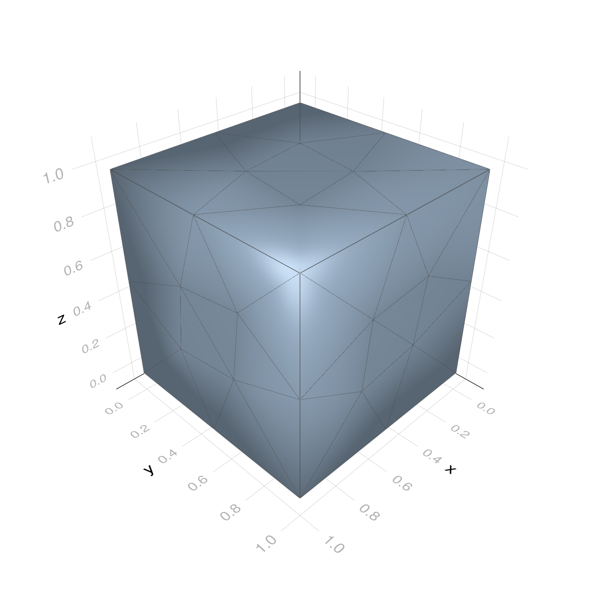
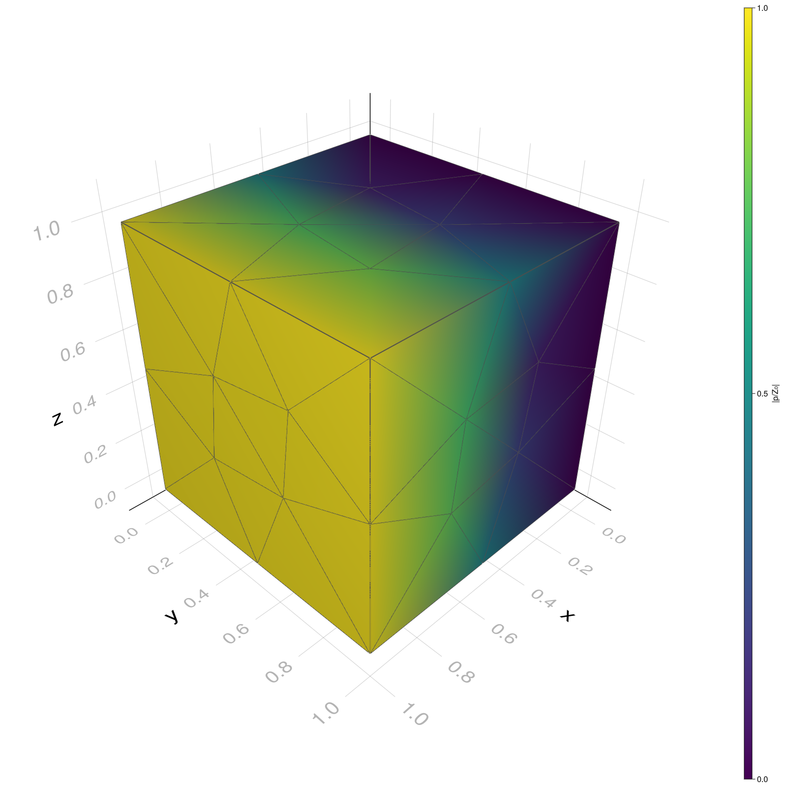

```@meta
EditURL = "../../../examples/3d_cube_wave.jl"
```

# Cube with vibrating sides (Interior)
# Importing related packages

````julia
using BoundaryIntegralEquations # For BIEs
using IterativeSolvers          # For gmres
using LinearAlgebra             # For Diagonal
using Plots                     # For 2d plots
using Meshes                    # For 3d mesh plots
import GLMakie as wgl
wgl.set_theme!(resolution=(1600, 1600))
````

# Setting up constants

````julia
frequency = 100.0;      # Frequency                [Hz]
c  = 343.0;             # Speed up sound           [m/s]
ρ₀ = 1.21;              # Mean density             [kg/m^3]
Z₀ = ρ₀*c;              # Characteristic impedance [Rayl]
v₀ = 1.0;               # Speed in the x-direction [m/s]
k  = 2π*frequency/c;    # Wavenumber
````

# Loading and visualizing the triangular cube mesh
First we define the path to the mesh file

````julia
mesh_file = joinpath(dirname(pathof(BoundaryIntegralEquations)),"..","examples","meshes","1m_cube_extremely_coarse");
````

Now we read in the mesh

````julia
physics_orders  = [:linear,:geometry,:disctriconstant,:disctrilinear,:disctriquadratic];
mesh = load3dTriangularComsolMesh(mesh_file;geometry_order=:linear, physics_order=physics_orders[5])
````

````
Number of elements: 	 84
Number of unkowns:  	 504
Geometry defined by:	 BoundaryIntegralEquations.TriangularLinear{Float64}
Physics defined by: 	 BoundaryIntegralEquations.DiscontinuousTriangularQuadratic{Float64}

````

We now define the mesh entity that contain the boundary condition. In this case it is boundary 0.

````julia
bc_ents = [0];
````

Now two simple meshes is created. One for the boundary condition and one for the remaining part of the mesh

````julia
simple_bc   = create_bc_simple_mesh(mesh,bc_ents);
simple_mesh = create_bc_simple_mesh(mesh,bc_ents,false);
````

Using the simple meshes we can visualize the mesh, with boundary 0 (where velocity condition will be applied) shown in red

````julia
fig = viz(simple_mesh;showfacets=true)
viz!(simple_bc;showfacets=true,color=:red)
````


# Analytical Solution
The analytical description of the interior pressure in unit cube with the side at ``x=0`` be applied a velocity of ``v_{0}``
```math
 p_\text{analytical}(x) = -\frac{\mathrm{i}Z_0v_{0}\cos(k(1 - x))}{\sin(k)}
```
where ``Z_0`` is the characteristic impedance and ``k`` is the wavenumber.
We now compute the analytical expression is computed at the points

````julia
x_ana = collect(0.00:0.01:1)
p_analytical = -im*Z₀*v₀*cos.(k*(1 .- x_ana))/(sin(k));
````

## Solution using the dense BEM
We start by solving the BEM system using dense matrices. For this we need to first assemble the matrices

````julia
F,G,C = assemble_parallel!(mesh,k,mesh.sources,n=2,m=2,progress=false);
H  = Diagonal(C) - F; # Adding the integral free term
````

In order to apply the boundary coniditon we must find the nodes corresponding to surface entity 0

````julia
bc_elements = 0 .== mesh.entities;
bc2 = sort(unique(mesh.physics_topology[:,bc_elements]));
````

We now define a vector corresponding to the velocities at `bc2`

````julia
v_bem = zeros(ComplexF64,length(C));
v_bem[bc2] .= im*Z₀*k*v₀*mesh.normals[1,bc2];
````

Using this we can define the right-hand side

````julia
b = G*v_bem;
````

Finally the pressures can be computed by solving a linear system of equations

````julia
p_bem = gmres(H,b;verbose=true);
````

````
=== gmres ===
rest	iter	resnorm
  1	  1	1.87e+03
  1	  2	9.34e+02
  1	  3	5.08e+02
  1	  4	1.82e+02
  1	  5	8.10e+01
  1	  6	3.87e+01
  1	  7	1.92e+01
  1	  8	7.68e+00
  1	  9	3.56e+00
  1	 10	1.37e+00
  1	 11	6.31e-01
  1	 12	2.55e-01
  1	 13	1.52e-01
  1	 14	6.56e-02
  1	 15	4.23e-02
  1	 16	1.67e-02
  1	 17	8.77e-03
  1	 18	3.87e-03
  1	 19	1.79e-03
  1	 20	1.09e-03
  2	  1	7.55e-04
  2	  2	4.27e-04
  2	  3	3.52e-04
  2	  4	3.14e-04
  2	  5	1.64e-04
  2	  6	8.69e-05
  2	  7	3.65e-05
  2	  8	1.99e-05


````

## Solution using the FMM-BEM
Similarly we can compute the BEM solution using the Fast Multipole Operators

````julia
Gf = FMMGOperator(mesh,k,depth=2);
Ff = FMMFOperator(mesh,k,depth=2);
Hf = 0.5I - Ff;
bf = Gf*v_bem;                     # Computing right-hand side
p_fmm = gmres(Hf,bf;verbose=true); # Solving the linear system
````

````
=== gmres ===
rest	iter	resnorm
  1	  1	1.87e+03
  1	  2	7.28e+02
  1	  3	1.83e+02
  1	  4	5.64e+01
  1	  5	1.38e+01
  1	  6	2.95e+00
  1	  7	9.62e-01
  1	  8	2.50e-01
  1	  9	6.49e-02
  1	 10	2.44e-02
  1	 11	7.74e-03
  1	 12	2.61e-03
  1	 13	1.01e-03
  1	 14	2.21e-04
  1	 15	7.88e-05
  1	 16	2.60e-05


````

# Field evaluations
In order to compare the results with the analytical solution we must use the found surface pressures to compute pressure at the interior field points. We therefore start by creating a matrix of points (as columns). Below ``N`` linearly spaced points defined by ``(x,0.5,0.5)`` with ``x\in[0.1,0.9]`` is created.

````julia
N = 20;
x = collect(0.1:(0.9-0.1)/(N-1):0.9);
y = 0.5ones(N);
z = 0.5ones(N);
X_fieldpoints = [x'; y'; z'];
````

Using the described field-points we can assemble the (dense) matrices for the field point evaluation

````julia
Fp,Gp,Cp = assemble_parallel!(mesh,k,X_fieldpoints,n=5,m=5,progress=false);
````

Using the matrices we can evalute the pressure at the field points using the previously found surface pressure

````julia
p_field  = Fp*p_bem + Gp*v_bem;
pf_field = Fp*p_fmm + Gp*v_bem;
````

Plotting the field point pressure it can be seen that all 3 methods find the correct pressures

````julia
plot(x_ana,abs.(p_analytical./Z₀), label="Analytical")
scatter!(x,abs.(p_field./Z₀),  label="Full", markershape=:rect)
scatter!(x,abs.(pf_field./Z₀), label="FMM")
ylabel!("|p/Z₀|"); xlabel!("r/a")
````

```@raw html
<?xml version="1.0" encoding="utf-8"?>
<svg xmlns="http://www.w3.org/2000/svg" xmlns:xlink="http://www.w3.org/1999/xlink" width="600" height="400" viewBox="0 0 2400 1600">
<defs>
  <clipPath id="clip680">
    <rect x="0" y="0" width="2400" height="1600"/>
  </clipPath>
</defs>
<path clip-path="url(#clip680)" d="M0 1600 L2400 1600 L2400 0 L0 0  Z" fill="#ffffff" fill-rule="evenodd" fill-opacity="1"/>
<defs>
  <clipPath id="clip681">
    <rect x="480" y="0" width="1681" height="1600"/>
  </clipPath>
</defs>
<path clip-path="url(#clip680)" d="M249.542 1423.18 L2352.76 1423.18 L2352.76 47.2441 L249.542 47.2441  Z" fill="#ffffff" fill-rule="evenodd" fill-opacity="1"/>
<defs>
  <clipPath id="clip682">
    <rect x="249" y="47" width="2104" height="1377"/>
  </clipPath>
</defs>
<polyline clip-path="url(#clip682)" style="stroke:#000000; stroke-linecap:round; stroke-linejoin:round; stroke-width:2; stroke-opacity:0.1; fill:none" points="309.067,1423.18 309.067,47.2441 "/>
<polyline clip-path="url(#clip682)" style="stroke:#000000; stroke-linecap:round; stroke-linejoin:round; stroke-width:2; stroke-opacity:0.1; fill:none" points="805.108,1423.18 805.108,47.2441 "/>
<polyline clip-path="url(#clip682)" style="stroke:#000000; stroke-linecap:round; stroke-linejoin:round; stroke-width:2; stroke-opacity:0.1; fill:none" points="1301.15,1423.18 1301.15,47.2441 "/>
<polyline clip-path="url(#clip682)" style="stroke:#000000; stroke-linecap:round; stroke-linejoin:round; stroke-width:2; stroke-opacity:0.1; fill:none" points="1797.19,1423.18 1797.19,47.2441 "/>
<polyline clip-path="url(#clip682)" style="stroke:#000000; stroke-linecap:round; stroke-linejoin:round; stroke-width:2; stroke-opacity:0.1; fill:none" points="2293.23,1423.18 2293.23,47.2441 "/>
<polyline clip-path="url(#clip680)" style="stroke:#000000; stroke-linecap:round; stroke-linejoin:round; stroke-width:4; stroke-opacity:1; fill:none" points="249.542,1423.18 2352.76,1423.18 "/>
<polyline clip-path="url(#clip680)" style="stroke:#000000; stroke-linecap:round; stroke-linejoin:round; stroke-width:4; stroke-opacity:1; fill:none" points="309.067,1423.18 309.067,1404.28 "/>
<polyline clip-path="url(#clip680)" style="stroke:#000000; stroke-linecap:round; stroke-linejoin:round; stroke-width:4; stroke-opacity:1; fill:none" points="805.108,1423.18 805.108,1404.28 "/>
<polyline clip-path="url(#clip680)" style="stroke:#000000; stroke-linecap:round; stroke-linejoin:round; stroke-width:4; stroke-opacity:1; fill:none" points="1301.15,1423.18 1301.15,1404.28 "/>
<polyline clip-path="url(#clip680)" style="stroke:#000000; stroke-linecap:round; stroke-linejoin:round; stroke-width:4; stroke-opacity:1; fill:none" points="1797.19,1423.18 1797.19,1404.28 "/>
<polyline clip-path="url(#clip680)" style="stroke:#000000; stroke-linecap:round; stroke-linejoin:round; stroke-width:4; stroke-opacity:1; fill:none" points="2293.23,1423.18 2293.23,1404.28 "/>
<path clip-path="url(#clip680)" d="M271.37 1454.1 Q267.759 1454.1 265.931 1457.66 Q264.125 1461.2 264.125 1468.33 Q264.125 1475.44 265.931 1479.01 Q267.759 1482.55 271.37 1482.55 Q275.005 1482.55 276.81 1479.01 Q278.639 1475.44 278.639 1468.33 Q278.639 1461.2 276.81 1457.66 Q275.005 1454.1 271.37 1454.1 M271.37 1450.39 Q277.181 1450.39 280.236 1455 Q283.315 1459.58 283.315 1468.33 Q283.315 1477.06 280.236 1481.67 Q277.181 1486.25 271.37 1486.25 Q265.56 1486.25 262.482 1481.67 Q259.426 1477.06 259.426 1468.33 Q259.426 1459.58 262.482 1455 Q265.56 1450.39 271.37 1450.39 Z" fill="#000000" fill-rule="nonzero" fill-opacity="1" /><path clip-path="url(#clip680)" d="M291.532 1479.7 L296.417 1479.7 L296.417 1485.58 L291.532 1485.58 L291.532 1479.7 Z" fill="#000000" fill-rule="nonzero" fill-opacity="1" /><path clip-path="url(#clip680)" d="M316.602 1454.1 Q312.991 1454.1 311.162 1457.66 Q309.356 1461.2 309.356 1468.33 Q309.356 1475.44 311.162 1479.01 Q312.991 1482.55 316.602 1482.55 Q320.236 1482.55 322.041 1479.01 Q323.87 1475.44 323.87 1468.33 Q323.87 1461.2 322.041 1457.66 Q320.236 1454.1 316.602 1454.1 M316.602 1450.39 Q322.412 1450.39 325.467 1455 Q328.546 1459.58 328.546 1468.33 Q328.546 1477.06 325.467 1481.67 Q322.412 1486.25 316.602 1486.25 Q310.791 1486.25 307.713 1481.67 Q304.657 1477.06 304.657 1468.33 Q304.657 1459.58 307.713 1455 Q310.791 1450.39 316.602 1450.39 Z" fill="#000000" fill-rule="nonzero" fill-opacity="1" /><path clip-path="url(#clip680)" d="M346.764 1454.1 Q343.152 1454.1 341.324 1457.66 Q339.518 1461.2 339.518 1468.33 Q339.518 1475.44 341.324 1479.01 Q343.152 1482.55 346.764 1482.55 Q350.398 1482.55 352.203 1479.01 Q354.032 1475.44 354.032 1468.33 Q354.032 1461.2 352.203 1457.66 Q350.398 1454.1 346.764 1454.1 M346.764 1450.39 Q352.574 1450.39 355.629 1455 Q358.708 1459.58 358.708 1468.33 Q358.708 1477.06 355.629 1481.67 Q352.574 1486.25 346.764 1486.25 Q340.953 1486.25 337.875 1481.67 Q334.819 1477.06 334.819 1468.33 Q334.819 1459.58 337.875 1455 Q340.953 1450.39 346.764 1450.39 Z" fill="#000000" fill-rule="nonzero" fill-opacity="1" /><path clip-path="url(#clip680)" d="M767.909 1454.1 Q764.298 1454.1 762.469 1457.66 Q760.664 1461.2 760.664 1468.33 Q760.664 1475.44 762.469 1479.01 Q764.298 1482.55 767.909 1482.55 Q771.543 1482.55 773.349 1479.01 Q775.178 1475.44 775.178 1468.33 Q775.178 1461.2 773.349 1457.66 Q771.543 1454.1 767.909 1454.1 M767.909 1450.39 Q773.719 1450.39 776.775 1455 Q779.853 1459.58 779.853 1468.33 Q779.853 1477.06 776.775 1481.67 Q773.719 1486.25 767.909 1486.25 Q762.099 1486.25 759.02 1481.67 Q755.965 1477.06 755.965 1468.33 Q755.965 1459.58 759.02 1455 Q762.099 1450.39 767.909 1450.39 Z" fill="#000000" fill-rule="nonzero" fill-opacity="1" /><path clip-path="url(#clip680)" d="M788.071 1479.7 L792.955 1479.7 L792.955 1485.58 L788.071 1485.58 L788.071 1479.7 Z" fill="#000000" fill-rule="nonzero" fill-opacity="1" /><path clip-path="url(#clip680)" d="M807.168 1481.64 L823.487 1481.64 L823.487 1485.58 L801.543 1485.58 L801.543 1481.64 Q804.205 1478.89 808.788 1474.26 Q813.395 1469.61 814.576 1468.27 Q816.821 1465.74 817.7 1464.01 Q818.603 1462.25 818.603 1460.56 Q818.603 1457.8 816.659 1456.07 Q814.738 1454.33 811.636 1454.33 Q809.437 1454.33 806.983 1455.09 Q804.552 1455.86 801.775 1457.41 L801.775 1452.69 Q804.599 1451.55 807.052 1450.97 Q809.506 1450.39 811.543 1450.39 Q816.913 1450.39 820.108 1453.08 Q823.302 1455.77 823.302 1460.26 Q823.302 1462.39 822.492 1464.31 Q821.705 1466.2 819.599 1468.8 Q819.02 1469.47 815.918 1472.69 Q812.816 1475.88 807.168 1481.64 Z" fill="#000000" fill-rule="nonzero" fill-opacity="1" /><path clip-path="url(#clip680)" d="M833.349 1451.02 L851.705 1451.02 L851.705 1454.96 L837.631 1454.96 L837.631 1463.43 Q838.649 1463.08 839.668 1462.92 Q840.686 1462.73 841.705 1462.73 Q847.492 1462.73 850.872 1465.9 Q854.251 1469.08 854.251 1474.49 Q854.251 1480.07 850.779 1483.17 Q847.307 1486.25 840.987 1486.25 Q838.811 1486.25 836.543 1485.88 Q834.298 1485.51 831.89 1484.77 L831.89 1480.07 Q833.974 1481.2 836.196 1481.76 Q838.418 1482.32 840.895 1482.32 Q844.899 1482.32 847.237 1480.21 Q849.575 1478.1 849.575 1474.49 Q849.575 1470.88 847.237 1468.77 Q844.899 1466.67 840.895 1466.67 Q839.02 1466.67 837.145 1467.08 Q835.293 1467.5 833.349 1468.38 L833.349 1451.02 Z" fill="#000000" fill-rule="nonzero" fill-opacity="1" /><path clip-path="url(#clip680)" d="M1263.45 1454.1 Q1259.84 1454.1 1258.01 1457.66 Q1256.21 1461.2 1256.21 1468.33 Q1256.21 1475.44 1258.01 1479.01 Q1259.84 1482.55 1263.45 1482.55 Q1267.09 1482.55 1268.89 1479.01 Q1270.72 1475.44 1270.72 1468.33 Q1270.72 1461.2 1268.89 1457.66 Q1267.09 1454.1 1263.45 1454.1 M1263.45 1450.39 Q1269.26 1450.39 1272.32 1455 Q1275.4 1459.58 1275.4 1468.33 Q1275.4 1477.06 1272.32 1481.67 Q1269.26 1486.25 1263.45 1486.25 Q1257.64 1486.25 1254.56 1481.67 Q1251.51 1477.06 1251.51 1468.33 Q1251.51 1459.58 1254.56 1455 Q1257.64 1450.39 1263.45 1450.39 Z" fill="#000000" fill-rule="nonzero" fill-opacity="1" /><path clip-path="url(#clip680)" d="M1283.61 1479.7 L1288.5 1479.7 L1288.5 1485.58 L1283.61 1485.58 L1283.61 1479.7 Z" fill="#000000" fill-rule="nonzero" fill-opacity="1" /><path clip-path="url(#clip680)" d="M1298.73 1451.02 L1317.09 1451.02 L1317.09 1454.96 L1303.01 1454.96 L1303.01 1463.43 Q1304.03 1463.08 1305.05 1462.92 Q1306.07 1462.73 1307.09 1462.73 Q1312.87 1462.73 1316.25 1465.9 Q1319.63 1469.08 1319.63 1474.49 Q1319.63 1480.07 1316.16 1483.17 Q1312.69 1486.25 1306.37 1486.25 Q1304.19 1486.25 1301.92 1485.88 Q1299.68 1485.51 1297.27 1484.77 L1297.27 1480.07 Q1299.35 1481.2 1301.58 1481.76 Q1303.8 1482.32 1306.28 1482.32 Q1310.28 1482.32 1312.62 1480.21 Q1314.96 1478.1 1314.96 1474.49 Q1314.96 1470.88 1312.62 1468.77 Q1310.28 1466.67 1306.28 1466.67 Q1304.4 1466.67 1302.53 1467.08 Q1300.67 1467.5 1298.73 1468.38 L1298.73 1451.02 Z" fill="#000000" fill-rule="nonzero" fill-opacity="1" /><path clip-path="url(#clip680)" d="M1338.85 1454.1 Q1335.23 1454.1 1333.41 1457.66 Q1331.6 1461.2 1331.6 1468.33 Q1331.6 1475.44 1333.41 1479.01 Q1335.23 1482.55 1338.85 1482.55 Q1342.48 1482.55 1344.29 1479.01 Q1346.11 1475.44 1346.11 1468.33 Q1346.11 1461.2 1344.29 1457.66 Q1342.48 1454.1 1338.85 1454.1 M1338.85 1450.39 Q1344.66 1450.39 1347.71 1455 Q1350.79 1459.58 1350.79 1468.33 Q1350.79 1477.06 1347.71 1481.67 Q1344.66 1486.25 1338.85 1486.25 Q1333.04 1486.25 1329.96 1481.67 Q1326.9 1477.06 1326.9 1468.33 Q1326.9 1459.58 1329.96 1455 Q1333.04 1450.39 1338.85 1450.39 Z" fill="#000000" fill-rule="nonzero" fill-opacity="1" /><path clip-path="url(#clip680)" d="M1759.99 1454.1 Q1756.38 1454.1 1754.55 1457.66 Q1752.75 1461.2 1752.75 1468.33 Q1752.75 1475.44 1754.55 1479.01 Q1756.38 1482.55 1759.99 1482.55 Q1763.63 1482.55 1765.43 1479.01 Q1767.26 1475.44 1767.26 1468.33 Q1767.26 1461.2 1765.43 1457.66 Q1763.63 1454.1 1759.99 1454.1 M1759.99 1450.39 Q1765.8 1450.39 1768.86 1455 Q1771.94 1459.58 1771.94 1468.33 Q1771.94 1477.06 1768.86 1481.67 Q1765.8 1486.25 1759.99 1486.25 Q1754.18 1486.25 1751.1 1481.67 Q1748.05 1477.06 1748.05 1468.33 Q1748.05 1459.58 1751.1 1455 Q1754.18 1450.39 1759.99 1450.39 Z" fill="#000000" fill-rule="nonzero" fill-opacity="1" /><path clip-path="url(#clip680)" d="M1780.15 1479.7 L1785.04 1479.7 L1785.04 1485.58 L1780.15 1485.58 L1780.15 1479.7 Z" fill="#000000" fill-rule="nonzero" fill-opacity="1" /><path clip-path="url(#clip680)" d="M1794.04 1451.02 L1816.26 1451.02 L1816.26 1453.01 L1803.72 1485.58 L1798.83 1485.58 L1810.64 1454.96 L1794.04 1454.96 L1794.04 1451.02 Z" fill="#000000" fill-rule="nonzero" fill-opacity="1" /><path clip-path="url(#clip680)" d="M1825.43 1451.02 L1843.79 1451.02 L1843.79 1454.96 L1829.71 1454.96 L1829.71 1463.43 Q1830.73 1463.08 1831.75 1462.92 Q1832.77 1462.73 1833.79 1462.73 Q1839.57 1462.73 1842.95 1465.9 Q1846.33 1469.08 1846.33 1474.49 Q1846.33 1480.07 1842.86 1483.17 Q1839.39 1486.25 1833.07 1486.25 Q1830.89 1486.25 1828.62 1485.88 Q1826.38 1485.51 1823.97 1484.77 L1823.97 1480.07 Q1826.06 1481.2 1828.28 1481.76 Q1830.5 1482.32 1832.98 1482.32 Q1836.98 1482.32 1839.32 1480.21 Q1841.66 1478.1 1841.66 1474.49 Q1841.66 1470.88 1839.32 1468.77 Q1836.98 1466.67 1832.98 1466.67 Q1831.1 1466.67 1829.23 1467.08 Q1827.38 1467.5 1825.43 1468.38 L1825.43 1451.02 Z" fill="#000000" fill-rule="nonzero" fill-opacity="1" /><path clip-path="url(#clip680)" d="M2245.3 1481.64 L2252.94 1481.64 L2252.94 1455.28 L2244.63 1456.95 L2244.63 1452.69 L2252.9 1451.02 L2257.57 1451.02 L2257.57 1481.64 L2265.21 1481.64 L2265.21 1485.58 L2245.3 1485.58 L2245.3 1481.64 Z" fill="#000000" fill-rule="nonzero" fill-opacity="1" /><path clip-path="url(#clip680)" d="M2274.65 1479.7 L2279.54 1479.7 L2279.54 1485.58 L2274.65 1485.58 L2274.65 1479.7 Z" fill="#000000" fill-rule="nonzero" fill-opacity="1" /><path clip-path="url(#clip680)" d="M2299.72 1454.1 Q2296.11 1454.1 2294.28 1457.66 Q2292.48 1461.2 2292.48 1468.33 Q2292.48 1475.44 2294.28 1479.01 Q2296.11 1482.55 2299.72 1482.55 Q2303.36 1482.55 2305.16 1479.01 Q2306.99 1475.44 2306.99 1468.33 Q2306.99 1461.2 2305.16 1457.66 Q2303.36 1454.1 2299.72 1454.1 M2299.72 1450.39 Q2305.53 1450.39 2308.59 1455 Q2311.67 1459.58 2311.67 1468.33 Q2311.67 1477.06 2308.59 1481.67 Q2305.53 1486.25 2299.72 1486.25 Q2293.91 1486.25 2290.84 1481.67 Q2287.78 1477.06 2287.78 1468.33 Q2287.78 1459.58 2290.84 1455 Q2293.91 1450.39 2299.72 1450.39 Z" fill="#000000" fill-rule="nonzero" fill-opacity="1" /><path clip-path="url(#clip680)" d="M2329.89 1454.1 Q2326.27 1454.1 2324.45 1457.66 Q2322.64 1461.2 2322.64 1468.33 Q2322.64 1475.44 2324.45 1479.01 Q2326.27 1482.55 2329.89 1482.55 Q2333.52 1482.55 2335.33 1479.01 Q2337.15 1475.44 2337.15 1468.33 Q2337.15 1461.2 2335.33 1457.66 Q2333.52 1454.1 2329.89 1454.1 M2329.89 1450.39 Q2335.7 1450.39 2338.75 1455 Q2341.83 1459.58 2341.83 1468.33 Q2341.83 1477.06 2338.75 1481.67 Q2335.7 1486.25 2329.89 1486.25 Q2324.08 1486.25 2321 1481.67 Q2317.94 1477.06 2317.94 1468.33 Q2317.94 1459.58 2321 1455 Q2324.08 1450.39 2329.89 1450.39 Z" fill="#000000" fill-rule="nonzero" fill-opacity="1" /><path clip-path="url(#clip680)" d="M1283.6 1537.87 Q1282.61 1537.3 1281.43 1537.04 Q1280.29 1536.76 1278.88 1536.76 Q1273.92 1536.76 1271.25 1540 Q1268.6 1543.22 1268.6 1549.27 L1268.6 1568.04 L1262.72 1568.04 L1262.72 1532.4 L1268.6 1532.4 L1268.6 1537.93 Q1270.45 1534.69 1273.41 1533.13 Q1276.37 1531.54 1280.6 1531.54 Q1281.21 1531.54 1281.94 1531.63 Q1282.67 1531.7 1283.56 1531.85 L1283.6 1537.87 Z" fill="#000000" fill-rule="nonzero" fill-opacity="1" /><path clip-path="url(#clip680)" d="M1300.15 1520.52 L1305.56 1520.52 L1289.01 1574.09 L1283.6 1574.09 L1300.15 1520.52 Z" fill="#000000" fill-rule="nonzero" fill-opacity="1" /><path clip-path="url(#clip680)" d="M1327.9 1550.12 Q1320.8 1550.12 1318.07 1551.75 Q1315.33 1553.37 1315.33 1557.29 Q1315.33 1560.4 1317.37 1562.25 Q1319.43 1564.07 1322.97 1564.07 Q1327.84 1564.07 1330.77 1560.63 Q1333.73 1557.16 1333.73 1551.43 L1333.73 1550.12 L1327.9 1550.12 M1339.58 1547.71 L1339.58 1568.04 L1333.73 1568.04 L1333.73 1562.63 Q1331.72 1565.88 1328.73 1567.44 Q1325.74 1568.97 1321.41 1568.97 Q1315.93 1568.97 1312.69 1565.91 Q1309.47 1562.82 1309.47 1557.67 Q1309.47 1551.65 1313.48 1548.6 Q1317.52 1545.54 1325.51 1545.54 L1333.73 1545.54 L1333.73 1544.97 Q1333.73 1540.93 1331.05 1538.73 Q1328.41 1536.5 1323.6 1536.5 Q1320.55 1536.5 1317.65 1537.23 Q1314.76 1537.97 1312.08 1539.43 L1312.08 1534.02 Q1315.3 1532.78 1318.32 1532.17 Q1321.34 1531.54 1324.21 1531.54 Q1331.94 1531.54 1335.76 1535.55 Q1339.58 1539.56 1339.58 1547.71 Z" fill="#000000" fill-rule="nonzero" fill-opacity="1" /><polyline clip-path="url(#clip682)" style="stroke:#000000; stroke-linecap:round; stroke-linejoin:round; stroke-width:2; stroke-opacity:0.1; fill:none" points="249.542,1384.92 2352.76,1384.92 "/>
<polyline clip-path="url(#clip682)" style="stroke:#000000; stroke-linecap:round; stroke-linejoin:round; stroke-width:2; stroke-opacity:0.1; fill:none" points="249.542,1072.8 2352.76,1072.8 "/>
<polyline clip-path="url(#clip682)" style="stroke:#000000; stroke-linecap:round; stroke-linejoin:round; stroke-width:2; stroke-opacity:0.1; fill:none" points="249.542,760.682 2352.76,760.682 "/>
<polyline clip-path="url(#clip682)" style="stroke:#000000; stroke-linecap:round; stroke-linejoin:round; stroke-width:2; stroke-opacity:0.1; fill:none" points="249.542,448.565 2352.76,448.565 "/>
<polyline clip-path="url(#clip682)" style="stroke:#000000; stroke-linecap:round; stroke-linejoin:round; stroke-width:2; stroke-opacity:0.1; fill:none" points="249.542,136.448 2352.76,136.448 "/>
<polyline clip-path="url(#clip680)" style="stroke:#000000; stroke-linecap:round; stroke-linejoin:round; stroke-width:4; stroke-opacity:1; fill:none" points="249.542,1423.18 249.542,47.2441 "/>
<polyline clip-path="url(#clip680)" style="stroke:#000000; stroke-linecap:round; stroke-linejoin:round; stroke-width:4; stroke-opacity:1; fill:none" points="249.542,1384.92 268.44,1384.92 "/>
<polyline clip-path="url(#clip680)" style="stroke:#000000; stroke-linecap:round; stroke-linejoin:round; stroke-width:4; stroke-opacity:1; fill:none" points="249.542,1072.8 268.44,1072.8 "/>
<polyline clip-path="url(#clip680)" style="stroke:#000000; stroke-linecap:round; stroke-linejoin:round; stroke-width:4; stroke-opacity:1; fill:none" points="249.542,760.682 268.44,760.682 "/>
<polyline clip-path="url(#clip680)" style="stroke:#000000; stroke-linecap:round; stroke-linejoin:round; stroke-width:4; stroke-opacity:1; fill:none" points="249.542,448.565 268.44,448.565 "/>
<polyline clip-path="url(#clip680)" style="stroke:#000000; stroke-linecap:round; stroke-linejoin:round; stroke-width:4; stroke-opacity:1; fill:none" points="249.542,136.448 268.44,136.448 "/>
<path clip-path="url(#clip680)" d="M126.205 1370.71 Q122.593 1370.71 120.765 1374.28 Q118.959 1377.82 118.959 1384.95 Q118.959 1392.06 120.765 1395.62 Q122.593 1399.16 126.205 1399.16 Q129.839 1399.16 131.644 1395.62 Q133.473 1392.06 133.473 1384.95 Q133.473 1377.82 131.644 1374.28 Q129.839 1370.71 126.205 1370.71 M126.205 1367.01 Q132.015 1367.01 135.07 1371.62 Q138.149 1376.2 138.149 1384.95 Q138.149 1393.68 135.07 1398.28 Q132.015 1402.87 126.205 1402.87 Q120.394 1402.87 117.316 1398.28 Q114.26 1393.68 114.26 1384.95 Q114.26 1376.2 117.316 1371.62 Q120.394 1367.01 126.205 1367.01 Z" fill="#000000" fill-rule="nonzero" fill-opacity="1" /><path clip-path="url(#clip680)" d="M146.366 1396.32 L151.251 1396.32 L151.251 1402.2 L146.366 1402.2 L146.366 1396.32 Z" fill="#000000" fill-rule="nonzero" fill-opacity="1" /><path clip-path="url(#clip680)" d="M171.436 1370.71 Q167.825 1370.71 165.996 1374.28 Q164.19 1377.82 164.19 1384.95 Q164.19 1392.06 165.996 1395.62 Q167.825 1399.16 171.436 1399.16 Q175.07 1399.16 176.876 1395.62 Q178.704 1392.06 178.704 1384.95 Q178.704 1377.82 176.876 1374.28 Q175.07 1370.71 171.436 1370.71 M171.436 1367.01 Q177.246 1367.01 180.301 1371.62 Q183.38 1376.2 183.38 1384.95 Q183.38 1393.68 180.301 1398.28 Q177.246 1402.87 171.436 1402.87 Q165.626 1402.87 162.547 1398.28 Q159.491 1393.68 159.491 1384.95 Q159.491 1376.2 162.547 1371.62 Q165.626 1367.01 171.436 1367.01 Z" fill="#000000" fill-rule="nonzero" fill-opacity="1" /><path clip-path="url(#clip680)" d="M201.598 1370.71 Q197.987 1370.71 196.158 1374.28 Q194.352 1377.82 194.352 1384.95 Q194.352 1392.06 196.158 1395.62 Q197.987 1399.16 201.598 1399.16 Q205.232 1399.16 207.037 1395.62 Q208.866 1392.06 208.866 1384.95 Q208.866 1377.82 207.037 1374.28 Q205.232 1370.71 201.598 1370.71 M201.598 1367.01 Q207.408 1367.01 210.463 1371.62 Q213.542 1376.2 213.542 1384.95 Q213.542 1393.68 210.463 1398.28 Q207.408 1402.87 201.598 1402.87 Q195.787 1402.87 192.709 1398.28 Q189.653 1393.68 189.653 1384.95 Q189.653 1376.2 192.709 1371.62 Q195.787 1367.01 201.598 1367.01 Z" fill="#000000" fill-rule="nonzero" fill-opacity="1" /><path clip-path="url(#clip680)" d="M127.2 1058.6 Q123.589 1058.6 121.76 1062.16 Q119.955 1065.7 119.955 1072.83 Q119.955 1079.94 121.76 1083.5 Q123.589 1087.05 127.2 1087.05 Q130.834 1087.05 132.64 1083.5 Q134.468 1079.94 134.468 1072.83 Q134.468 1065.7 132.64 1062.16 Q130.834 1058.6 127.2 1058.6 M127.2 1054.89 Q133.01 1054.89 136.066 1059.5 Q139.144 1064.08 139.144 1072.83 Q139.144 1081.56 136.066 1086.17 Q133.01 1090.75 127.2 1090.75 Q121.39 1090.75 118.311 1086.17 Q115.256 1081.56 115.256 1072.83 Q115.256 1064.08 118.311 1059.5 Q121.39 1054.89 127.2 1054.89 Z" fill="#000000" fill-rule="nonzero" fill-opacity="1" /><path clip-path="url(#clip680)" d="M147.362 1084.2 L152.246 1084.2 L152.246 1090.08 L147.362 1090.08 L147.362 1084.2 Z" fill="#000000" fill-rule="nonzero" fill-opacity="1" /><path clip-path="url(#clip680)" d="M166.459 1086.14 L182.778 1086.14 L182.778 1090.08 L160.834 1090.08 L160.834 1086.14 Q163.496 1083.39 168.079 1078.76 Q172.686 1074.11 173.866 1072.76 Q176.112 1070.24 176.991 1068.51 Q177.894 1066.75 177.894 1065.06 Q177.894 1062.3 175.95 1060.57 Q174.028 1058.83 170.927 1058.83 Q168.727 1058.83 166.274 1059.59 Q163.843 1060.36 161.065 1061.91 L161.065 1057.19 Q163.89 1056.05 166.343 1055.47 Q168.797 1054.89 170.834 1054.89 Q176.204 1054.89 179.399 1057.58 Q182.593 1060.26 182.593 1064.76 Q182.593 1066.88 181.783 1068.81 Q180.996 1070.7 178.889 1073.3 Q178.311 1073.97 175.209 1077.19 Q172.107 1080.38 166.459 1086.14 Z" fill="#000000" fill-rule="nonzero" fill-opacity="1" /><path clip-path="url(#clip680)" d="M192.639 1055.52 L210.996 1055.52 L210.996 1059.45 L196.922 1059.45 L196.922 1067.93 Q197.94 1067.58 198.959 1067.42 Q199.977 1067.23 200.996 1067.23 Q206.783 1067.23 210.162 1070.4 Q213.542 1073.57 213.542 1078.99 Q213.542 1084.57 210.07 1087.67 Q206.598 1090.75 200.278 1090.75 Q198.102 1090.75 195.834 1090.38 Q193.588 1090.01 191.181 1089.27 L191.181 1084.57 Q193.264 1085.7 195.487 1086.26 Q197.709 1086.82 200.186 1086.82 Q204.19 1086.82 206.528 1084.71 Q208.866 1082.6 208.866 1078.99 Q208.866 1075.38 206.528 1073.27 Q204.19 1071.17 200.186 1071.17 Q198.311 1071.17 196.436 1071.58 Q194.584 1072 192.639 1072.88 L192.639 1055.52 Z" fill="#000000" fill-rule="nonzero" fill-opacity="1" /><path clip-path="url(#clip680)" d="M126.205 746.481 Q122.593 746.481 120.765 750.045 Q118.959 753.587 118.959 760.717 Q118.959 767.823 120.765 771.388 Q122.593 774.929 126.205 774.929 Q129.839 774.929 131.644 771.388 Q133.473 767.823 133.473 760.717 Q133.473 753.587 131.644 750.045 Q129.839 746.481 126.205 746.481 M126.205 742.777 Q132.015 742.777 135.07 747.383 Q138.149 751.967 138.149 760.717 Q138.149 769.443 135.07 774.05 Q132.015 778.633 126.205 778.633 Q120.394 778.633 117.316 774.05 Q114.26 769.443 114.26 760.717 Q114.26 751.967 117.316 747.383 Q120.394 742.777 126.205 742.777 Z" fill="#000000" fill-rule="nonzero" fill-opacity="1" /><path clip-path="url(#clip680)" d="M146.366 772.082 L151.251 772.082 L151.251 777.962 L146.366 777.962 L146.366 772.082 Z" fill="#000000" fill-rule="nonzero" fill-opacity="1" /><path clip-path="url(#clip680)" d="M161.482 743.402 L179.839 743.402 L179.839 747.337 L165.765 747.337 L165.765 755.809 Q166.783 755.462 167.802 755.3 Q168.82 755.115 169.839 755.115 Q175.626 755.115 179.005 758.286 Q182.385 761.457 182.385 766.874 Q182.385 772.453 178.913 775.554 Q175.44 778.633 169.121 778.633 Q166.945 778.633 164.677 778.263 Q162.431 777.892 160.024 777.152 L160.024 772.453 Q162.107 773.587 164.329 774.142 Q166.552 774.698 169.028 774.698 Q173.033 774.698 175.371 772.592 Q177.709 770.485 177.709 766.874 Q177.709 763.263 175.371 761.156 Q173.033 759.05 169.028 759.05 Q167.153 759.05 165.278 759.467 Q163.427 759.883 161.482 760.763 L161.482 743.402 Z" fill="#000000" fill-rule="nonzero" fill-opacity="1" /><path clip-path="url(#clip680)" d="M201.598 746.481 Q197.987 746.481 196.158 750.045 Q194.352 753.587 194.352 760.717 Q194.352 767.823 196.158 771.388 Q197.987 774.929 201.598 774.929 Q205.232 774.929 207.037 771.388 Q208.866 767.823 208.866 760.717 Q208.866 753.587 207.037 750.045 Q205.232 746.481 201.598 746.481 M201.598 742.777 Q207.408 742.777 210.463 747.383 Q213.542 751.967 213.542 760.717 Q213.542 769.443 210.463 774.05 Q207.408 778.633 201.598 778.633 Q195.787 778.633 192.709 774.05 Q189.653 769.443 189.653 760.717 Q189.653 751.967 192.709 747.383 Q195.787 742.777 201.598 742.777 Z" fill="#000000" fill-rule="nonzero" fill-opacity="1" /><path clip-path="url(#clip680)" d="M127.2 434.363 Q123.589 434.363 121.76 437.928 Q119.955 441.47 119.955 448.599 Q119.955 455.706 121.76 459.271 Q123.589 462.812 127.2 462.812 Q130.834 462.812 132.64 459.271 Q134.468 455.706 134.468 448.599 Q134.468 441.47 132.64 437.928 Q130.834 434.363 127.2 434.363 M127.2 430.66 Q133.01 430.66 136.066 435.266 Q139.144 439.85 139.144 448.599 Q139.144 457.326 136.066 461.933 Q133.01 466.516 127.2 466.516 Q121.39 466.516 118.311 461.933 Q115.256 457.326 115.256 448.599 Q115.256 439.85 118.311 435.266 Q121.39 430.66 127.2 430.66 Z" fill="#000000" fill-rule="nonzero" fill-opacity="1" /><path clip-path="url(#clip680)" d="M147.362 459.965 L152.246 459.965 L152.246 465.845 L147.362 465.845 L147.362 459.965 Z" fill="#000000" fill-rule="nonzero" fill-opacity="1" /><path clip-path="url(#clip680)" d="M161.251 431.285 L183.473 431.285 L183.473 433.275 L170.927 465.845 L166.042 465.845 L177.848 435.22 L161.251 435.22 L161.251 431.285 Z" fill="#000000" fill-rule="nonzero" fill-opacity="1" /><path clip-path="url(#clip680)" d="M192.639 431.285 L210.996 431.285 L210.996 435.22 L196.922 435.22 L196.922 443.692 Q197.94 443.345 198.959 443.183 Q199.977 442.998 200.996 442.998 Q206.783 442.998 210.162 446.169 Q213.542 449.34 213.542 454.757 Q213.542 460.336 210.07 463.437 Q206.598 466.516 200.278 466.516 Q198.102 466.516 195.834 466.146 Q193.588 465.775 191.181 465.035 L191.181 460.336 Q193.264 461.47 195.487 462.025 Q197.709 462.581 200.186 462.581 Q204.19 462.581 206.528 460.474 Q208.866 458.368 208.866 454.757 Q208.866 451.146 206.528 449.039 Q204.19 446.933 200.186 446.933 Q198.311 446.933 196.436 447.349 Q194.584 447.766 192.639 448.646 L192.639 431.285 Z" fill="#000000" fill-rule="nonzero" fill-opacity="1" /><path clip-path="url(#clip680)" d="M117.015 149.792 L124.654 149.792 L124.654 123.427 L116.343 125.093 L116.343 120.834 L124.607 119.168 L129.283 119.168 L129.283 149.792 L136.922 149.792 L136.922 153.728 L117.015 153.728 L117.015 149.792 Z" fill="#000000" fill-rule="nonzero" fill-opacity="1" /><path clip-path="url(#clip680)" d="M146.366 147.848 L151.251 147.848 L151.251 153.728 L146.366 153.728 L146.366 147.848 Z" fill="#000000" fill-rule="nonzero" fill-opacity="1" /><path clip-path="url(#clip680)" d="M171.436 122.246 Q167.825 122.246 165.996 125.811 Q164.19 129.353 164.19 136.482 Q164.19 143.589 165.996 147.154 Q167.825 150.695 171.436 150.695 Q175.07 150.695 176.876 147.154 Q178.704 143.589 178.704 136.482 Q178.704 129.353 176.876 125.811 Q175.07 122.246 171.436 122.246 M171.436 118.543 Q177.246 118.543 180.301 123.149 Q183.38 127.732 183.38 136.482 Q183.38 145.209 180.301 149.816 Q177.246 154.399 171.436 154.399 Q165.626 154.399 162.547 149.816 Q159.491 145.209 159.491 136.482 Q159.491 127.732 162.547 123.149 Q165.626 118.543 171.436 118.543 Z" fill="#000000" fill-rule="nonzero" fill-opacity="1" /><path clip-path="url(#clip680)" d="M201.598 122.246 Q197.987 122.246 196.158 125.811 Q194.352 129.353 194.352 136.482 Q194.352 143.589 196.158 147.154 Q197.987 150.695 201.598 150.695 Q205.232 150.695 207.037 147.154 Q208.866 143.589 208.866 136.482 Q208.866 129.353 207.037 125.811 Q205.232 122.246 201.598 122.246 M201.598 118.543 Q207.408 118.543 210.463 123.149 Q213.542 127.732 213.542 136.482 Q213.542 145.209 210.463 149.816 Q207.408 154.399 201.598 154.399 Q195.787 154.399 192.709 149.816 Q189.653 145.209 189.653 136.482 Q189.653 127.732 192.709 123.149 Q195.787 118.543 201.598 118.543 Z" fill="#000000" fill-rule="nonzero" fill-opacity="1" /><path clip-path="url(#clip680)" d="M14.1925 810.55 L79.3773 810.55 L79.3773 815.961 L14.1925 815.961 L14.1925 810.55 Z" fill="#000000" fill-rule="nonzero" fill-opacity="1" /><path clip-path="url(#clip680)" d="M58.657 790.466 L77.5631 790.466 L77.5631 796.355 L28.3562 796.355 L28.3562 790.466 L33.7671 790.466 Q30.5842 788.62 29.0564 785.819 Q27.4968 782.987 27.4968 779.072 Q27.4968 772.579 32.6531 768.536 Q37.8093 764.462 46.212 764.462 Q54.6147 764.462 59.771 768.536 Q64.9272 772.579 64.9272 779.072 Q64.9272 782.987 63.3994 785.819 Q61.8398 788.62 58.657 790.466 M46.212 770.542 Q39.7508 770.542 36.0905 773.215 Q32.3984 775.857 32.3984 780.504 Q32.3984 785.151 36.0905 787.825 Q39.7508 790.466 46.212 790.466 Q52.6732 790.466 56.3653 787.825 Q60.0256 785.151 60.0256 780.504 Q60.0256 775.857 56.3653 773.215 Q52.6732 770.542 46.212 770.542 Z" fill="#000000" fill-rule="nonzero" fill-opacity="1" /><path clip-path="url(#clip680)" d="M16.4842 744.347 L16.4842 738.936 L70.0516 755.487 L70.0516 760.898 L16.4842 744.347 Z" fill="#000000" fill-rule="nonzero" fill-opacity="1" /><path clip-path="url(#clip680)" d="M16.4842 735.276 L16.4842 697.941 L21.3858 697.941 L58.5933 727.987 L58.5933 697.209 L64.0042 697.209 L64.0042 736.008 L59.1026 736.008 L21.895 705.962 L21.895 735.276 L16.4842 735.276 Z" fill="#000000" fill-rule="nonzero" fill-opacity="1" /><path clip-path="url(#clip680)" d="M42.4562 676.138 Q39.719 677.73 39.719 680.944 Q39.719 684.159 42.4562 685.75 Q45.1935 687.374 50.668 687.374 Q56.1743 687.374 58.9116 685.75 Q61.6488 684.159 61.6488 680.944 Q61.6488 677.73 58.9116 676.138 Q56.1743 674.515 50.668 674.515 Q45.1935 674.515 42.4562 676.138 M36.8862 680.944 Q36.8862 675.82 40.4192 673.115 Q43.9522 670.409 50.668 670.409 Q57.4157 670.409 60.9486 673.115 Q64.4816 675.82 64.4816 680.944 Q64.4816 686.101 60.9486 688.806 Q57.4157 691.511 50.668 691.511 Q43.9522 691.511 40.4192 688.806 Q36.8862 686.101 36.8862 680.944 Z" fill="#000000" fill-rule="nonzero" fill-opacity="1" /><path clip-path="url(#clip680)" d="M14.1925 654.463 L79.3773 654.463 L79.3773 659.874 L14.1925 659.874 L14.1925 654.463 Z" fill="#000000" fill-rule="nonzero" fill-opacity="1" /><polyline clip-path="url(#clip682)" style="stroke:#009af9; stroke-linecap:round; stroke-linejoin:round; stroke-width:4; stroke-opacity:1; fill:none" points="309.067,1051.41 328.909,1074.34 348.75,1097.36 368.592,1120.49 388.434,1143.7 408.275,1167 428.117,1190.37 447.958,1213.8 467.8,1237.29 487.642,1260.83 507.483,1284.41 527.325,1308.03 547.167,1331.67 567.008,1355.33 586.85,1379 606.692,1367.16 626.533,1343.5 646.375,1319.85 666.216,1296.22 686.058,1272.62 705.9,1249.05 725.741,1225.54 745.583,1202.08 765.425,1178.67 785.266,1155.34 805.108,1132.09 824.95,1108.92 844.791,1085.84 864.633,1062.86 884.475,1039.99 904.316,1017.24 924.158,994.606 943.999,972.107 963.841,949.746 983.683,927.531 1003.52,905.469 1023.37,883.569 1043.21,861.837 1063.05,840.28 1082.89,818.906 1102.73,797.722 1122.57,776.735 1142.42,755.951 1162.26,735.38 1182.1,715.026 1201.94,694.896 1221.78,674.999 1241.62,655.339 1261.47,635.924 1281.31,616.761 1301.15,597.856 1320.99,579.214 1340.83,560.843 1360.67,542.748 1380.52,524.936 1400.36,507.413 1420.2,490.184 1440.04,473.255 1459.88,456.632 1479.72,440.321 1499.57,424.326 1519.41,408.654 1539.25,393.31 1559.09,378.298 1578.93,363.624 1598.77,349.293 1618.62,335.309 1638.46,321.677 1658.3,308.403 1678.14,295.489 1697.98,282.941 1717.82,270.763 1737.67,258.958 1757.51,247.532 1777.35,236.487 1797.19,225.827 1817.03,215.556 1836.87,205.678 1856.71,196.196 1876.56,187.112 1896.4,178.43 1916.24,170.153 1936.08,162.284 1955.92,154.825 1975.76,147.778 1995.61,141.147 2015.45,134.933 2035.29,129.139 2055.13,123.766 2074.97,118.816 2094.81,114.291 2114.66,110.192 2134.5,106.522 2154.34,103.28 2174.18,100.468 2194.02,98.0869 2213.86,96.1378 2233.71,94.6211 2253.55,93.5375 2273.39,92.8871 2293.23,92.6703 "/>
<path clip-path="url(#clip682)" d="M491.483 1274.55 L491.483 1306.55 L523.483 1306.55 L523.483 1274.55 L491.483 1274.55 Z" fill="#e26f46" fill-rule="evenodd" fill-opacity="1" stroke="#000000" stroke-opacity="1" stroke-width="3.2"/>
<path clip-path="url(#clip682)" d="M575.027 1359.14 L575.027 1391.14 L607.027 1391.14 L607.027 1359.14 L575.027 1359.14 Z" fill="#e26f46" fill-rule="evenodd" fill-opacity="1" stroke="#000000" stroke-opacity="1" stroke-width="3.2"/>
<path clip-path="url(#clip682)" d="M658.571 1265.85 L658.571 1297.85 L690.571 1297.85 L690.571 1265.85 L658.571 1265.85 Z" fill="#e26f46" fill-rule="evenodd" fill-opacity="1" stroke="#000000" stroke-opacity="1" stroke-width="3.2"/>
<path clip-path="url(#clip682)" d="M742.115 1166.3 L742.115 1198.3 L774.115 1198.3 L774.115 1166.3 L742.115 1166.3 Z" fill="#e26f46" fill-rule="evenodd" fill-opacity="1" stroke="#000000" stroke-opacity="1" stroke-width="3.2"/>
<path clip-path="url(#clip682)" d="M825.658 1067.26 L825.658 1099.26 L857.658 1099.26 L857.658 1067.26 L825.658 1067.26 Z" fill="#e26f46" fill-rule="evenodd" fill-opacity="1" stroke="#000000" stroke-opacity="1" stroke-width="3.2"/>
<path clip-path="url(#clip682)" d="M909.202 969.685 L909.202 1001.69 L941.202 1001.69 L941.202 969.685 L909.202 969.685 Z" fill="#e26f46" fill-rule="evenodd" fill-opacity="1" stroke="#000000" stroke-opacity="1" stroke-width="3.2"/>
<path clip-path="url(#clip682)" d="M992.746 874.31 L992.746 906.31 L1024.75 906.31 L1024.75 874.31 L992.746 874.31 Z" fill="#e26f46" fill-rule="evenodd" fill-opacity="1" stroke="#000000" stroke-opacity="1" stroke-width="3.2"/>
<path clip-path="url(#clip682)" d="M1076.29 781.773 L1076.29 813.773 L1108.29 813.773 L1108.29 781.773 L1076.29 781.773 Z" fill="#e26f46" fill-rule="evenodd" fill-opacity="1" stroke="#000000" stroke-opacity="1" stroke-width="3.2"/>
<path clip-path="url(#clip682)" d="M1159.83 692.663 L1159.83 724.663 L1191.83 724.663 L1191.83 692.663 L1159.83 692.663 Z" fill="#e26f46" fill-rule="evenodd" fill-opacity="1" stroke="#000000" stroke-opacity="1" stroke-width="3.2"/>
<path clip-path="url(#clip682)" d="M1243.38 607.533 L1243.38 639.533 L1275.38 639.533 L1275.38 607.533 L1243.38 607.533 Z" fill="#e26f46" fill-rule="evenodd" fill-opacity="1" stroke="#000000" stroke-opacity="1" stroke-width="3.2"/>
<path clip-path="url(#clip682)" d="M1326.92 526.905 L1326.92 558.905 L1358.92 558.905 L1358.92 526.905 L1326.92 526.905 Z" fill="#e26f46" fill-rule="evenodd" fill-opacity="1" stroke="#000000" stroke-opacity="1" stroke-width="3.2"/>
<path clip-path="url(#clip682)" d="M1410.46 451.27 L1410.46 483.27 L1442.46 483.27 L1442.46 451.27 L1410.46 451.27 Z" fill="#e26f46" fill-rule="evenodd" fill-opacity="1" stroke="#000000" stroke-opacity="1" stroke-width="3.2"/>
<path clip-path="url(#clip682)" d="M1494.01 381.087 L1494.01 413.087 L1526.01 413.087 L1526.01 381.087 L1494.01 381.087 Z" fill="#e26f46" fill-rule="evenodd" fill-opacity="1" stroke="#000000" stroke-opacity="1" stroke-width="3.2"/>
<path clip-path="url(#clip682)" d="M1577.55 316.781 L1577.55 348.781 L1609.55 348.781 L1609.55 316.781 L1577.55 316.781 Z" fill="#e26f46" fill-rule="evenodd" fill-opacity="1" stroke="#000000" stroke-opacity="1" stroke-width="3.2"/>
<path clip-path="url(#clip682)" d="M1661.1 258.74 L1661.1 290.74 L1693.1 290.74 L1693.1 258.74 L1661.1 258.74 Z" fill="#e26f46" fill-rule="evenodd" fill-opacity="1" stroke="#000000" stroke-opacity="1" stroke-width="3.2"/>
<path clip-path="url(#clip682)" d="M1744.64 207.316 L1744.64 239.316 L1776.64 239.316 L1776.64 207.316 L1744.64 207.316 Z" fill="#e26f46" fill-rule="evenodd" fill-opacity="1" stroke="#000000" stroke-opacity="1" stroke-width="3.2"/>
<path clip-path="url(#clip682)" d="M1828.18 162.815 L1828.18 194.815 L1860.18 194.815 L1860.18 162.815 L1828.18 162.815 Z" fill="#e26f46" fill-rule="evenodd" fill-opacity="1" stroke="#000000" stroke-opacity="1" stroke-width="3.2"/>
<path clip-path="url(#clip682)" d="M1911.73 125.481 L1911.73 157.481 L1943.73 157.481 L1943.73 125.481 L1911.73 125.481 Z" fill="#e26f46" fill-rule="evenodd" fill-opacity="1" stroke="#000000" stroke-opacity="1" stroke-width="3.2"/>
<path clip-path="url(#clip682)" d="M1995.27 95.3149 L1995.27 127.315 L2027.27 127.315 L2027.27 95.3149 L1995.27 95.3149 Z" fill="#e26f46" fill-rule="evenodd" fill-opacity="1" stroke="#000000" stroke-opacity="1" stroke-width="3.2"/>
<path clip-path="url(#clip682)" d="M2078.81 70.1857 L2078.81 102.186 L2110.81 102.186 L2110.81 70.1857 L2078.81 70.1857 Z" fill="#e26f46" fill-rule="evenodd" fill-opacity="1" stroke="#000000" stroke-opacity="1" stroke-width="3.2"/>
<circle clip-path="url(#clip682)" cx="507.483" cy="1284.19" r="14.4" fill="#3da44d" fill-rule="evenodd" fill-opacity="1" stroke="#000000" stroke-opacity="1" stroke-width="3.2"/>
<circle clip-path="url(#clip682)" cx="591.027" cy="1384.24" r="14.4" fill="#3da44d" fill-rule="evenodd" fill-opacity="1" stroke="#000000" stroke-opacity="1" stroke-width="3.2"/>
<circle clip-path="url(#clip682)" cx="674.571" cy="1286.03" r="14.4" fill="#3da44d" fill-rule="evenodd" fill-opacity="1" stroke="#000000" stroke-opacity="1" stroke-width="3.2"/>
<circle clip-path="url(#clip682)" cx="758.115" cy="1187.1" r="14.4" fill="#3da44d" fill-rule="evenodd" fill-opacity="1" stroke="#000000" stroke-opacity="1" stroke-width="3.2"/>
<circle clip-path="url(#clip682)" cx="841.658" cy="1089.35" r="14.4" fill="#3da44d" fill-rule="evenodd" fill-opacity="1" stroke="#000000" stroke-opacity="1" stroke-width="3.2"/>
<circle clip-path="url(#clip682)" cx="925.202" cy="993.353" r="14.4" fill="#3da44d" fill-rule="evenodd" fill-opacity="1" stroke="#000000" stroke-opacity="1" stroke-width="3.2"/>
<circle clip-path="url(#clip682)" cx="1008.75" cy="899.691" r="14.4" fill="#3da44d" fill-rule="evenodd" fill-opacity="1" stroke="#000000" stroke-opacity="1" stroke-width="3.2"/>
<circle clip-path="url(#clip682)" cx="1092.29" cy="808.917" r="14.4" fill="#3da44d" fill-rule="evenodd" fill-opacity="1" stroke="#000000" stroke-opacity="1" stroke-width="3.2"/>
<circle clip-path="url(#clip682)" cx="1175.83" cy="721.57" r="14.4" fill="#3da44d" fill-rule="evenodd" fill-opacity="1" stroke="#000000" stroke-opacity="1" stroke-width="3.2"/>
<circle clip-path="url(#clip682)" cx="1259.38" cy="638.17" r="14.4" fill="#3da44d" fill-rule="evenodd" fill-opacity="1" stroke="#000000" stroke-opacity="1" stroke-width="3.2"/>
<circle clip-path="url(#clip682)" cx="1342.92" cy="559.212" r="14.4" fill="#3da44d" fill-rule="evenodd" fill-opacity="1" stroke="#000000" stroke-opacity="1" stroke-width="3.2"/>
<circle clip-path="url(#clip682)" cx="1426.46" cy="485.164" r="14.4" fill="#3da44d" fill-rule="evenodd" fill-opacity="1" stroke="#000000" stroke-opacity="1" stroke-width="3.2"/>
<circle clip-path="url(#clip682)" cx="1510.01" cy="416.465" r="14.4" fill="#3da44d" fill-rule="evenodd" fill-opacity="1" stroke="#000000" stroke-opacity="1" stroke-width="3.2"/>
<circle clip-path="url(#clip682)" cx="1593.55" cy="353.522" r="14.4" fill="#3da44d" fill-rule="evenodd" fill-opacity="1" stroke="#000000" stroke-opacity="1" stroke-width="3.2"/>
<circle clip-path="url(#clip682)" cx="1677.1" cy="296.708" r="14.4" fill="#3da44d" fill-rule="evenodd" fill-opacity="1" stroke="#000000" stroke-opacity="1" stroke-width="3.2"/>
<circle clip-path="url(#clip682)" cx="1760.64" cy="246.358" r="14.4" fill="#3da44d" fill-rule="evenodd" fill-opacity="1" stroke="#000000" stroke-opacity="1" stroke-width="3.2"/>
<circle clip-path="url(#clip682)" cx="1844.18" cy="202.766" r="14.4" fill="#3da44d" fill-rule="evenodd" fill-opacity="1" stroke="#000000" stroke-opacity="1" stroke-width="3.2"/>
<circle clip-path="url(#clip682)" cx="1927.73" cy="166.157" r="14.4" fill="#3da44d" fill-rule="evenodd" fill-opacity="1" stroke="#000000" stroke-opacity="1" stroke-width="3.2"/>
<circle clip-path="url(#clip682)" cx="2011.27" cy="136.521" r="14.4" fill="#3da44d" fill-rule="evenodd" fill-opacity="1" stroke="#000000" stroke-opacity="1" stroke-width="3.2"/>
<circle clip-path="url(#clip682)" cx="2094.81" cy="111.755" r="14.4" fill="#3da44d" fill-rule="evenodd" fill-opacity="1" stroke="#000000" stroke-opacity="1" stroke-width="3.2"/>
<path clip-path="url(#clip680)" d="M319.649 300.469 L757.955 300.469 L757.955 93.1086 L319.649 93.1086  Z" fill="#ffffff" fill-rule="evenodd" fill-opacity="1"/>
<polyline clip-path="url(#clip680)" style="stroke:#000000; stroke-linecap:round; stroke-linejoin:round; stroke-width:4; stroke-opacity:1; fill:none" points="319.649,300.469 757.955,300.469 757.955,93.1086 319.649,93.1086 319.649,300.469 "/>
<polyline clip-path="url(#clip680)" style="stroke:#009af9; stroke-linecap:round; stroke-linejoin:round; stroke-width:4; stroke-opacity:1; fill:none" points="343.018,144.949 483.232,144.949 "/>
<path clip-path="url(#clip680)" d="M522.435 132.275 L516.092 149.474 L528.8 149.474 L522.435 132.275 M519.796 127.669 L525.097 127.669 L538.268 162.229 L533.407 162.229 L530.259 153.363 L514.68 153.363 L511.532 162.229 L506.602 162.229 L519.796 127.669 Z" fill="#000000" fill-rule="nonzero" fill-opacity="1" /><path clip-path="url(#clip680)" d="M564.68 146.581 L564.68 162.229 L560.421 162.229 L560.421 146.719 Q560.421 143.039 558.985 141.21 Q557.55 139.382 554.68 139.382 Q551.231 139.382 549.24 141.581 Q547.249 143.78 547.249 147.576 L547.249 162.229 L542.967 162.229 L542.967 136.303 L547.249 136.303 L547.249 140.331 Q548.777 137.993 550.837 136.835 Q552.921 135.678 555.629 135.678 Q560.097 135.678 562.388 138.456 Q564.68 141.21 564.68 146.581 Z" fill="#000000" fill-rule="nonzero" fill-opacity="1" /><path clip-path="url(#clip680)" d="M584.958 149.196 Q579.796 149.196 577.805 150.377 Q575.814 151.557 575.814 154.405 Q575.814 156.673 577.296 158.016 Q578.8 159.335 581.37 159.335 Q584.911 159.335 587.041 156.835 Q589.194 154.312 589.194 150.145 L589.194 149.196 L584.958 149.196 M593.453 147.437 L593.453 162.229 L589.194 162.229 L589.194 158.293 Q587.735 160.655 585.559 161.789 Q583.384 162.9 580.235 162.9 Q576.254 162.9 573.893 160.678 Q571.555 158.432 571.555 154.682 Q571.555 150.307 574.472 148.085 Q577.411 145.863 583.221 145.863 L589.194 145.863 L589.194 145.446 Q589.194 142.507 587.249 140.909 Q585.328 139.289 581.833 139.289 Q579.61 139.289 577.504 139.821 Q575.397 140.354 573.453 141.419 L573.453 137.483 Q575.791 136.581 577.99 136.141 Q580.189 135.678 582.272 135.678 Q587.897 135.678 590.675 138.594 Q593.453 141.511 593.453 147.437 Z" fill="#000000" fill-rule="nonzero" fill-opacity="1" /><path clip-path="url(#clip680)" d="M602.226 126.21 L606.485 126.21 L606.485 162.229 L602.226 162.229 L602.226 126.21 Z" fill="#000000" fill-rule="nonzero" fill-opacity="1" /><path clip-path="url(#clip680)" d="M626.184 164.636 Q624.379 169.266 622.666 170.678 Q620.953 172.09 618.082 172.09 L614.68 172.09 L614.68 168.525 L617.18 168.525 Q618.939 168.525 619.911 167.692 Q620.883 166.858 622.064 163.756 L622.828 161.812 L612.342 136.303 L616.856 136.303 L624.957 156.581 L633.059 136.303 L637.573 136.303 L626.184 164.636 Z" fill="#000000" fill-rule="nonzero" fill-opacity="1" /><path clip-path="url(#clip680)" d="M647.666 128.942 L647.666 136.303 L656.439 136.303 L656.439 139.613 L647.666 139.613 L647.666 153.687 Q647.666 156.858 648.522 157.761 Q649.402 158.664 652.064 158.664 L656.439 158.664 L656.439 162.229 L652.064 162.229 Q647.133 162.229 645.258 160.4 Q643.383 158.548 643.383 153.687 L643.383 139.613 L640.258 139.613 L640.258 136.303 L643.383 136.303 L643.383 128.942 L647.666 128.942 Z" fill="#000000" fill-rule="nonzero" fill-opacity="1" /><path clip-path="url(#clip680)" d="M662.04 136.303 L666.3 136.303 L666.3 162.229 L662.04 162.229 L662.04 136.303 M662.04 126.21 L666.3 126.21 L666.3 131.604 L662.04 131.604 L662.04 126.21 Z" fill="#000000" fill-rule="nonzero" fill-opacity="1" /><path clip-path="url(#clip680)" d="M693.869 137.298 L693.869 141.28 Q692.063 140.284 690.235 139.798 Q688.429 139.289 686.577 139.289 Q682.434 139.289 680.142 141.928 Q677.851 144.544 677.851 149.289 Q677.851 154.034 680.142 156.673 Q682.434 159.289 686.577 159.289 Q688.429 159.289 690.235 158.803 Q692.063 158.293 693.869 157.298 L693.869 161.233 Q692.087 162.067 690.165 162.483 Q688.267 162.9 686.114 162.9 Q680.258 162.9 676.809 159.219 Q673.36 155.539 673.36 149.289 Q673.36 142.946 676.832 139.312 Q680.327 135.678 686.392 135.678 Q688.36 135.678 690.235 136.095 Q692.11 136.488 693.869 137.298 Z" fill="#000000" fill-rule="nonzero" fill-opacity="1" /><path clip-path="url(#clip680)" d="M713.059 149.196 Q707.897 149.196 705.906 150.377 Q703.915 151.557 703.915 154.405 Q703.915 156.673 705.397 158.016 Q706.901 159.335 709.471 159.335 Q713.012 159.335 715.142 156.835 Q717.295 154.312 717.295 150.145 L717.295 149.196 L713.059 149.196 M721.554 147.437 L721.554 162.229 L717.295 162.229 L717.295 158.293 Q715.836 160.655 713.661 161.789 Q711.485 162.9 708.337 162.9 Q704.355 162.9 701.994 160.678 Q699.656 158.432 699.656 154.682 Q699.656 150.307 702.573 148.085 Q705.512 145.863 711.323 145.863 L717.295 145.863 L717.295 145.446 Q717.295 142.507 715.35 140.909 Q713.429 139.289 709.934 139.289 Q707.712 139.289 705.605 139.821 Q703.499 140.354 701.554 141.419 L701.554 137.483 Q703.892 136.581 706.091 136.141 Q708.29 135.678 710.374 135.678 Q715.999 135.678 718.776 138.594 Q721.554 141.511 721.554 147.437 Z" fill="#000000" fill-rule="nonzero" fill-opacity="1" /><path clip-path="url(#clip680)" d="M730.327 126.21 L734.586 126.21 L734.586 162.229 L730.327 162.229 L730.327 126.21 Z" fill="#000000" fill-rule="nonzero" fill-opacity="1" /><path clip-path="url(#clip680)" d="M390.37 174.033 L390.37 219.544 L435.881 219.544 L435.881 174.033 L390.37 174.033 Z" fill="#e26f46" fill-rule="evenodd" fill-opacity="1" stroke="#000000" stroke-opacity="1" stroke-width="4.55111"/>
<path clip-path="url(#clip680)" d="M506.602 179.509 L526.463 179.509 L526.463 183.444 L511.277 183.444 L511.277 193.629 L524.981 193.629 L524.981 197.564 L511.277 197.564 L511.277 214.069 L506.602 214.069 L506.602 179.509 Z" fill="#000000" fill-rule="nonzero" fill-opacity="1" /><path clip-path="url(#clip680)" d="M530.652 203.837 L530.652 188.143 L534.912 188.143 L534.912 203.675 Q534.912 207.356 536.347 209.208 Q537.782 211.036 540.652 211.036 Q544.101 211.036 546.092 208.837 Q548.106 206.638 548.106 202.842 L548.106 188.143 L552.365 188.143 L552.365 214.069 L548.106 214.069 L548.106 210.087 Q546.555 212.448 544.495 213.606 Q542.458 214.74 539.749 214.74 Q535.282 214.74 532.967 211.962 Q530.652 209.184 530.652 203.837 M541.37 187.518 L541.37 187.518 Z" fill="#000000" fill-rule="nonzero" fill-opacity="1" /><path clip-path="url(#clip680)" d="M561.138 178.05 L565.397 178.05 L565.397 214.069 L561.138 214.069 L561.138 178.05 Z" fill="#000000" fill-rule="nonzero" fill-opacity="1" /><path clip-path="url(#clip680)" d="M574.309 178.05 L578.569 178.05 L578.569 214.069 L574.309 214.069 L574.309 178.05 Z" fill="#000000" fill-rule="nonzero" fill-opacity="1" /><circle clip-path="url(#clip680)" cx="413.125" cy="248.629" r="20.48" fill="#3da44d" fill-rule="evenodd" fill-opacity="1" stroke="#000000" stroke-opacity="1" stroke-width="4.55111"/>
<path clip-path="url(#clip680)" d="M506.602 231.349 L526.463 231.349 L526.463 235.284 L511.277 235.284 L511.277 245.469 L524.981 245.469 L524.981 249.404 L511.277 249.404 L511.277 265.909 L506.602 265.909 L506.602 231.349 Z" fill="#000000" fill-rule="nonzero" fill-opacity="1" /><path clip-path="url(#clip680)" d="M533.87 231.349 L540.837 231.349 L549.657 254.867 L558.523 231.349 L565.49 231.349 L565.49 265.909 L560.93 265.909 L560.93 235.562 L552.018 259.265 L547.319 259.265 L538.407 235.562 L538.407 265.909 L533.87 265.909 L533.87 231.349 Z" fill="#000000" fill-rule="nonzero" fill-opacity="1" /><path clip-path="url(#clip680)" d="M574.772 231.349 L581.74 231.349 L590.559 254.867 L599.425 231.349 L606.393 231.349 L606.393 265.909 L601.832 265.909 L601.832 235.562 L592.92 259.265 L588.221 259.265 L579.309 235.562 L579.309 265.909 L574.772 265.909 L574.772 231.349 Z" fill="#000000" fill-rule="nonzero" fill-opacity="1" /></svg>

```

The surface pressures can also be plotted. Note that it is only possible to plot linear meshes, meaing that we must remove the quadratic parts.

````julia
data_mesh,data_viz = create_vizualization_data(mesh,p_fmm)
fig, ax, hm = viz(data_mesh;showfacets=true, color=abs.(data_viz/Z₀))
wgl.Colorbar(fig[1,2],label="|p/Z₀|");
````



---

*This page was generated using [Literate.jl](https://github.com/fredrikekre/Literate.jl).*

