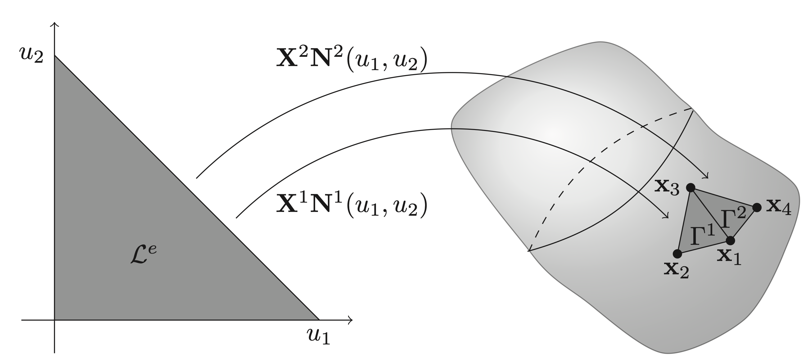
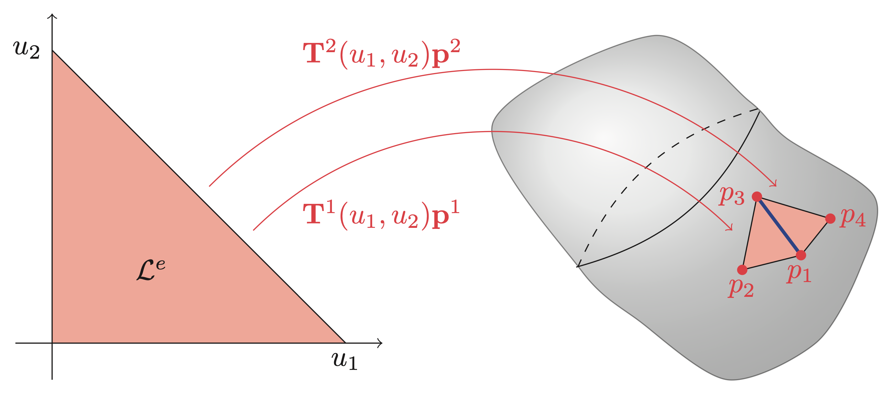
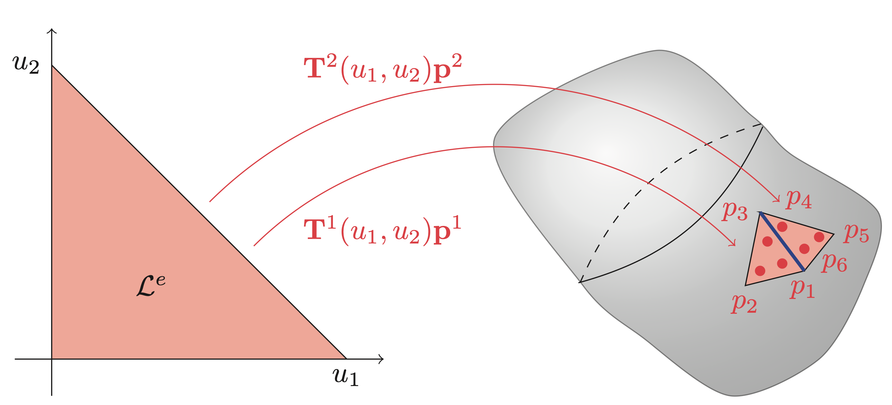

# Theoretical Background
This page includes the (some of) theoretical foundations of `BoundaryIntegralEquations.jl`.

## Getting the computer to understand functions
In the most basic terms, computers are only capable of understanding numbers, which means that they are inherently unable to solve equations where the unknowns are functions. This is a problem when trying to solve BIEs. To solve this problem, the functions are instead approximated using parameterizations for which the coefficients (numbers) are unknown. Intuitively, these numbers are exactly what the computer is asked to find. For element methods, this parameterization is chosen to be the simplest possible: A linear combination of functions

```math
p(\mathbf{x}) \approx \mathbf{T}(\mathbf{x})\mathbf{p} 
    = 
    \begin{bmatrix} T_1(\mathbf{x}) &  T_2(\mathbf{x}) &  \dots  &  T_n(\mathbf{x}) \end{bmatrix}
    \begin{bmatrix} p_1             \\ p_2             \\ \vdots \\ p_n             \end{bmatrix}. 
```
where ``p`` is the unknown function being approximated. Note that the linearity is with respect to the unknown parameters ``\mathbf{p}``, but not necessarily in the known basis functions ``\mathbf{T}(\mathbf{x})``. A useful, but not necessary, property is called the Cardinal property stating that 
```math
T_i(\mathbf{x}_j) = \delta_{ij} = 
    \begin{cases}
        1, \quad i = j\\
        0, \quad i \neq j    
    \end{cases}.
```

The usefulness is due the property making the ``j``th value of ``\mathbf{p}`` interpretable as the value of the function at point ``\mathbf{x}_j`` as

```math
\mathbf{T}(\mathbf{x}_j)\mathbf{p} = p_j.
```

One might ask: *How does the above relate to The Boundary Element Method?* The answer is that the functions ``\mathbf{T}_i`` are chosen to be simpler functions with support equal to only a few subdomains of the original domain. These subdomains are commonly referred to as elements. 

## What is an element?
A key insight is that the element serves two purposes: It represents a subdomain of the original domain (also referred to as the geometry) while also describing parts of the unknown function(s) of interest. In the case of surface elements, which are the ones used for BEMs, the parameterization of the subdomain, i.e. the element, is done as
```math
    \mathbf{x}^e(\mathbf{u}) = \mathbf{X}^e\mathbf{N}^e(\mathbf{u}) \in \Gamma^e, \quad \forall \mathbf{u} \in \mathcal{L}^e,
```
where the superscript ``e`` denotes the element number, ``\mathbf{x}^e`` is a matrix with columns equal to the interpolation nodes of the geometry, ``\mathbf{N}^e(\mathbf{u})`` are the so-called shape functions, ``\Gamma^e`` is the element in global coordinates and ``\mathcal{L}^e`` are the local coordinates. The structure of some collection of interpolation nodes (``\mathbf{X}^e``) multiplied by some shape function (``\mathbf{N}^e(\mathbf{u})``) is the same for most geometric elements. For BEMs in 3D, it is common to work with triangular elements, which can be seen in the Figure below. In particular, the elements in \autoref{fig:sfd:geom} are linear, for which a description can be found in the Example.



!!! info "Example: Linear triangular elements"
    The linear shape functions for a triangular element can have the form
    ```math
    \begin{equation}
        \mathbf{X}^e(u_1,u_2) = 
        \begin{bmatrix}
            1 - u_1 - u_2 \\ u_1 \\ u_2
        \end{bmatrix}, \quad u_1\in[0, 1],\ u_2\in[0, 1-u_1].
    \end{equation}
    ```
    The choice in the wording can is because the ordering of the columns of ``\mathbf{X}^e`` can change the ordering rows of ``\mathbf{N}^e(\mathbf{u})`` or vice versa. This is something that one should keep in mind in practice when using different mesh file formats. Taking the second element of Figure above as an example, it could be that 
    ```math
    \begin{equation}
        \mathbf{X}^2 = \begin{bmatrix} \mathbf{x}_3 & \mathbf{x}_1 & \mathbf{x}_4 \end{bmatrix}.
    \end{equation}
    ```
    Note that extending the geometric interpolation to higher orders is as simple as adding more rows/functions to ``\mathbf{N}^e(u_1,u_2)`` as well as more columns/points to ``\mathbf{X}^e``. 


In addition to the geometric interpolation of each element, we need to further define interpolations of the unknown functions, which in the case of the Kirchhoff-Helmholtz equation is ``p(\mathbf{x})`` and ``v_\mathbf{n}(\mathbf{x})``. Taking ``p(\mathbf{x})`` as an example, we find that on element ``e`` this interpolation can be done as
```math
    p(\mathbf{x}^e(\mathbf{u})) = \mathbf{T}(\mathbf{x}^e(\mathbf{u}))\mathbf{p} = \underbrace{\mathbf{T}(\mathbf{x}(\mathbf{u}))(\mathbf{L}^e)^\top}_{\mathbf{T}^e(\mathbf{u})}\underbrace{\mathbf{L}^e\mathbf{p}}_{\mathbf{p}^e} = \mathbf{T}^e(u)\mathbf{p}^e, \quad \mathbf{u} \in \mathcal{L}^e
```
where ``\mathbf{L}^e`` is a permutation-like matrix that extracts the relevant values of ``\mathbf{p}`` and orders them such that they correspond to the local basis functions of ``\mathbf{T}^e(\mathbf{u})``. The local basis functions are usually chosen as Lagrange polynomials, but other basis functions, such as, e.g., Legendre polynomials and splines, have also been successfully applied [beer2020a](@cite). The figures and examples below show the interpolation on triangular elements in the case of continuous interpolation and discontinuous interpolation. In short, the difference between continuous and discontinuous interpolations is that the interpolation nodes ``\mathbf{p}^e`` are shared between multiple elements (continuous elements) or completely inside the element (discontinuous elements). A consequence of the position of the interpolation nodes is that the value on the shared edge, highlighted in blue in both figures, is uniquely defined for continuous elements, while it serves as a discontinuity for discontinuous elements. 




!!! info "Example: Basis functions for linear interpolation"
    Continuous linear basis functions on triangular elements are similar to shape functions for a linear triangular element and differ only in the fact that it is the transpose.
    ```math
    \begin{equation}
        \mathbf{T}^e_\text{continuous}(u_1,u_2) = 
        \begin{bmatrix}
            1 - u_1 - u_2 & u_1 & u_2
        \end{bmatrix}, \quad u_1\in[0, 1],\ u_2\in[0, 1-u_1],
    \end{equation}
    ```
    where the subscript "continuous" is only there to highlight that it is a continuous formulation. Again, the ordering of the columns of the row vector depends on the ordering of the element corners. The discontinuous linear interpolation is simply a scaled continuous formulation
    ```math
    \begin{equation}
        \mathbf{T}^e_\text{discontinuous}(u_1,u_2) = \mathbf{T}^e_\text{continuous}\left(\frac{u_1 - \beta}{1-3\beta},\frac{u_2 - \beta}{1 - 3\beta}\right),
    \end{equation}
    ```
    where ``\beta \in \left[0,\frac{1}{2}\right[`` is a scalar representing the location of the interpolation nodes in the local ``\mathcal{L}^e`` coordinates.

!!! info "Example: Element Localization Matrix"
    For a continuous linear element ``e`` all three corners correspond to a value of the global vector ``\mathbf{p}``. For example, the second element in continuous plot has local corner values given by ``\mathbf{p}^2 = \begin{bmatrix}p_3 & p_1 & p_4 \end{bmatrix}^\top``. This element would have ``\mathbf{L}^e`` given as
    ```math
    \begin{equation}
        \mathbf{L}^2 = 
        \begin{bmatrix}
            0 & 0 & 1 & 0 & \dots & 0\\
            1 & 0 & 0 & 0 & \dots & 0\\
            0 & 0 & 0 & 1 & \dots & 0
        \end{bmatrix},
    \end{equation}
    ```
    so that ``\mathbf{p}^2 = \mathbf{L}^2\mathbf{p}``. Note that ``\mathbf{L}^e`` is only an artifact of the mathematical description. Any reasonable implementation should use indexing instead of multiplication with ``\mathbf{L}^e``.

    In the case of the discontinuous description the same element in discontinuous plot would have ``\mathbf{p}^2 = \begin{bmatrix}p_4 & p_5 & p_6\end{bmatrix}^\top`` meaning that
    ```math
    \begin{equation}
        \mathbf{L}^2 = 
        \begin{bmatrix}
            0 & 0 & 0 & 1 & 0 & 0 & 0 & \dots & 0\\
            0 & 0 & 0 & 0 & 1 & 0 & 0 & \dots & 0\\
            0 & 0 & 0 & 0 & 0 & 1 & 0 & \dots & 0
        \end{bmatrix}.
    \end{equation}
    ```
    Note here that the discontinuous nature result in ``\mathbf{L}^e`` simply picks out three consecutive values. 

!!! info "Note: "
    The element localization matrix can also be used to define the geometric interpolation. Following a similar procedure as for the pressure, we can write the interpolation as
    ```math
    \begin{equation}
        \mathbf{x}(\mathbf{u}) = \mathbf{X}\mathbf{N}(\mathbf{u}) = \underbrace{\mathbf{X}\left(\mathbf{L}^e\right)^\top}_{\mathbf{X}^e}\underbrace{\mathbf{L}^e\mathbf{N}(\mathbf{u})}_{\mathbf{N}^e(\mathbf{u})},
    \end{equation}
    ```
    where ``\mathbf{X}`` is a matrix whose columns contain all the interpolation nodes of the geometry and ``\mathbf{N}(\mathbf{u})`` are global basis functions. However, in practice, using this formulation does not give an advantage, as ``\mathbf{X}`` is fully known. This is opposed to the interpolation of functions for which both ``\mathbf{p}`` and ``\mathbf{v}_\mathbf{n}`` are unknown.

## Quadrature
As we will explore in the next section, the underlying mathematics of boundary element methods is that of boundary integrals. In most cases, it is not possible to compute these integrals analytically. Instead, a quadrature scheme is used to approximate the integrals. To do so, the boundary integrals in global coordinates are transformed into the local element coordinates. This transformation comes with the cost of the need to compute the so-called Jacobian function, which describes the local deformation from the transformation. For 2D and 3D this deformation looks as follows

```math
\begin{alignat*}{3}
    \text{2D:} & \quad \text{jacobian}(u)   &&= \left\|\mathbf{X}^e \frac{\mathrm{d}\mathbf{N}^e(u)}{\mathrm{d}u}\right\|_2 \quad && \text{(length deformation)}\\
    \text{3D:} & \quad \text{jacobian}(u,v) &&= \left\|\left(\mathbf{X}^e \frac{\mathrm{d}\mathbf{N}^e(u,v)}{\mathrm{d}u}\right) \times \left(\mathbf{X}^e \frac{\mathrm{d}\mathbf{N}^e(u,v)}{\mathrm{d}v}\right) \right\|_2 \quad && \text{(area deformation)}
\end{alignat*}
```

Applying this the surface integral can be transformed into local coordinates and approximated using a suitable quadrature scheme as

```math
    \int_{\Gamma^e} f(\mathbf{x})\ \mathrm{d}S_\mathbf{x} = \int_{\mathcal{L}^e} \text{jacobian}(\mathbf{u})f(\mathbf{u})\ \mathrm{d}\mathbf{u} \approx \sum_{i=1}^{Q} \text{jacobian}(\mathbf{u}_i)w_if(\mathbf{u}_i),
```
    
where ``\mathbf{u}_i`` is the ``i``th quadrature point with corresponding weights ``w_i``.

## The Boundary Element Method
In simple terms, the boundary element method is a method for solving boundary integral equations through a discretization of both the unknown function and the domain [Marburg2017](@cite). In this software, the main focus is solving the so-called Kirchhoff-Helmholtz integral equation
```math
\int_\Gamma \phi(\mathbf{x}) \left(\zeta(\mathbf{x})p(\mathbf{x}) + \int_\Gamma \frac{\partial G(\mathbf{x}, \mathbf{y})}{\partial \mathbf{n}(\mathbf{y})}p(\mathbf{y})\ \mathrm{d}S_\mathbf{y} -
    \mathrm{i} \rho_0 c k \int_\Gamma G(\mathbf{x},\mathbf{y})v_\mathbf{n}(\mathbf{y})\ \mathrm{d}S_\mathbf{y}\right)\ \mathrm{d}S_\mathbf{x} = 0.
```
where 
```math 
    G(\mathbf{x},\mathbf{y}) = \frac{\exp\left(\mathrm{i}k\|\mathbf{x} - \mathbf{y}\|_2\right)}{4\pi\|\mathbf{x} - \mathbf{y}\|_2},
``` 
is the Green's function of the Helmholtz operator, ``k`` is the wavenumber, ``\rho_0`` is the ambient density, ``c`` is the speed of sound, ``\phi(\mathbf{x})`` is a so-called test function, and ``\zeta(\mathbf{x})`` is the integral free term depending only on the geometry at point ``\mathbf{x}``. When ``\mathbf{x}`` is located on a smooth part of the surface ``\zeta(\mathbf{x})`` is equal to ``\frac{1}{2}``, but otherwise fluctuates between 0 and 1.

The approach implemented is the so-called collocation approach. This approach is based where the test function is equal to the sum of Dirac-delta functions centered around each of the collocation points, that is,

```math
\phi(\mathbf{x}) =  \mathbf{a}^\top
                    \begin{bmatrix}
                        \delta\left(\mathbf{x} - \mathbf{t}_1\right)\\ 
                        \delta\left(\mathbf{x} - \mathbf{t}_2\right)\\ 
                        \vdots\\
                        \delta\left(\mathbf{x} - \mathbf{t}_n\right)\\ 
                    \end{bmatrix},
```

where ``\mathbf{a} \in \mathbb{C}^n`` is a vector of arbitrary coefficients and ``\mathbf{t}_i \in \mathbb{R}^3`` are the nodal mesh positions (target points). 

```math
\mathbf{a}^\top
\begin{bmatrix}
    c(\mathbf{t}_1)p(\mathbf{t}_1)\\ 
    c(\mathbf{t}_2)p(\mathbf{t}_2)\\ 
    \vdots \\ 
    c(\mathbf{t}_n)p(\mathbf{t}_n)
\end{bmatrix} 
+ 
\mathbf{a}^\top
\begin{bmatrix}
    \int_\Gamma\frac{\partial G(\mathbf{t}_1, \mathbf{y})}{\partial\mathbf{n}(\mathbf{y})}p(\mathbf{y})\ \mathrm{d}S_\mathbf{y}\\
    \int_\Gamma\frac{\partial G(\mathbf{t}_2, \mathbf{y})}{\partial\mathbf{n}(\mathbf{y})}p(\mathbf{y})\ \mathrm{d}S_\mathbf{y}\\
    \vdots \\
    \int_\Gamma\frac{\partial G(\mathbf{t}_n, \mathbf{y})}{\partial\mathbf{n}(\mathbf{y})}p(\mathbf{y})\ \mathrm{d}S_\mathbf{y}
\end{bmatrix}
=
\mathbf{a}^\top
\begin{bmatrix}
    \mathrm{i} \rho_0 c k\int_\Gamma G(\mathbf{t}_1, \mathbf{y})v_\mathbf{n}(\mathbf{y})\ \mathrm{d}S_\mathbf{y}\\
    \mathrm{i} \rho_0 c k\int_\Gamma G(\mathbf{t}_2, \mathbf{y})v_\mathbf{n}(\mathbf{y})\ \mathrm{d}S_\mathbf{y}\\
    \vdots \\
    \mathrm{i} \rho_0 c k\int_\Gamma G(\mathbf{t}_n, \mathbf{y})v_\mathbf{n}(\mathbf{y})\ \mathrm{d}S_\mathbf{y}
\end{bmatrix}.
```

In its current form the solution to the above equation is a *function* which a computer can not be tasked to find. Instead, the problem is made computationally tractable by parametrizing the functions ``p`` and ``v_\mathbf{n}`` as shown previously. As such the above reduces to

```math
\mathbf{a}^\top
\begin{bmatrix}
    c(\mathbf{t}_1)\mathbf{T}(\mathbf{t}_1)\mathbf{p}\\ 
    c(\mathbf{t}_2)\mathbf{T}(\mathbf{t}_2)\mathbf{p}\\ 
    \vdots \\ 
    c(\mathbf{t}_n)\mathbf{T}(\mathbf{t}_n)\mathbf{p}
\end{bmatrix}
+ 
\mathbf{a}^\top
\begin{bmatrix}
    \int_\Gamma\frac{\partial G(\mathbf{t}_1, \mathbf{y})}{\partial\mathbf{n}(\mathbf{y})}\mathbf{T}(\mathbf{y})\mathbf{p}\ \mathrm{d}S_\mathbf{y}\\
    \int_\Gamma\frac{\partial G(\mathbf{t}_2, \mathbf{y})}{\partial\mathbf{n}(\mathbf{y})}\mathbf{T}(\mathbf{y})\mathbf{p}\ \mathrm{d}S_\mathbf{y}\\
    \vdots \\
    \int_\Gamma\frac{\partial G(\mathbf{t}_n, \mathbf{y})}{\partial\mathbf{n}(\mathbf{y})}\mathbf{T}(\mathbf{y})\mathbf{p}\ \mathrm{d}S_\mathbf{y}
\end{bmatrix}
\approx
\mathbf{a}^\top
\begin{bmatrix}
    \mathrm{i} \rho_0 c k\int_\Gamma G(\mathbf{t}_1, \mathbf{y})\mathbf{T}(\mathbf{y})\mathbf{v}_\mathbf{n}\ \mathrm{d}S_\mathbf{y}\\
    \mathrm{i} \rho_0 c k\int_\Gamma G(\mathbf{t}_2, \mathbf{y})\mathbf{T}(\mathbf{y})\mathbf{v}_\mathbf{n}\ \mathrm{d}S_\mathbf{y}\\
    \vdots \\
    \mathrm{i} \rho_0 c k\int_\Gamma G(\mathbf{t}_n, \mathbf{y})\mathbf{T}(\mathbf{y})\mathbf{v}_\mathbf{n}\ \mathrm{d}S_\mathbf{y}
\end{bmatrix}.
```

By the cardinal property of the basis functions it follows that

```math
\mathbf{a}^\top
\left(
\text{diag}\left(\begin{bmatrix}
    c(\mathbf{t}_1)\\ 
    c(\mathbf{t}_2)\\ 
    \vdots \\ 
    c(\mathbf{t}_n)
\end{bmatrix}\right)
+ 
\begin{bmatrix}
    \int_\Gamma\frac{\partial G(\mathbf{t}_1, \mathbf{y})}{\partial\mathbf{n}(\mathbf{y})}\mathbf{T}(\mathbf{y})\ \mathrm{d}S_\mathbf{y}\\
    \int_\Gamma\frac{\partial G(\mathbf{t}_2, \mathbf{y})}{\partial\mathbf{n}(\mathbf{y})}\mathbf{T}(\mathbf{y})\ \mathrm{d}S_\mathbf{y}\\
    \vdots \\
    \int_\Gamma\frac{\partial G(\mathbf{t}_n, \mathbf{y})}{\partial\mathbf{n}(\mathbf{y})}\mathbf{T}(\mathbf{y})\ \mathrm{d}S_\mathbf{y}
\end{bmatrix}\right)\mathbf{p}
\approx
\mathbf{a}^\top
\begin{bmatrix}
    \mathrm{i} \rho_0 c k\int_\Gamma G(\mathbf{t}_1, \mathbf{y})\mathbf{T}(\mathbf{y})\ \mathrm{d}S_\mathbf{y}\\
    \mathrm{i} \rho_0 c k\int_\Gamma G(\mathbf{t}_2, \mathbf{y})\mathbf{T}(\mathbf{y})\ \mathrm{d}S_\mathbf{y}\\
    \vdots \\
    \mathrm{i} \rho_0 c k\int_\Gamma G(\mathbf{t}_n, \mathbf{y})\mathbf{T}(\mathbf{y})\ \mathrm{d}S_\mathbf{y}
\end{bmatrix}\mathbf{v}_\mathbf{n}.
```

Since the above has to hold for all ``\mathbf{a} \in \mathbb{C}^n`` it follows that
```math
\left(\text{diag}\left(\begin{bmatrix}
    c(\mathbf{t}_1)\\ 
    c(\mathbf{t}_2)\\ 
    \vdots \\ 
    c(\mathbf{t}_n)
\end{bmatrix}\right)
+ 
\mathbf{F}\right)\mathbf{p}
=
\mathrm{i} \rho_0 c k\mathbf{G}\mathbf{v}_\mathbf{n}.
```

For simplification purposes the above is sometimes written as

```math
\mathbf{H}\mathbf{p} + \mathbf{G}\partial_\mathbf{n}\mathbf{p} = \mathbf{0}.
```

We now briefly explain how to compute the ``k``th row of ``\mathbf{F}``. To do so element description of the unknown functions is used
```math
\begin{equation}
    p(\mathbf{y}^e(\mathbf{u})) \approx \mathbf{T}(\mathbf{y})\mathbf{p} = \underbrace{\mathbf{T}(\mathbf{y}^e(\mathbf{u}))(\mathbf{L}^e)^\top}_{\mathbf{T}^e(\mathbf{u})}\mathbf{L}^e\mathbf{p}
\end{equation}
```

Inserting this it follows that

```math
\begin{aligned}
\int_\Gamma\frac{\partial G(\mathbf{t}_k, \mathbf{y})}{\partial\mathbf{n}(\mathbf{y})}\mathbf{T}(\mathbf{y})\mathbf{p}\ \mathrm{d}S_\mathbf{y} 
&\approx \sum_{e=1}^{N}\left(\int_{\Gamma^e}\frac{\partial G(\mathbf{t}_k, \mathbf{y})}{\partial\mathbf{n}(\mathbf{y})}\mathbf{T}(\mathbf{y})(\mathbf{L}^e)^\top\mathbf{L}^e\ \mathrm{d}S_\mathbf{y}\right) \mathbf{p}\\
&\approx \left(\underbrace{\sum_{e=1}^{N}\left(\sum_{i=1}^{Q(\mathbf{z}_j,e)}\frac{\partial G(\mathbf{t}_k, \mathbf{y}^e(\mathbf{u}_i))}{\partial\mathbf{n}(\mathbf{y}^e(\mathbf{u}_i))}\text{jacobian}(\mathbf{u}_i)w_i\mathbf{T}^e(\mathbf{u}_i)\right)\mathbf{L}^e}_{j\text{th row of }\mathbf{F}}\right)\mathbf{p},
\end{aligned}
```

where the number of quadrature points, ``Q(\mathbf{t}_k,e)``, is depended on element location with respect to the collocation point ``\mathbf{t}_k``. Note that approximation in the first line of the above is due to approximation of the geometry using elements while the second approximation is due to the integration error. A similar approach can be applied for the rows of ``\mathbf{G}``.

A downside of the BEM is that the resulting matrices ``\mathbf{H}, \mathbf{G} \in \mathbb{C}^{n\times n}`` are dense, meaning that storing the two matrices scales as ``\mathcal{O}(n^2)`` rendering the direct application of the method unusable large ``n``.

## The Fast Multipole Method and BEM
The Fast Multipole Method (FMM) can be used to accelerate the multiplication with the BEM matrices ``\mathbf{H}`` and ``\mathbf{G}``. Throughout the years many good resources that explain the intricacies of the FMM have been written. As such the details will here be left out. Instead, the focus will be on how to apply a 3rd-party FMM into an existing BEM framework. As an example the focus will be on the *Flatiron Institute Fast Multipole Libraries* [fmm3d](@cite), as this is the library currently interfaced in `BoundaryIntegralEquations.jl`. This library can be used to accelerate sums of the following form from ``O(NQ)`` to ``O(\text{log}(NQ))``
```math
    u(\mathbf{t}_k) = \sum_{j=1}^{NQ}G(\mathbf{t}_k,\mathbf{y}_j)c_j, \quad 
    u(\mathbf{t}_k) = \sum_{j=1}^{NQ}\mathbf{n}(\mathbf{y}_j)^\top\nabla G(\mathbf{t}_k,\mathbf{y}_j)c_j
```
where the ``j``th term is excluded from the sum if ``\mathbf{t}_k = \mathbf{y}_j``. The question is now: *How can this be used to speed up multiplication with the BEM matrices?*

To see how we start by simplifying things by assuming that each element requires the same amount of quadrature points (this will cause numerical issues that are then fixed by a nearfield correction step), ``Q``, and that we want to multiply with a known vector ``\mathbf{z}``. Then for a row of ``\mathbf{G}`` we have that
```math
\begin{aligned}
    \left(\underbrace{\int_\Gamma G(\mathbf{t}_k,\mathbf{y})\mathbf{T}(\mathbf{y})\ \mathrm{d}S_\mathbf{y}}_{k\text{th row of } \mathbf{G}}\right)\mathbf{z}
    &\approx
    \left(\sum_{e=1}^{N}\left(\sum_{i=1}^{Q}G(\mathbf{t}_k, \mathbf{y}^e(\mathbf{u}_i))\text{jacobian}(\mathbf{u}_i)w_i\mathbf{T}^e(\mathbf{u}_i)\right)\mathbf{L}^e\right)\mathbf{z}\\
    &= \left(\sum_{j=1}^{NQ}G(\mathbf{t}_k, \mathbf{y}_j)\underbrace{\text{jacobian}(\mathbf{u}_j)w_j\mathbf{T}^{e(j)}(\mathbf{u}_j)\mathbf{L}^{e(j)}}_{j\text{th row of } \mathbf{C}}\right)\mathbf{z}\\
    &= 
    \begin{bmatrix}
        G(\mathbf{t}_k, \mathbf{y}_1) & G(\mathbf{t}_k, \mathbf{y}_2,) & \dots & G(\mathbf{t}_k, \mathbf{y}_{NQ})
    \end{bmatrix}
    \mathbf{C}\mathbf{z}
\end{aligned}
```
where the subscript ``j`` refers to an ordering of the collection of Gaussian points from all elements and ``e(j)`` is a function that returns the element number that Gaussian point ``j`` is located on. Furthermore, the matrix ``\mathbf{C}`` can be thought of as a transformation from ``\mathbf{z}`` into the coefficients ``4\pi c_j``. A similar approach can be applied to ``\mathbf{H}``
```math
\begin{aligned}
    \left(\underbrace{\int_\Gamma\frac{\partial G(\mathbf{t}_k, \mathbf{y})}{\partial\mathbf{n}(\mathbf{y})}\mathbf{T}(\mathbf{y})\ \mathrm{d}S_\mathbf{y}}_{k\text{th row of } \mathbf{F}}\right)\mathbf{y}
    &\approx 
    \left(\sum_{e=1}^{N}\left(\sum_{i=1}^{Q}\frac{\partial G(\mathbf{t}_k, \mathbf{y}^e(\mathbf{u}_i))}{\partial\mathbf{n}(\mathbf{y})}\text{jacobian}(\mathbf{u}_i)w_i\mathbf{T}^e(\mathbf{u}_i)\right)\mathbf{L}^e\right)\mathbf{z}\\
    &= \left(\sum_{j=1}^{NQ}\nabla G(\mathbf{t}_k, \mathbf{y}_j)\cdot \mathbf{n}(\mathbf{y}_j)\underbrace{\text{jacobian}(\mathbf{u}_j)w_j\mathbf{T}^{e(j)}(\mathbf{u}_j)\mathbf{L}^{e(j)}}_{j\text{th row of }\mathbf{C}}\right)\mathbf{z}\\
    &= 
    \begin{bmatrix}
        \nabla G(\mathbf{t}_k, \mathbf{y}_1)\cdot \mathbf{n}(\mathbf{y}_1) &
        \dots &
        \nabla G(\mathbf{t}_k, \mathbf{y}_{NQ})\cdot \mathbf{n}(\mathbf{y}_{NQ})
    \end{bmatrix}
    \mathbf{C}\mathbf{z},
\end{aligned}
```
where ``\mathbf{C}`` is a matrix that transforms ``\mathbf{z}`` into the coefficients ``4\pi v_j``. The two equations highlights how the FMM can be applied for problems where the number of Gaussian points on each element is equal. However, in practical cases this approach will be victim to numerical instabilities due to numerical errors stemming from the integration of elements close to the collocation point. To resolve this issue the BEM matrices is split into parts
```math
        \mathbf{A} = \mathbf{B}\mathbf{C} + \mathbf{S}, \quad \mathbf{G} \in\mathbb{C}^{n\times NQ},\ \mathbf{S}\in\mathbb{C}^{n\times n},\ \mathbf{C}\in\mathbb{R}^{NQ\times n}.
```
Here ``\mathbf{B}`` is the part approximated by the FMM (using ``Q`` Gaussian points on each element), ``\mathbf{C}`` is the coefficient mapping, and ``\mathbf{S}`` the nearfield correction. In short the nearfield correction subtract the wrong integration done by using only ``Q`` Gaussian points and adds on the correct integration instead. It is important to note that ``\mathbf{S}`` and ``\mathbf{C}`` are both highly sparse matrices, meaning that both assembly and multiplication with these scale ``\mathcal{O}(n\tau)`` where ``\tau \ll n``. This means that using an approximate scheme for ``\mathbf{B}`` with a multiplication that scales linear in time and memory result in a representation of ``\mathbf{A}`` that scales similarly.


## ``\mathcal{H}``-Matrices
The ``\mathcal{H}``-matrix approach differs from the FMM by the fact that it does not accelerate the sums directly. Instead, it approximates parts of the matrix that corresponds to performing the integration for all the ``n`` collocation points at the same time. In particular, it approximates the ``\mathbf{B}`` part of the BE matrix split as
```math
\mathbf{B} = 
    \begin{bmatrix}
        G(\mathbf{x}_1,\mathbf{y}_1)  & G(\mathbf{x}_1,\mathbf{y}_2) & \dots    & G(\mathbf{x}_1,\mathbf{y}_{NQ}) \\
        G(\mathbf{x}_2,\mathbf{y}_1)  & G(\mathbf{x}_2,\mathbf{y}_2) & \dots    & G(\mathbf{x}_2,\mathbf{y}_{NQ}) \\
        \vdots          & \vdots         & \ddots   & \vdots            \\
        G(\mathbf{x}_n,\mathbf{y}_1)  & G(\mathbf{x}_n,\mathbf{y}_2) & \dots    & G(\mathbf{x}_n,\mathbf{y}_{NQ})
    \end{bmatrix},
```
for the ``\mathbf{G}``-matrix and as
```math
 \mathbf{B} = 
    \begin{bmatrix}
        \mathbf{n}(\mathbf{y}_1)^\top G(\mathbf{x}_1,\mathbf{y}_1)  & \mathbf{n}(\mathbf{y}_2)^\top G(\mathbf{x}_1,\mathbf{y}_2) & \dots    & \mathbf{n}(\mathbf{y}_{NQ})^\top G(\mathbf{x}_1,\mathbf{y}_{NQ})\\
        \mathbf{n}(\mathbf{y}_1)^\top G(\mathbf{x}_2,\mathbf{y}_1)  & \mathbf{n}(\mathbf{y}_2)^\top G(\mathbf{x}_2,\mathbf{y}_2) & \dots    & \mathbf{n}(\mathbf{y}_{NQ})^\top G(\mathbf{x}_2,\mathbf{y}_{NQ})\\
        \vdots                          & \vdots                         & \ddots   & \vdots \\
        \mathbf{n}(\mathbf{y}_1)^\top G(\mathbf{x}_n,\mathbf{y}_1)  & \mathbf{n}(\mathbf{y}_2)^\top G(\mathbf{x}_n,\mathbf{y}_2) & \dots    & \mathbf{n}(\mathbf{y}_{NQ})^\top G(\mathbf{x}_n,\mathbf{y}_{NQ})
    \end{bmatrix},
```
for the ``\mathbf{F}``-matrix. The approximation itself is based on the fact that subblocks of the matrix is well approximated by low-rank matrices. In this library all ``\mathcal{H}``-matrix computations is done using the [HMatrices.jl](https://github.com/WaveProp/HMatrices.jl) package developed by Luiz M. Faria [hmatrices][@cite]. The specific format implemented in this library is the standard that the scales ``O(n\text{log}(n))`` in terms of memory and computation. At the same some experimentation of the newly developed Interpolated Factored Green's Function (IFGF) [bauinger2021a](@cite) approach using the [IFGF.jl](https://github.com/WaveProp/IFGF.jl) package also developed by Luiz [ifgf](@cite). Note, that an often mentioned strength of the ``\mathcal{H}``-matrix approach is that it is possible to compute the LU-factorization of the matrix efficiently, which is particularly important for high-frequency problems where an iterative solver might have issue converging. However, in the case of collocation BEM an LU-factorization can not directly be applied. Worse so when dealing with losses where the linear system of equation is a collection of matrix products.

## Bibliography
```@bibliography
```
