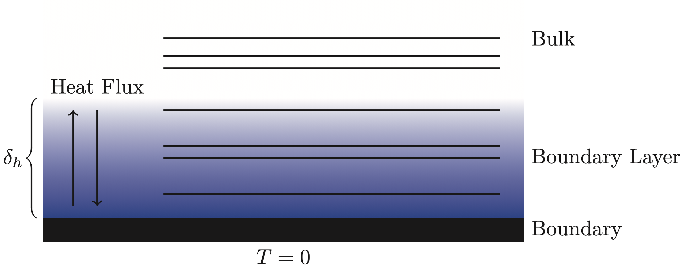
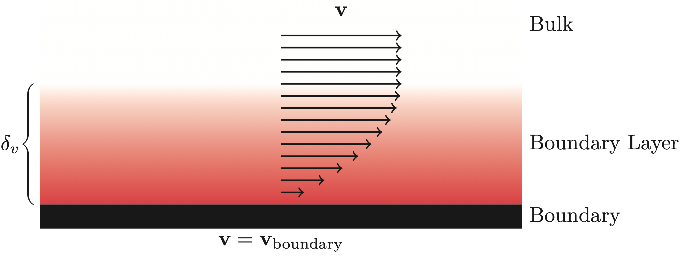
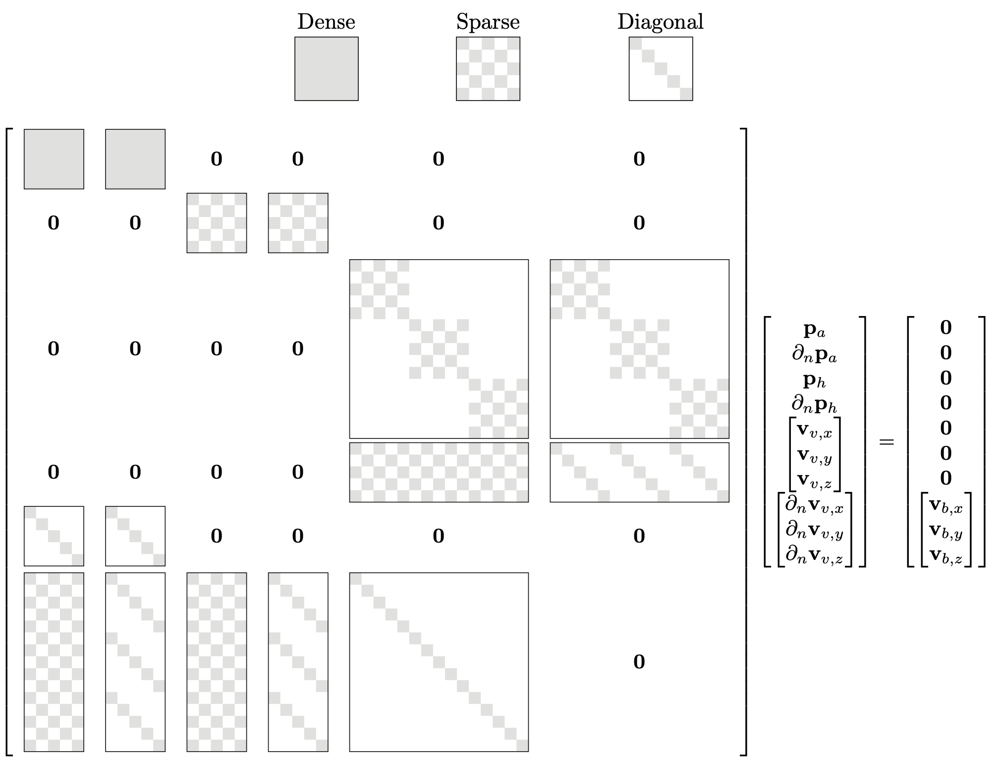
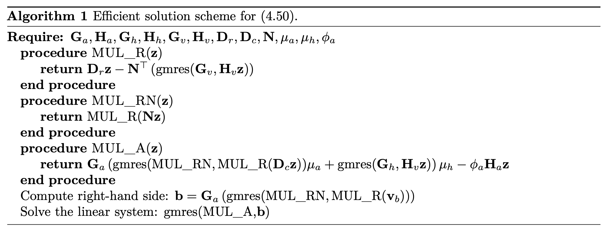

# Theoretical Background of Lossy-BEM
This page includes the (some of) theoretical foundations for including viscous and thermal losses into the simulations performed in of `BoundaryIntegralEquations.jl`.

For an example [look here.](examples/3d_lossy_sphere.md)

## Kirchhoff Decomposition
An equivalent formulation of the fully linearized Navier-Stokes (FLNS) equation is the Kirchhoff decomposition, which divides the problem into three *modes*, each satisfying its own Helmholtz equation.
```math
\begin{alignat}{3}
    &\text{Acoustic Mode:} \quad &&(\Delta + k_a^2)p_a(\mathbf{x})     &&= 0,\\
    &\text{Thermal Mode: } \quad &&(\Delta + k_h^2)p_h(\mathbf{x})     &&= 0,\\
    &\text{Viscous Mode: } \quad &&(\Delta + k_v^2)\mathbf{v}_v(\mathbf{x})   &&= \mathbf{0}, \quad \text{with}\quad \nabla\cdot \mathbf{v}_v(\mathbf{x}) = 0.
\end{alignat}
```
The three modal wavenumbers (``k_a,\ k_h\ \&\ k_v``) all depend on the lossless wavenumber (``k``) and the physical properties of the fluid, such as the thermal conductivity, specific heat capacity under constant pressure and the shear/bulk viscosity coefficients [henriquez2002a](@cite). The total pressure and velocity can be extracted as the sum of the contributions of each of the three modes
```math
\begin{align}
    p_t   &= p_a + p_h,\\
    \mathbf{v}_t &= \mathbf{v}_a + \mathbf{v}_h + \mathbf{v}_v.
\end{align}
```
Using the standard notation for the BEM discretization for the three modes, it must be true that
```math
\begin{equation}
    \mathbf{H}_a\mathbf{p}_a + \mathbf{G}_a\frac{\partial\mathbf{p}_a}{\partial \mathbf{n}} = \mathbf{0},\quad
    \mathbf{H}_h\mathbf{p}_h + \mathbf{G}_h\frac{\partial\mathbf{p}_h}{\partial \mathbf{n}} = \mathbf{0},\quad
    \mathbf{H}_v\mathbf{v}   + \mathbf{G}_v\frac{\partial\mathbf{v}  }{\partial \mathbf{n}} = \mathbf{0},
\end{equation}
```
where
```math
\begin{equation}
    \mathbf{v}             =   \begin{bmatrix} \mathbf{v}_{v_x} & \mathbf{v}_{v_y} & \mathbf{v}_{v_z}\end{bmatrix}^\top, \quad 
    \partial_\mathbf{n}\mathbf{v} =   \begin{bmatrix} \partial_\mathbf{n}\mathbf{v}_{v_x} & 
                                        \partial_\mathbf{n}\mathbf{v}_{v_y} & 
                                        \partial_\mathbf{n}\mathbf{v}_{v_z}
                        \end{bmatrix}^\top,
\end{equation}
``` 
and
```math
\begin{equation}
    \mathbf{H}_v = \text{blkdiag}\left(\widetilde{\mathbf{H}_v},\ \widetilde{\mathbf{H}_v},\ \widetilde{\mathbf{H}_v}\right), \quad
    \mathbf{G}_v = \text{blkdiag}\left(\widetilde{\mathbf{G}_v},\ \widetilde{\mathbf{G}_v},\ \widetilde{\mathbf{G}_v}\right),
\end{equation}
```
with ``\widetilde{\mathbf{H}_v}`` and ``\widetilde{\mathbf{G}_v}`` being the result of a scalar discretization with wavenumber ``k_v`` and ``\text{blkdiag}`` is the block-diagonal operator.

## Boundary Coupling of the Modes
In the case of the fluid being air, it is valid to prescribe the so-called isothermal boundary condition due to high higher heat capacity of the boundary material. Mathematically, this condition can be written as
```math
\begin{equation}
    p_a(\mathbf{x})\tau_a + p_h(\mathbf{x})\tau_h = 0, \quad \mathbf{x} \in \Gamma,
\end{equation}
```
where ``\tau_a`` and ``\tau_h`` are dependent on the lossless wavenumber as well as the physical properties of fluid. In short, this boundary condition forces the temperature fluctuations to be zero, meaning that there is no exchange of heat between the fluid and the boundary. As such, there is a transition from the physics at the boundary to the bulk where the wave propagation can be considered isentropic (see Figure below). This transitional phase is in the literature called the thermal boundary layer and has a thickness that depends on the frequency. In air, the thickness can be approximated as [morse1968a](@cite)
```math
\begin{equation}
    \delta_h \approx 2.5\frac{1}{\sqrt{f}}\text{ mm}.
\end{equation}
```


Furthermore, due to frictional forces the air sticks to the surface of objects. As such, it is common to prescribe a no-slip boundary condition
```math
\begin{equation}
    \nabla p_a(\mathbf{x})\phi_a + \nabla p_h (\mathbf{x})\phi_h + \mathbf{v}_v(\mathbf{x}) = \mathbf{v}_{\text{boundary}}(\mathbf{x}), \quad \mathbf{x} \in \Gamma, 
\end{equation}
```
Similar to the modal wavenumbers the constants ``\phi_a``, and ``\phi_h`` are dependent on the lossless wavenumber as well as the physical properties of fluid. Again, the boundary condition results in a transitional phase from the boundary to the bulk (see Figure below). The thickness of the viscous boundary layer is of the same order as that of the thermal boundary layer, and can be approximated as [morse1968a](@cite)
```math
\begin{equation}
    \delta_v \approx 2.1\frac{1}{\sqrt{f}}\text{ mm}.
\end{equation}
```



## The Lossy System of Equations
The components of the three modes can be computed by solving the large system of equations originating from the combination of the three discretized integral equations, null-divergence constraint and boundary conditions 
```math
\begin{equation}
    \begin{bmatrix}
        \quad\text{The three modes on the form described in (6)}\quad\\
        \quad\text{Null Divergence Constraint}      \quad\\
        \quad\text{Isothermal Boundary Condition}   \quad\\
        \quad\text{No-Slip Boundary Condition}
    \end{bmatrix}
    \begin{bmatrix}
        \mathbf{p}_a\\ \partial_\mathbf{n}\mathbf{p}_a\\ \mathbf{p}_h\\ \partial_\mathbf{n}\mathbf{p}_h\\ \mathbf{v} \\ \partial_\mathbf{n}\mathbf{v}
    \end{bmatrix}
    =
    \begin{bmatrix}
        \mathbf{0}  \\ \mathbf{0} \\ \mathbf{0} \\ \mathbf{0} \\ \mathbf{0} \\ \mathbf{v}_s
    \end{bmatrix},
\end{equation}
```
where
```math
\begin{equation}
    \mathbf{v}_s   = \begin{bmatrix} \mathbf{v}_{x_0} & \mathbf{v}_{y_0} & \mathbf{v}_{z_0}\end{bmatrix}^\top,
\end{equation}
``` 
is the boundary velocities at each of the collocation nodes stacked with respect to the ``x, y,`` and ``z`` direction. From an implementation point of view, the equation above poses a challenge: How are the gradients required for the two boundary conditions and the null-divergence constraint computed? The answer lies in the boundary element representation of the underlying variables.

## Interpolation Function Derivatives
The interpolation function derivatives (IFDs) are the derivatives of the boundary element interpolation functions. As the boundary element interpolation is defined only on the surface, the interpolation function derivatives contain only the tangential information. The full gradient is then computed by combining the tangential information from the IFDs with the normal information coming directly from the boundary element interpolation of the normal derivative.

Taking the acoustic pressure ``p_a`` as an example, it follows that the boundary element representation of the interpolation on element ``e`` is given as
```math
\begin{equation}
    % p_a\left(\mathbf{x}^e(\mathbf{u})\right) = p_a\left(\mathbf{X}^e\mathbf{N}^e(\mathbf{u})\right) = \mathbf{T}^e(\mathbf{u})\mathbf{p}_a^e, \quad \mathbf{u}\in\mathcal{L}^e,\ \mathbf{x} \in \Gamma_e,
    p_a\left(\mathbf{x}^e(\mathbf{u})\right) = \mathbf{T}^e(\mathbf{u})\mathbf{p}_a^e, \quad \mathbf{u}\in\mathcal{L}^e,\ \mathbf{x} \in \Gamma_e,
\end{equation}
```
where ``\mathbf{p}_a^e`` represent the nodal acoustical pressures of element $e$ while ``\mathbf{N}^e(\mathbf{u})`` and $\mathbf{T}^e(\mathbf{u})$ denotes the chosen interpolation schemes for respectively the geometry and the (acoustical) pressure on element $e$. The resulting gradient of $p_a$ on element $e$ can then be computed as
```math
\begin{equation}
    \nabla_{\mathbf{u}}p_a\left(\mathbf{x}^e(\mathbf{u})\right) = \left(\nabla_{\mathbf{u}}\mathbf{T}^e(\mathbf{u})\right)\mathbf{p}_a^e
\end{equation}
```
since the values ``\mathbf{p}_a^e`` are constants. Applying the multivariate chain rule $\nabla_{\mathbf{u}}p_a = (\nabla_{\mathbf{u}}\mathbf{x}^e(\mathbf{u})^\top)\nabla_\mathbf{x} p_a$ followed by an isolation with respect to $\nabla_\mathbf{x}$ gives the gradient of interest. Since the computations are based on boundary elements we have that the transpose of the Jacobian matrix
```math
\begin{equation}
    \nabla_{\mathbf{u}}\mathbf{x}^e(\mathbf{u})^\top 
    = \nabla_{\mathbf{u}}(\mathbf{X}^e\mathbf{N}^e(\mathbf{u}))^\top 
    = \nabla_{\mathbf{u}}\mathbf{N}^e(\mathbf{u})^\top\left(\mathbf{X}^e\right)^\top,
\end{equation}
```
is a $2\times 3$-matrix which cannot be inverted. It has been shown that it is enough to introduce an artificial $u_3$ such that $\frac{\partial\mathbf{T}^e}{\partial u_3} = \mathbf{0}$ (with $\mathbf{0}$ being a row vector of appropriate length filled with zeros), while substituting $\frac{\partial\mathbf{x}^e}{\partial u_3} = \frac{\partial\mathbf{x}^e}{\partial u_1}\times \frac{\partial\mathbf{x}^e}{\partial u_2}$ [atalla2015a](@cite). As a result, the tangential part of the gradient can be computed as
```math
\begin{equation}
    \nabla_\mathbf{x}^\parallel p_a\left(\mathbf{x}^e(\mathbf{x}_i)\right) 
    = 
    \begin{bmatrix}
        \left(\frac{\partial\mathbf{x}^e}{\partial u_1}\right)^\top\\
        \left(\frac{\partial\mathbf{x}^e}{\partial u_2}\right)^\top\\
        \left(\frac{\partial\mathbf{x}^e}{\partial u_1}\times \dfrac{\partial\mathbf{x}^e}{\partial u_2}\right)^\top
    \end{bmatrix}
    ^{-1}
    \begin{bmatrix}
        \frac{\partial\mathbf{T}^e}{\partial u_1}\\
        \frac{\partial\mathbf{T}^e}{\partial u_2}\\
        \mathbf{0}
    \end{bmatrix}
    \mathbf{p}_a^e, \quad \mathbf{x} \in \Gamma_e,
\end{equation} 
```
where the superscript $\parallel$ is used to explicitly show that this is only the tangential part of the gradient.  On element $e$ there is a local coordinate $\mathbf{x}_i$ for which $\mathbf{x}^e(\mathbf{x}_i)$ is equal to a collocation point. Say that this is the $i$th collocation point then this means that there is a $\mathbf{x}_i^{e,i}$ for which $\mathbf{x}^{e}\left(\mathbf{x}_i^{e,i}\right) = \mathbf{x}_i$. Using the element interpolation description that $\mathbf{p}_a^e = \mathbf{L}^e\mathbf{p}_a$, it follows that
```math
\begin{equation}
    \nabla_\mathbf{x}^\parallel p_a\left(\mathbf{x}^{e}(\mathbf{x}_i^{e,i})\right) = \nabla_\mathbf{x}^\parallel p_a(\mathbf{x}_i) = 
    \begin{bmatrix}
        \left(\dfrac{\partial\mathbf{x}^e}{\partial u_1}\right)^\top\\
        \left(\dfrac{\partial\mathbf{x}^e}{\partial u_2}\right)^\top\\
        \left(\dfrac{\partial\mathbf{x}^e}{\partial u_1}\times \dfrac{\partial\mathbf{x}^e}{\partial u_2}\right)^\top
    \end{bmatrix}
    ^{-1}
    \begin{bmatrix}
        \dfrac{\partial\mathbf{T}^e}{\partial u_1}\\
        \dfrac{\partial\mathbf{T}^e}{\partial u_2}\\
        \mathbf{0}
    \end{bmatrix}
    \mathbf{L}^e\mathbf{p}_a = 
    \begin{bmatrix}
        \mathbf{D}_x^{e,i}\\ \mathbf{D}_y^{e,i}\\ \mathbf{D}_z^{e,i}
    \end{bmatrix}
    \mathbf{p}_a.
\end{equation}
```
In the case of discontinuous elements, the collocation point is only connected to a single element, meaning that in practice the $e$th superscript is redundant. However, in the case of continuous elements, the collocation point can be connected to multiple elements, and the interpolation function derivative is chosen to be the average contribution from each of the connected elements. As such, the $i$th rows of the $\mathbf{D}_\bullet$-matrices can be computed as
```math
\begin{equation}
    \mathbf{D}_x^{i} = \frac{1}{N_e(i)}\sum_{e=1}^{N_e(i)}\mathbf{D}_x^{e,i},\quad 
    \mathbf{D}_y^{i} = \frac{1}{N_e(i)}\sum_{e=1}^{N_e(i)}\mathbf{D}_y^{e,i},\quad
    \mathbf{D}_z^{i} = \frac{1}{N_e(i)}\sum_{e=1}^{N_e(i)}\mathbf{D}_z^{e,i},
\end{equation}
```
where $N_e(i)$ denotes the number of elements that is connected to collocation point $i$. The different $\mathbf{D}_\bullet^i$ in the above are the collection of the $i$th rows in three separate matrices, $\mathbf{D}_x, \mathbf{D}_y$ and $\mathbf{D}_z$ so that 
```math
\begin{equation}
    % \left[\frac{\partial\mathbf{p}_a}{\partial x}\right]^\parallel = \mathbf{D}_x\mathbf{p}_a, \quad \left[\frac{\partial\mathbf{p}_a}{\partial y}\right]^\parallel = \mathbf{D}_y\mathbf{p}_a, \quad \left[\frac{\partial\mathbf{p}_a}{\partial z}\right]^\parallel = \mathbf{D}_z\mathbf{p}_a.
    \frac{\partial\mathbf{p}_a}{\partial x}^\parallel = \mathbf{D}_x\mathbf{p}_a, \quad 
    \frac{\partial\mathbf{p}_a}{\partial y}^\parallel = \mathbf{D}_y\mathbf{p}_a, \quad 
    \frac{\partial\mathbf{p}_a}{\partial z}^\parallel = \mathbf{D}_z\mathbf{p}_a.
\end{equation}
```
If the chosen discretization of the thermal and viscous modes is the same as for the acoustical mode, then the above interpolation function derivative matrices can be reused to compute $\nabla_\mathbf{x}^\parallel p_h$ and $\nabla_\mathbf{x}^\parallel\cdot \mathbf{v}_v$ respectively.


## The Lossy System of Equations
The aim of the new formulation is to eliminate the change-of-basis utilized in both the no-slip and the null-divergence conditions. For the no-slip boundary condition, the solution is simply to realize that the full gradient is the sum of the tangential and normal gradient information. Written out this means that
```math
\begin{equation}
    \nabla p_a = \nabla^\parallel p_a + \nabla^\perp p_a,
\end{equation}
```
where $\nabla^\perp p_a$ is the projection of the gradient onto the normal direction
```math
\begin{equation}
    \nabla^\perp p_a
    = \text{proj}_\mathbf{n}(\nabla p_a) 
    = \mathbf{n}\frac{\mathbf{n}^\top\nabla p_a}{\mathbf{n}^\top\mathbf{n}}
    = \mathbf{n}\partial_\mathbf{n} p_a.
\end{equation}
```
From the knowledge that the IFD only contains the tangential information and that the normal derivative is described by the BE discretization the discrete form of full gradient can be written as
```math
\begin{equation}
    \nabla\mathbf{p}_a = \begin{bmatrix}\mathbf{D}_x \\ \mathbf{D}_y \\ \mathbf{D}_z\end{bmatrix}\mathbf{p}_a + \begin{bmatrix} \text{diag}(\mathbf{n}_x) \\ \text{diag}(\mathbf{n}_y)\\ \text{diag}(\mathbf{n}_z) \end{bmatrix}
    \partial_\mathbf{n}\mathbf{p}_a.
\end{equation}
```
For the divergence a similar realization to that of the gradient is needed. That is, the total divergence is equal to the sum of the tangential and normal divergence. Written out, this means that
```math
\begin{equation}
    \nabla_\mathbf{x}\cdot\mathbf{v}_v = \nabla_\mathbf{x}^\parallel\cdot \mathbf{v}_v + \nabla_\mathbf{x}^\perp\cdot \mathbf{v}_v.
\end{equation}
```
As such, the discrete form of divergence of $\mathbf{v}_v$ can be computed as
```math
\begin{equation}
    \nabla\cdot\mathbf{v} = \begin{bmatrix} \mathbf{D}_x  & \mathbf{D}_y  & \mathbf{D}_z\end{bmatrix} \mathbf{v} + \begin{bmatrix} \text{diag}(\mathbf{n}_x) & \text{diag}(\mathbf{n}_y)& \text{diag}(\mathbf{n}_z)\end{bmatrix} \partial_\mathbf{n}\mathbf{v}.
\end{equation}
```
Finally, using the discrete forms of the gradients and null-divergence large lossy system can be written as
```math
\begin{equation}
    \begin{bmatrix}
    \mathbf{G}_a       & \mathbf{G}_a      & \mathbf{0}         & \mathbf{0}        & \mathbf{0}   & \mathbf{0}     \\
    \mathbf{0}         & \mathbf{0}        & \mathbf{G}_h       & \mathbf{G}_h      & \mathbf{0}   & \mathbf{0}     \\
    \mathbf{0}         & \mathbf{0}        & \mathbf{0}         & \mathbf{0}        & \mathbf{G}_v & \mathbf{G}_v   \\
    \mathbf{0}         & \mathbf{0}        & \mathbf{0}         & \mathbf{0}        & \mathbf{D}_r & \mathbf{N}^\top\\
    \tau_a\mathbf{I}   & \mathbf{0}        & \tau_h\mathbf{I}   & \mathbf{0}        & \mathbf{0}   & \mathbf{0}     \\
    \phi_a\mathbf{D}_c & \phi_a\mathbf{N}  & \phi_h\mathbf{D}_c & \phi_h\mathbf{N}  & \mathbf{I}   & \mathbf{0}     
    \end{bmatrix}
    \begin{bmatrix}
        \mathbf{p}_a\\ \partial_\mathbf{n}\mathbf{p}_a\\ \mathbf{p}_h\\ \partial_\mathbf{n}\mathbf{p}_h\\ \mathbf{v} \\ \partial_\mathbf{n}\mathbf{v}
    \end{bmatrix}
    =
    \begin{bmatrix}
        \mathbf{0} \\ \mathbf{0} \\ \mathbf{0} \\ \mathbf{0} \\ \mathbf{0} \\ \mathbf{v}_s
    \end{bmatrix},
\end{equation}
```
where the following notation were introduced
```math
\begin{equation}
    \mathbf{N}   = \begin{bmatrix} \text{diag}(\mathbf{n}_x) & \text{diag}(\mathbf{n}_y)& \text{diag}(\mathbf{n}_z)\end{bmatrix}^\top,\quad
    \mathbf{D}_c = \begin{bmatrix} \mathbf{D}_x^\top & \mathbf{D}_y^\top & \mathbf{D}_z^\top\end{bmatrix}^\top, \quad
    \mathbf{D}_r = \begin{bmatrix} \mathbf{D}_x  & \mathbf{D}_y  & \mathbf{D}_z\end{bmatrix}.
\end{equation}
```
As this linear system has 10 DOF pr. collocation node, it becomes problematic to solve directly for even moderately large problems on a desktop machine. Fortunately, the system itself has *structure* which can be utilized. In particular, all the matrices, except $\mathbf{G}_a$ and $\mathbf{G}_a$, are extremely sparse (see Figure below). However, due to the ill-conditioning of the large lossy system of equations, the structure cannot be easily utilized. The following section explains how the system can be condensed to a well-conditioned linear system with only 1 DOF pr. collocation node.



## Iterative Solution Scheme
The large lossy system of equations is ill-conditioned. As such, solving it through a conventional iterative solution scheme does not work. To resolve this, a Schur complement preconditioning step is used to reduce to a linear system that only has $\mathbf{p}_a$ as a DOF. The resulting system is well-conditioned and can be solved using an iterative solution scheme. A brief derivation similar to that found in Paper J2 is restated here.

Due to the simplicity of the isothermal boundary condition the thermal mode can easily be removed using that
```math
\begin{equation}
    \mathbf{p}_h = -\frac{\tau_a}{\tau_h}\mathbf{p}_a,\quad 
    \partial_\mathbf{n} p_h = \frac{\tau_a}{\tau_h}\mathbf{G}_h^{-1}\mathbf{H}_h\mathbf{p}_a.
\end{equation}
```
As such the large lossy system of equations can be reduced to
```math
\begin{equation}
    \begin{bmatrix}
    \mathbf{H}_a                                & \mathbf{G}_a     & \mathbf{0}   & \mathbf{0}      \\
    \mathbf{0}                                  & \mathbf{0}       & \mathbf{H}_v & \mathbf{G}_v    \\
    \mathbf{0}                                  & \mathbf{0}       & \mathbf{D}_r & \mathbf{N}^\top \\
    \mu_a\mathbf{D}_c + \mu_h\mathbf{N}\mathbf{G}_h^{-1}\mathbf{H}_h & \phi_a\mathbf{N} & \mathbf{I}   & \mathbf{0}     
    \end{bmatrix}
    \begin{bmatrix}
        \mathbf{p}_a\\ \partial_\mathbf{n}\mathbf{p}_a\\ \mathbf{v} \\ \partial_\mathbf{n}\mathbf{v}
    \end{bmatrix}
    =
    \begin{bmatrix}
        \mathbf{0} \\ \mathbf{0} \\ \mathbf{0} \\ \mathbf{v}_s
    \end{bmatrix},
\end{equation}
```
where the following two constants are introduced to ease the notation
```math
\begin{equation}
    \mu_a = \phi_a - \frac{\tau_a\phi_h}{\tau_h}, \quad \mu_h = \frac{\tau_a\phi_h}{\tau_h}. 
\end{equation}
```
The normal components of $\mathbf{p}_a$ and $\mathbf{v}$ can further be removed using the discretized integral equations
```math
\begin{align}
    \partial_\mathbf{n} \mathbf{p}_a &= -\mathbf{G}_a^{-1}\mathbf{H}_a\mathbf{p}_a, \\
    \partial_\mathbf{n} \mathbf{v}   &= -\mathbf{G}_v^{-1}\mathbf{H}_v\mathbf{v}.
\end{align}
```
Using the above it follows that
```math
\begin{equation}
    \begin{bmatrix}
    \mathbf{0}         & \mathbf{D}_r - \mathbf{N}^\top \mathbf{G}_v^{-1}\mathbf{H}_v\\
    \mu_a\mathbf{D}_c + \mathbf{N}\left(\mu_h\mathbf{G}_h^{-1}\mathbf{H}_h - \phi_a\mathbf{G}_a^{-1}\mathbf{H}_a\right) & \mathbf{I}   
    \end{bmatrix}
    \begin{bmatrix}
        \mathbf{p}_a\\ \mathbf{v}
    \end{bmatrix}
    =
    \begin{bmatrix}
        \mathbf{0} \\ \mathbf{v}_s - \phi_a\mathbf{N}\mathbf{G}_a^{-1}\mathbf{p}_\text{inc}
    \end{bmatrix}.
\end{equation}
```
Finally, the viscous mode can be completely removed using that
```math
\begin{equation}
    \mathbf{v} = \mathbf{v}_s - \left(\mu_a\mathbf{D}_c + \mu_h\mathbf{N}\mathbf{G}_h^{-1}\mathbf{H}_h - \phi_a\mathbf{N}\mathbf{G}_a^{-1}\mathbf{H}_a\right)\mathbf{p}_a.
\end{equation}
```
To ease the notation the following shorthand is introduced
```math
\begin{equation}
    \mathbf{R} = \mathbf{D}_r - \mathbf{N}^\top\mathbf{G}_v^{-1}\mathbf{H}_v.
\end{equation}
```
As such we can simplify to
```math
\begin{equation}
    \mathbf{R}\left(\mu_a\mathbf{D}_c + \mathbf{N}\left(\mu_h\mathbf{G}_h^{-1}\mathbf{H}_h - \phi_a\mathbf{G}_a^{-1}\mathbf{H}_a\right)\right)\mathbf{p}_a = \mathbf{R}\mathbf{v}_s.
\end{equation}
```
From a numerical point of view, the above is inconvenient as it requires the inverse of the dense matrix $\mathbf{G}_a$. To remove this requirement the above is left multiplied with
```math
\begin{equation}
    \mathbf{G}_a\left(\mathbf{R}\mathbf{N}\right)^{-1},
\end{equation} 
```
which result in
```math
\begin{equation}
    \left[\mathbf{G}_a\left(\mu_a\left(\mathbf{R}\mathbf{N}\right)^{-1}\mathbf{R}\mathbf{D}_c + \mu_h\mathbf{G}_h^{-1}\mathbf{H}_h\right) - \phi_a\mathbf{H}_a\right]\mathbf{p}_a = \mathbf{G}_a\left(\mathbf{R}\mathbf{N}\right)^{-1}\mathbf{R} \mathbf{v}_s.
\end{equation}
```
As the aim is to solve large problems, we need to be able to solve the above using an iterative scheme. To do so, we must be able to define multiplication with the linear map corresponding to the system matrix. Doing so is fairly straightforward, with the caveat that each multiplication actually requires the solution of additional linear systems. The reason for this is that we need to multiply by both $\mathbf{G}_h^{-1}$, $\mathbf{G}_v^{-1}$, and $\left(\mathbf{R}\mathbf{N}\right)^{-1}$. Given that $\mathbf{G}_h^{-1}$ and $\mathbf{G}_v^{-1}$ are sparse and well-conditioned, they can be applied using a sparse LU-factorization or another iterative scheme. For multiplication with $\left(\mathbf{R}\mathbf{N}\right)^{-1}$, the only option is to use an iterative scheme, as there is no guarantee that the matrix is sparse. The full efficient solution scheme of the above equation can be found in the Algorithm below (Equation 4.50 refers to the above equation).



## Bibliography
```@bibliography
Pages = []
Canonical = false

morse1968a
henriquez2002a
atalla2015a
```
